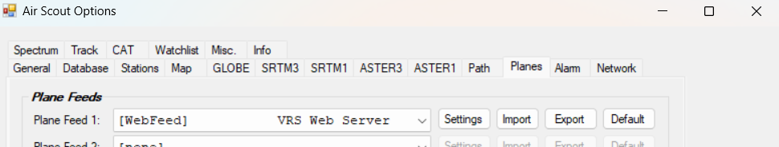
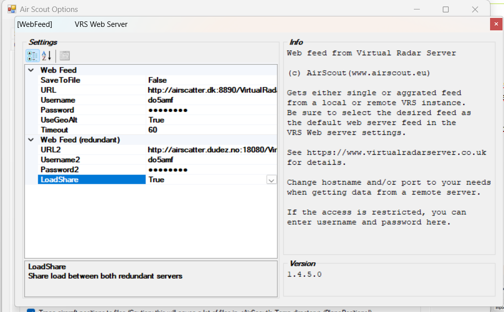
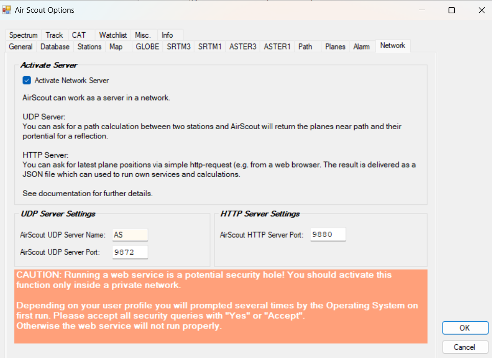

# AirScout-Integration

> 🇬🇧 [English version](en-AirScout-Integration) | 🇩🇪 Du liest gerade die deutsche Version

AirScout (von DL2ALF) ist ein Programm zur Erkennung von Flugzeugen für den Aircraft-Scatter-Betrieb. KST4Contest ist eng mit AirScout integriert und zeigt reflektierbare Flugzeuge direkt in der Benutzerliste an.

> **Aircraft Scatter** ermöglicht sehr weitreichende Verbindungen auf VHF und höher – auch für Stationen mit geringer Höhe über NN oder ungünstigen topografischen Verhältnissen.

---

## AirScout herunterladen

Download von AirScout:
- http://airscout.eu/index.php/download

---

## Flugzeugdaten-Feeds (ADSB)

Öffentliche Flugzeugdaten-Feeds im Internet sind oft unzuverlässig und begrenzt nutzbar. Eine empfohlene Alternative bietet **OV3T (Thomas)** mit einem dedizierten ADSB-Feed-Dienst:

- https://airscatter.dk/
- https://www.facebook.com/groups/825093981868542

Für diesen Dienst ist ein Account erforderlich. Bitte eine Spende für Thomas in Betracht ziehen – der Server-Betrieb ist nicht kostenlos!

---

## AirScout einrichten

### Schritt 1: ADSB-Feed in AirScout konfigurieren

1. AirScout starten.
2. In den AirScout-Einstellungen den OV3T-Feed-Account eintragen (Benutzername, Passwort, URL).

3. Verbindung testen.

### Schritt 2: UDP-Kommunikation für KST4Contest aktivieren

In AirScout die UDP-Schnittstelle aktivieren:

- In den AirScout-Einstellungen die entsprechende Checkbox aktivieren (nur eine Checkbox notwendig).
- Standard-Ports nicht ändern, wenn kein besonderer Grund vorliegt.

### Schritt 3: KST4Contest-Einstellungen

In den KST4Contest-Preferences → **AirScout Settings**:
- AirScout-Kommunikation aktivieren
- IP und Port auf Standardwerte lassen (sofern nicht geändert)

{ width=85% }

---

## Kommunikation zwischen KST4Contest und AirScout (ab v1.263)

**Verbesserung in v1.263**: KST4Contest sendet nur noch Stationen an AirScout, deren QRB (Entfernung) kleiner als das eingestellte **Maximum-QRB** ist. Das Abfrageintervall wurde von 12 Sekunden auf **60 Sekunden** verlängert.

**Vorteile:**
- Deutlich weniger Berechnungsaufwand für AirScout
- Deutlich weniger Nachrichtenverkehr
- Das Tracking-Problem mit dem „Show Path in AirScout"-Button wurde dadurch deutlich verbessert
- Weniger Rechenleistung insgesamt

Außerdem: Der Name des KST4Contest-Clients und des AirScout-Servers war früher hartcodiert (`KST` und `AS`). Ab v1.263 werden die in den Preferences eingetragenen Namen verwendet.

---

## Mehrere KST4Contest-Instanzen und AirScout

> **Achtung**: Wenn mehrere KST4Contest-Instanzen gleichzeitig betrieben werden und bei beiden die AirScout-Kommunikation aktiviert ist, antwortet AirScout **an beide Instanzen**.

Das ist unproblematisch, wenn:
- Beide Instanzen denselben Locator verwenden, **oder**
- Beide Instanzen unterschiedliche Login-Rufzeichen haben.

Andernfalls kann es zu fehlerhaften AP-Daten kommen.

---

## AP-Spalte in der Benutzerliste

Nach der Einrichtung erscheint in der Benutzerliste eine **AP-Spalte** mit bis zu zwei reflektierbaren Flugzeugen pro Station.

Beispiel-Darstellung:

| Station | AP-Info |
|---|---|
| DF9QX | 2 Planes: 0 min / 0 min, je 100% |
| F5DYD | 2 Planes: 14 min / 31 min, je 50% |

Die AP-Informationen sind auch im **Privatnachrichten-Fenster** verfügbar.

Die Prozentzahl gibt das Reflexionspotenzial an (Größe des Flugzeugs, Höhe, Entfernung).

---

## AP-Variablen in Nachrichten

Die Flugzeugdaten können direkt in Nachrichten eingefügt werden:

- `FIRSTAP` → z. B. `a very big AP in 1 min`
- `SECONDAP` → z. B. `Next big AP in 9 min`

Details: [Makros und Variablen](Makros-und-Variablen#variablen)

---

## „Show Path in AirScout"-Button

In der Benutzerliste gibt es einen Button mit einem Pfeil, der die Richtung (QTF) zur ausgewählten Station anzeigt. Ein Klick maximiert AirScout und zeigt den Pfad mit reflektierbaren Flugzeugen zum ausgewählten Gesprächspartner.
