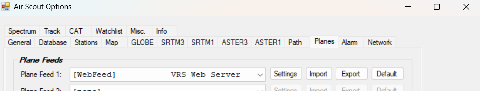
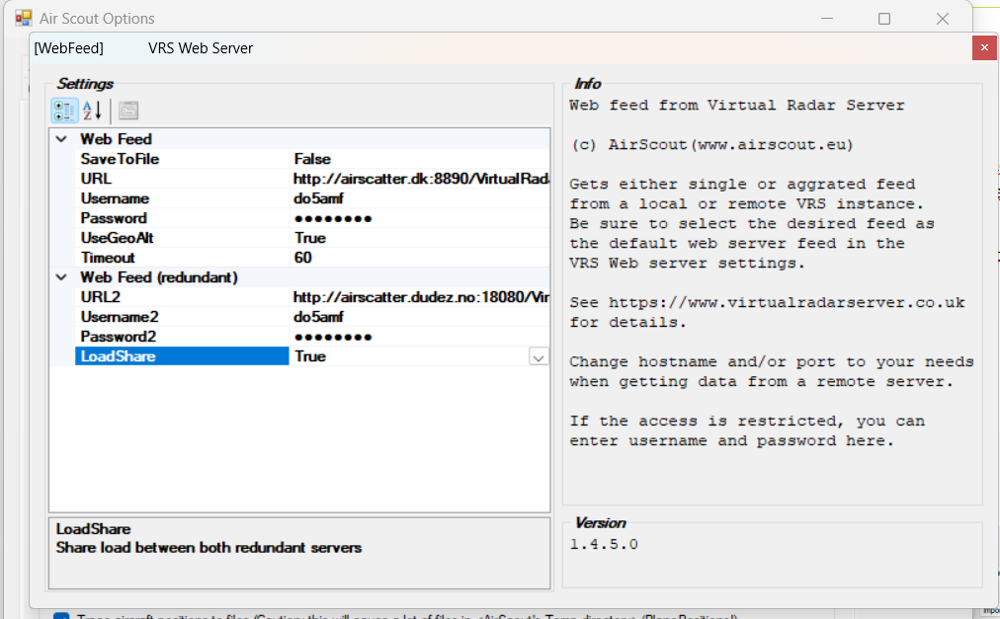

# AirScout-Integration

> 🇬🇧 [English version](en-AirScout-Integration) | 🇩🇪 Du liest gerade die deutsche Version

AirScout (von DL2ALF) berechnet Aircraft-Scatter-Gelegenheiten anhand aktueller Flugzeugpositionen. KST4Contest übernimmt diese Ergebnisse und zeigt für die jeweilige Gegenstation geeignete Flugzeuge direkt in der Benutzerliste an.

> **Aircraft Scatter** ermöglicht sehr weitreichende Verbindungen auf VHF und höher – auch für Stationen mit geringer Höhe über NN oder ungünstigen topografischen Verhältnissen.

---

## AirScout herunterladen

Download von AirScout:
- http://airscout.eu/index.php/download

---

## Flugzeugdaten-Feeds (ADS-B)

Öffentliche Flugzeugdaten-Feeds im Internet sind oft unzuverlässig und nur eingeschränkt nutzbar. Eine empfohlene Alternative bietet **OV3T (Thomas)** mit einem dedizierten ADS-B-Feed-Dienst:

- https://airscatter.dk/
- https://www.facebook.com/groups/825093981868542

Für diesen Dienst ist ein Account erforderlich. Bitte eine Spende für Thomas in Betracht ziehen – der Server-Betrieb ist nicht kostenlos!

---

## AirScout einrichten

### Schritt 1: ADS-B-Feed in AirScout konfigurieren

1. AirScout starten.
2. In den AirScout-Einstellungen den OV3T-Feed-Account eintragen (Benutzername, Passwort, URL).

3. Verbindung testen.

### Schritt 2: UDP-Kommunikation für KST4Contest aktivieren

In AirScout die UDP-Schnittstelle aktivieren:

- In den AirScout-Einstellungen die entsprechende Checkbox aktivieren (nur eine Checkbox notwendig).
- Standard-Ports nicht ändern, wenn kein besonderer Grund vorliegt.

### Schritt 3: KST4Contest-Einstellungen

In den KST4Contest-Preferences → **AirScout Settings**:
- AirScout-Kommunikation aktivieren
- IP und Port auf Standardwerte lassen (sofern nicht geändert)

{ width=85% }

---

## Kommunikation zwischen KST4Contest und AirScout (ab v1.263)

**Verbesserung in v1.263**: KST4Contest sendet nur noch Stationen an AirScout, deren QRB (Entfernung) kleiner als das eingestellte **Maximum-QRB** ist. Das Abfrageintervall wurde von 12 Sekunden auf **60 Sekunden** verlängert.

**Vorteile:**
- Deutlich weniger Berechnungsaufwand für AirScout
- Deutlich weniger Nachrichtenverkehr
- Das Tracking-Problem mit dem „Show Path in AirScout"-Button wurde dadurch deutlich verbessert
- Weniger Rechenleistung insgesamt

Außerdem: Der Name des KST4Contest-Clients und des AirScout-Servers war früher hartcodiert (`KST` und `AS`). Ab v1.263 werden die in den Preferences eingetragenen Namen verwendet.

---

## Mehrere KST4Contest-Instanzen und AirScout

> **Achtung**: Wenn mehrere KST4Contest-Instanzen gleichzeitig betrieben werden und bei beiden die AirScout-Kommunikation aktiviert ist, antwortet AirScout **an beide Instanzen**.

Das ist unproblematisch, wenn:
- Beide Instanzen denselben Locator verwenden, **oder**
- Beide Instanzen unterschiedliche Login-Rufzeichen haben.

Andernfalls kann es zu fehlerhaften AP-Daten kommen.

---

## AP-Spalte in der Benutzerliste

Nach der Einrichtung erscheint in der Benutzerliste eine **AP-Spalte**. Sie zeigt für jede Station die Ankunftszeit und das von AirScout berechnete Reflexionspotenzial der ersten beiden geeigneten Flugzeuge.

Beispiel-Darstellung:

| Station | AP-Info |
|---|---|
| DF9QX | 0 (100 %) / 0 (100 %) |
| F5DYD | 14 (50 %) / 31 (50 %) |

Die Zahl vor der Klammer gibt die verbleibenden Minuten bis zur berechneten Gelegenheit an. Die Prozentzahl beschreibt das von AirScout gemeldete Reflexionspotenzial. Sie ist keine QSO-Wahrscheinlichkeit.

Die AP-Informationen sind auch im **Privatnachrichten-Fenster** verfügbar.

## Einfluss auf Priority Score und Timeline

Mindestens ein von AirScout als erreichbar gemeldetes Flugzeug erhöht den Priority Score der Station. Eine unmittelbar bevorstehende Gelegenheit in null, einer oder zwei Minuten wird zusätzlich zeitabhängig gewichtet. AirScout ist dabei nur ein Faktor neben Worked-Status, verfügbaren Bändern, QRB, Antennenrichtung, Chat-Aktivität und Skeds.

Die AP- und Sked-Timeline verwendet den Priority Score zur Auswahl interessanter Stationen und ordnet die nächste geeignete Aircraft-Scatter-Gelegenheit zeitlich ein. Das Reflexionspotenzial bestimmt zusätzlich die Darstellung des AP-Symbols. Die Timeline bleibt eine Vorschau; sie garantiert kein QSO.

---

## AP-Variablen in Nachrichten

Die Flugzeugdaten der ausgewählten Station können direkt in Shortcuts, Snippets und andere stationsbezogene Nachrichten eingefügt werden:

- `FIRSTAP` → z. B. `a very big AP in 1 min`
- `SECONDAP` → z. B. `Next big AP in 9 min`

Details: [Makros und Variablen](de-Makros-und-Variablen#variablen)

Da die Werte eine ausgewählte Gegenstation benötigen, stehen `FIRSTAP` und `SECONDAP` nicht als globale Beacon-Variablen zur Verfügung.

---

## „Show Path in AirScout"-Button

In der Benutzerliste gibt es einen Button mit einem Pfeil, der die Richtung (QTF) zur ausgewählten Station anzeigt. Ein Klick maximiert das externe AirScout-Fenster und lässt dort den Pfad zur ausgewählten Gegenstation mit den berechneten Aircraft-Scatter-Gelegenheiten anzeigen. Die Schaltfläche startet keine eigene Gelände- oder Ausbreitungsberechnung in KST4Contest.
