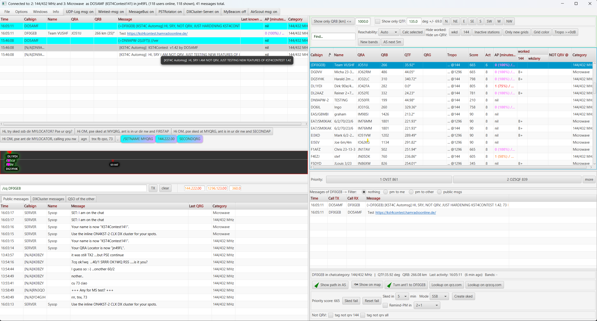
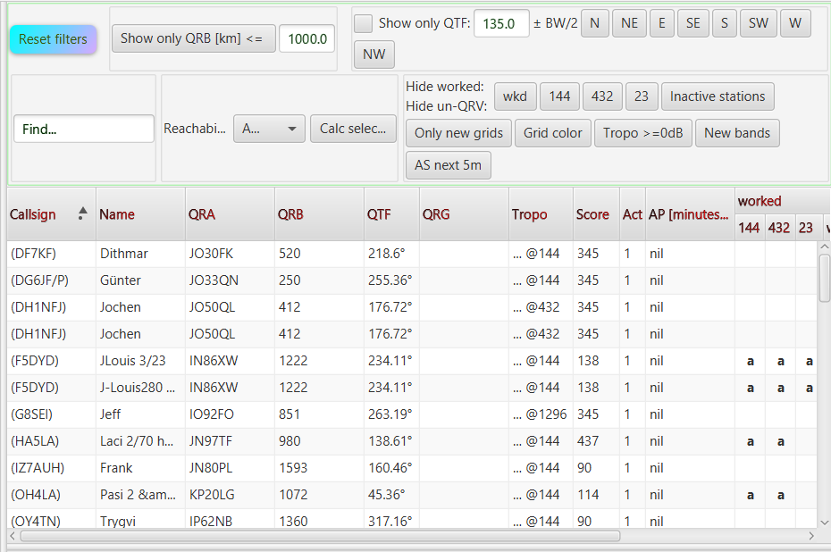

# Benutzeroberfläche

> 🇬🇧 [English version](en-User-Interface) | 🇩🇪 Du liest gerade die deutsche Version

## Verbinden mit dem Chat

1. Im Einstellungsfenster eine **Chat-Kategorie** auswählen (z. B. 144 MHz VHF, 432 MHz UHF, …).
2. **Connect**-Button klicken.
3. Warten bis die Verbindung aufgebaut ist.

> Trennen und Neu-Verbinden ist nur über das Einstellungsfenster möglich. Es empfiehlt sich daher, das Einstellungsfenster geöffnet zu lassen.

---

## Hauptfenster-Überblick

Das Hauptfenster besteht aus mehreren Bereichen:

### PM-Fenster (oben links)

Zeigt alle empfangenen **Privatnachrichten** sowie abgefangene öffentliche Nachrichten, die das eigene Rufzeichen enthalten. Neue Nachrichten erscheinen in **Rot** und faden alle 30 Sekunden über Gelb bis Weiß ab.

### Benutzerliste (Chat Members)

Die zentrale Tabelle aller aktuell aktiven Chat-Nutzer. Spalten (je nach Konfiguration):

| Spalte | Inhalt |
|---|---|
| Call | Rufzeichen der Station |
| Name | Name aus dem Chat-Namenfeld |
| Loc | Maidenhead-Locator |
| QRB | Entfernung in km |
| QTF | Richtung in Grad |
| QRG | Zuletzt aus einer Chat-Nachricht erkannte Frequenz |
| AP | AirScout-Flugzeugdaten (wenn aktiv) |
| Band-Farben | Worked/NOT-QRV-Status pro Band |

Die QRG-Spalte zeigt die zuletzt für eine Station erkannte Frequenz. Fehlende Nullen werden für die Anzeige ergänzt, sodass beispielsweise `144.21` als `144.210` erscheint. Erkennt KST4Contest nacheinander Frequenzen auf mehreren Bändern, zeigt die Spalte den letzten Treffer; die internen Bandinformationen können trotzdem mehrere aktuelle Bänder der Station enthalten.

Relative Angaben werden zunächst mit einem höchstens 30 Minuten alten Bandkontext desselben Absenders kombiniert. Nur wenn dieser fehlt, verwendet KST4Contest das globale Fallback-Band. Erkennungsregeln, Beispiele und Grenzen: [QRG-Erkennung](de-Funktionen#qrg-erkennung).

**Sortierung**: Klick auf Spaltenköpfe. QRB-Sortierung arbeitet numerisch (ab v1.22 korrigiert).

Ein grün und fett dargestelltes Rufzeichen kennzeichnet eine aus einer gerichteten Nachricht hergeleitete Richtungsgelegenheit. Die Markierung bezieht sich auf den Absender der Nachricht und bleibt höchstens fünf Minuten sichtbar. Herleitung und Grenzen: [Richtungsgelegenheiten aus gerichteten Nachrichten](de-Funktionen#richtungsgelegenheiten-aus-gerichteten-nachrichten).
### Sendfeld

Texteingabe für ausgehende Nachrichten. Nach Klick auf ein Rufzeichen in der Benutzerliste erhält das Sendfeld automatisch den Fokus – sofort tippen ohne Doppelklick (ab v1.22).

### MYQRG-Feld

Rechts neben dem Sendbutton. Zeigt die aktuelle eigene QRG an, kann auch manuell eingetragen werden.

### MYQTF-Feld *(für v1.3)*

Eingabefeld für die aktuelle Antennenrichtung. Wird für die geplante `MYQTF`-Variable verwendet.

---

## Nachrichtentabellen

KST4Contest zeigt Nachrichtentexte bewusst einzeilig an. So bleiben auch bei hohem Chat-Aufkommen viele Einträge gleichzeitig sichtbar. Der Nachteil liegt auf der Hand: Bei einer schmalen **Message**-Spalte passt nicht jede Nachricht vollständig in die Zeile.

Ist ein Nachrichtentext breiter als die sichtbare Zelle, zeigt KST4Contest den vollständigen Inhalt als Tooltip an. Dazu die Maus kurz über die betreffende **Message**-Zelle halten. Passt der Text vollständig in die Spalte, wird kein zusätzlicher Volltext-Tooltip eingeblendet.

Webadressen mit `http://`, `https://` oder dem Präfix `www.` werden innerhalb des Nachrichtentextes als Links dargestellt. Ein Klick öffnet die Adresse im Standardbrowser des Betriebssystems. Andere Protokolle werden nicht als Link behandelt.

Damit muss der Divider nicht allein deshalb verschoben werden, um eine einzelne längere Nachricht zu lesen. Für einen dauerhaft breiteren Nachrichtenbereich kann er selbstverständlich weiterhin angepasst werden.

---

## Filter

Die Filterleiste befindet sich oberhalb der Chatmember-Tabelle. Sie ist in mehrere logisch zusammengehörige Bereiche gegliedert:

- **Show only QTF** begrenzt die Liste auf eine gewählte Antennenrichtung.
- **Show only QRB [km] <=** setzt eine maximale Entfernung.
- **Find** sucht nach einem Rufzeichen.
- **Hide worked** und die Band-Schaltflächen blenden bereits gearbeitete beziehungsweise nicht verfügbare Stationen aus.
- **Reachability**, **Only new grids**, **Tropo >=0dB**, **New bands** und **AS next 5m** unterstützen die Auswahl technisch interessanter Kandidaten.

Die Filterleiste besitzt keine feste Breite. QTF sowie die Worked- und Reachability-Filter nutzen zunächst den gesamten Platz ihrer jeweiligen Zeile. Wird der horizontale Divider nach rechts verschoben und die Chatmember-Ansicht dadurch schmaler, wechseln die Controls erst dann in die nächste Zeile, wenn ihre tatsächlich benötigte Breite nicht mehr zur Verfügung steht.

Im Klartext: Die Filter bestimmen weiterhin den Inhalt der Tabelle, aber nicht mehr die Mindestbreite der gesamten rechten Programmseite. In der normalen Ansicht bleibt die Leiste kompakt. Erst bei einer tatsächlich schmalen Ansicht benötigt sie mehr Höhe. Der Divider kann anschließend wieder nach links verschoben werden; die Controls ordnen sich unmittelbar neu an.

---
---

## Stationsinfo-Panel (Further Info)

Rechts unten werden die Nachrichten der ausgewählten Station zusammengeführt. Dazu gehören öffentliche Nachrichten, Privatnachrichten an die eigene Station und – soweit im Chat sichtbar – Privatnachrichten an andere Stationen.

Der im Panel gewählte Filter bestimmt, welche dieser Nachrichten angezeigt werden. Unter **Settings → GUI** lässt sich festlegen, welcher Filter beim Öffnen einer Stationsinformation vorausgewählt ist:

- alle Nachrichten,
- Privatnachrichten an die eigene Station,
- Privatnachrichten an andere Stationen oder
- öffentliche Nachrichten.

Die Einstellung verändert nur die Darstellung im Stationsinfo-Panel. Nachrichten werden dadurch weder verworfen noch aus den übrigen Nachrichtentabellen entfernt. Der Filter kann im Panel jederzeit für die aktuell betrachtete Station gewechselt werden.

Hier können auch **Sked-Erinnerungen / Wecker** für beide Skkedpartner aktiviert werden.

---

## Prioritätsliste

Zeigt die vom Score-Service berechneten Top-Kandidaten. Aktualisiert sich automatisch im Hintergrund basierend auf Richtung, Entfernung und AP-Verfügbarkeit.

---

## Cluster & QSO der anderen

Separates Fenster (kann miniaturisiert werden). Zeigt den Kommunikationsfluss zwischen anderen Stationen – interessant in ruhigeren Phasen.

---

## Menü

### Window
- **Use Dark Mode** (ab v1.26): Dunkles Farbschema aktivieren/deaktivieren.

---

## Fenstergrößen und Divider

Ab **v1.21** werden beim Klick auf **„Save Settings"** auch Fenstergrößen und Divider-Positionen aller Panels in der Konfigurationsdatei gespeichert und beim nächsten Start wiederhergestellt.

Bei Problemen mit der Darstellung: Konfigurationsdatei löschen → KST4Contest erstellt neue Standardwerte.

---

## Tipps zur Bedienung

- **Einstellungsfenster geöffnet lassen**: Schneller Zugriff auf Beacon-Aktivierung/Deaktivierung.
- **Rechtsklick in der Benutzerliste**: Öffnet das Snippet-Menü und weitere Aktionen (QRZ.com-Profil, NOT-QRV-Tags setzen).
- **Enter aus dem Chat heraus**: Wenn im Sendfeld Text steht, sendet Enter direkt – auch wenn der Fokus woanders liegt.
- **Beacon stoppen**: Beim Scannen von Frequenzen den Beacon ausschalten, damit der Chat nicht mit Meldungen überflutet wird.
