# Funktionen

> 🇬🇧 [English version](en-Features) | 🇩🇪 Du liest gerade die deutsche Version

Dieses Kapitel beschreibt die wichtigsten Funktionen von KST4Contest, ihre Herleitung und die Grenzen der daraus gewonnenen Informationen.

---
## Richtungsgelegenheiten aus gerichteten Nachrichten

Im ON4KST-Chat ist sichtbar, welche Station eine Nachricht an welche andere Station richtet. Eine tatsächliche Antennenrichtung wird dabei nicht übertragen. Für den Contestbetrieb lässt sich aus einer solchen Nachricht trotzdem eine brauchbare Annahme ableiten: Wer einen Sked anfragt, beantwortet oder vorbereitet, richtet seine Antenne normalerweise zumindest ungefähr auf die angesprochene Station.

KST4Contest wertet deshalb gerichtete Nachrichten zwischen zwei anderen Stationen aus. Die Nachricht muss nicht ausdrücklich als Sked gekennzeichnet sein. Entscheidend sind der Absender, der Empfänger und deren Locator.

### Wie wird die Richtung hergeleitet?

Angenommen, Station A schreibt eine gerichtete Nachricht an Station B:

1. KST4Contest berechnet die Richtung von Station A zu Station B.
2. Diese Richtung wird als wahrscheinliche Antennenrichtung von Station A verwendet.
3. Anschließend wird die Richtung von Station A zur eigenen Station berechnet.
4. Die Winkeldifferenz wird mit der Hälfte des konfigurierten Antennen-Öffnungswinkels verglichen.
5. Zusätzlich muss Station A innerhalb des konfigurierten maximalen QRB liegen.

Ein eingetragener Öffnungswinkel von `70°` ergibt damit einen angenommenen Korridor von jeweils `35°` links und rechts der Richtung von Station A zu Station B.

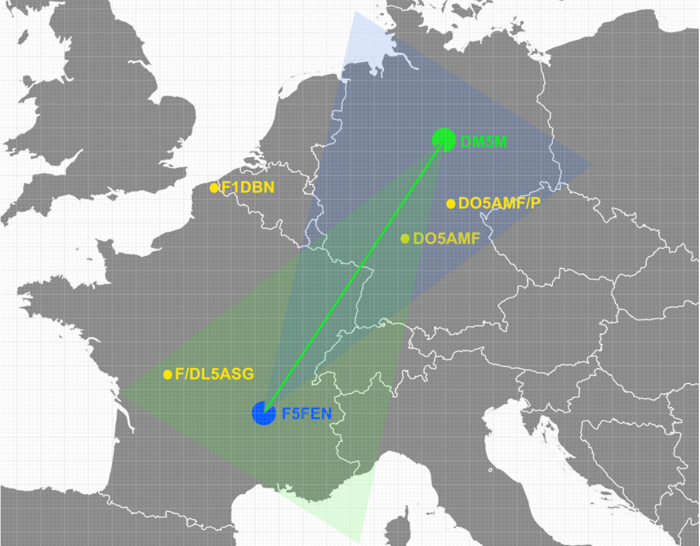

Im dargestellten Beispiel verläuft der grüne Korridor von F5FEN in Richtung DM5M. Sendet F5FEN eine gerichtete Nachricht an DM5M, prüft KST4Contest, ob die eigene Station innerhalb dieses Korridors liegt. Bei einer Antwort von DM5M an F5FEN wird die Richtung neu berechnet: Dann beginnt der blaue Korridor bei DM5M und zeigt in Gegenrichtung auf F5FEN. Bewertet wird also bei jeder Nachricht die angenommene Antennenrichtung des jeweiligen Absenders.

| Beispiel | Ergebnis |
|---|---|
| Richtung A → B: `120°`, Richtung A → eigene Station: `145°` | Winkeldifferenz `25°`: Richtungsgelegenheit erkannt |
| Richtung A → B: `120°`, Richtung A → eigene Station: `165°` | Winkeldifferenz `45°`: außerhalb des angenommenen Korridors |
| Locator von A oder B fehlt | Keine Richtungsberechnung möglich |
| A liegt außerhalb des maximalen QRB | Keine Richtungsgelegenheit |

### Was wird in der Benutzerliste angezeigt?

Wird eine Richtungsgelegenheit erkannt, erscheint das Rufzeichen des Absenders in der Benutzerliste grün und fett. Im Evening-Modus wird dafür ein helleres Grün verwendet. Der Empfänger der Nachricht wird nicht allein deshalb markiert; eine Antwort in Gegenrichtung wird als eigene Nachricht und damit als neuer Fall berechnet.

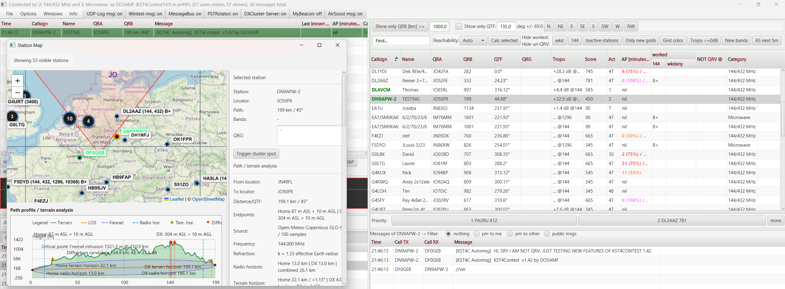

Im Bild sendete DF0GEB eine gerichtete Nachricht an DN9APW und bekam eine Antwort. KST4Contest erkannte die Richtungsgelegenheit und markierte DN9APW in der Benutzerliste.
Zur Verdeutlichung ist die MAP eingeblendet. Ich stehe als Empfänger zwischen beiden Stationen und bekomme deswegen die Warnung.

Die Markierung bleibt fünf Minuten ab der letzten passenden Nachricht sichtbar. Eine weitere passende Nachricht derselben Station beginnt diesen Zeitraum erneut. Sendet die Station vorher eine gerichtete Nachricht, deren Richtung die Bedingungen nicht erfüllt, wird die Markierung unmittelbar entfernt.

Ist die einfache Soundausgabe aktiviert, gibt KST4Contest beim erstmaligen Erkennen der Richtungsgelegenheit zusätzlich einen kurzen Hinweis aus. Solange die Station bereits markiert ist, wird derselbe Hinweis nicht mit jeder weiteren passenden Nachricht wiederholt.

### Was bedeutet die Markierung – und was nicht?

Die Berechnung ist eine geometrische Herleitung. Sie beweist nicht, dass Station A ihre Antenne tatsächlich auf Station B ausgerichtet hat. Ebenso wenig berücksichtigt sie Gelände, aktuelle Ausbreitungsbedingungen, die reale Antennencharakteristik der fremden Station oder deren Rotatorposition.

ON4KST liefert keinen individuellen Öffnungswinkel für die fremde Station. KST4Contest verwendet deshalb den für die eigene Antenne konfigurierten Wert auch als Näherung für Station A. Ein zu großer Wert erzeugt entsprechend mehr mögliche Richtungsgelegenheiten, ein zu kleiner Wert kann brauchbare Situationen übersehen.

Im Klartext: Die grüne Markierung ist ein begründeter Hinweis auf eine mögliche Gelegenheit. Sie ist weder eine Ausbreitungsvorhersage noch eine Garantie für ein QSO.

Konfiguration:

- [Antennen-Öffnungswinkel](de-Konfiguration#antennen-öffnungswinkel-antenna-beamwidth)
- [Standard-Maximum-QRB](de-Konfiguration#standard-maximum-qrb)

---

## Weitergabe als DX-Cluster-Spot

Seit Version 1.23 kann KST4Contest eine erkannte Richtungsgelegenheit an den DX-Cluster-Client eines Logprogramms weitergeben. Dafür muss der lokale DX-Cluster-Server aktiviert und für den Absender eine verwertbare Frequenz bekannt sein.

Die Frequenz kann bereits aus einer früheren Nachricht stammen oder erstmals in der aktuell auslösenden Nachricht stehen. In beiden Fällen steht sie der Spot-Prüfung zur Verfügung. KST4Contest überträgt damit nicht jede im Chat gefundene QRG, sondern nur Frequenzen, die mit einer geometrisch passenden gerichteten Nachricht zusammenfallen.

Die Fünf-Minuten-Markierung und der DX-Cluster-Spot beruhen auf derselben Richtungsberechnung, haben aber einen unterschiedlichen Lebenszyklus: Die Markierung bleibt vorübergehend in der Benutzerliste sichtbar. Der Spot wird unmittelbar beim Verarbeiten der passenden Nachricht erzeugt.

Einrichtung, Frequenzbehandlung und Grenzen: [Integrierter DX-Cluster-Server](de-DX-Cluster-Server).

---

## QRG-Erkennung

Im ON4KST-Chat werden Frequenzen selten einheitlich geschrieben. Eine Station nennt beispielsweise zuerst `432.088`, später nur noch `.100` und in einer weiteren Nachricht `qrg 120`. Für einen Menschen ist der Zusammenhang meistens klar. Ein Programm muss dagegen unterscheiden, ob `120` eine Frequenz, eine Zeitangabe, eine Entfernung oder etwas völlig anderes bedeutet.

KST4Contest wertet deshalb den Text jeder öffentlichen und gerichteten Chat-Nachricht aus. Eine erkannte QRG wird dem Absender zugeordnet und in der **QRG-Spalte** der Benutzerliste angezeigt. Die Spalte enthält die zuletzt erkannte Frequenz und stellt mindestens drei Nachkommastellen dar. Ein intern als `144.21` gespeicherter Wert erscheint damit als `144.210`.

### Welche Angaben werden erkannt?

| Schreibweise | Beispiel | Verarbeitung |
|---|---|---|
| Vollständige Frequenz | `144.210`, `432,088`, `10368.100` | Das Band ergibt sich direkt aus der Frequenz. |
| Relative Frequenz mit Punkt oder Komma | `.210`, `,088` | Das Band wird aus dem Stationskontext oder dem konfigurierten Fallback ergänzt. |
| Dreistellige Frequenz mit Textkontext | `qrg 210`, `freq is 210`, `on 210`, `210 MHz` | Die Zahl wird als relative Frequenz behandelt. |
| Dreistellige Zahl ohne Frequenzkontext | `210`, `599`, `144` | Die Zahl wird absichtlich nicht als QRG übernommen. |

Die letzte Einschränkung verhindert plausible, aber falsche Ergebnisse. Mit einem Fallback von `144 MHz` ließe sich ein Signalrapport `599` technisch problemlos zu `144.599 MHz` zusammensetzen. Das Ergebnis wäre formal gültig und fachlich trotzdem Unsinn.

### Wie wird das Band einer relativen QRG bestimmt?

KST4Contest verwendet folgende Reihenfolge:

1. Wurde für denselben Absender innerhalb der letzten 30 Minuten bereits eine passende vollständige Frequenz erkannt, verwendet KST4Contest deren Band.
2. Sind mehrere aktuelle Bänder bekannt, wird der zuletzt aktualisierte plausible Bandkontext verwendet.
3. Fehlt ein geeigneter Stationskontext, verwendet KST4Contest das unter **Fallback band for relative QRG detection** ausgewählte Band.

Beispiel: Das globale Fallback steht auf `144 MHz`. Eine Station nennt zunächst `432.088` und schreibt wenige Minuten später `.100`. KST4Contest ergänzt nicht das globale Fallback, sondern den aktuelleren Stationskontext. Das Ergebnis ist `432.100 MHz`. Schreibt eine andere Station ohne vorherige Bandinformation `.100`, wird daraus `144.100 MHz`.

Das Fallback-Band ist damit tatsächlich nur der letzte Ausweg. Es wird aus den von KST4Contest unterstützten Bandwerten ausgewählt und wirkt auf die gesamte QRG-Erkennung – nicht nur auf den integrierten DX-Cluster.

### Wofür wird die erkannte QRG verwendet?

Die zuletzt erkannte Frequenz erscheint in der Benutzerliste. Der zugehörige Bandkontext kann außerdem in weitere Funktionen einfließen, beispielsweise in:

- die Erkennung aktiver Bänder einer Station,
- den Chatmember-Score und die Prioritätslisten,
- Band-Upgrade-Hinweise nach einem Logeintrag,
- die Frequenzwahl bei Skeds,
- einen DX-Cluster-Spot aus einer erkannten Richtungsgelegenheit.

Steht die QRG erstmals in der Nachricht, die zugleich eine Richtungsgelegenheit auslöst, wird sie vor der Richtungs- und Spotprüfung verarbeitet. Der daraus erzeugte Spot kann deshalb bereits die Frequenz dieser Nachricht verwenden.

Die Erkennung bleibt eine Textauswertung. KST4Contest kann nicht beweisen, dass die Station noch auf der genannten Frequenz arbeitet oder ob sich eine mehrdeutige Angabe auf einen anderen Zusammenhang bezieht. Genau deshalb werden nackte dreistellige Zahlen ohne Frequenzkontext nicht mehr übernommen.

Konfiguration und unterstützte Fallback-Bänder: [Fallback-Band für relative QRG-Erkennung](de-Konfiguration#fallback-band-für-relative-qrg-erkennung).

Verwendung in der Bandmap eines Logprogramms: [Integrierter DX-Cluster-Server](de-DX-Cluster-Server).

---
## Gearbeitete Rufzeichen, neue Bänder und neue Großfelder

KST4Contest unterscheidet drei Informationen, die im Contest ähnlich aussehen können, aber unterschiedliche Fragen beantworten:

1. Wurde dieses Rufzeichen bereits gearbeitet?
2. Wurde dieses Rufzeichen auf einem bestimmten Band gearbeitet?
3. Wurde das vierstellige Maidenhead-Großfeld bereits gearbeitet – möglicherweise mit einer anderen Station?

Diese Trennung ist notwendig. Ein bereits gearbeitetes Rufzeichen kann auf einem anderen Band weiterhin interessant sein. Umgekehrt kann eine noch nicht gearbeitete Station in einem Großfeld liegen, das bereits im Log steht.

### Worked-Informationen aus dem Log

Die [Log-Synchronisation](de-Log-Synchronisation) übernimmt neue QSOs aus dem Logprogramm. Welche Informationen dabei zur Verfügung stehen, hängt von der verwendeten Schnittstelle ab:

- Der dateibasierte Simplelogfile-Interpreter erkennt nur das Rufzeichen. Er kann deshalb lediglich den globalen Worked-Status setzen.
- Die QSO-UDP-Schnittstellen und der Win-Test-Netzwerk-Listener können zusätzlich das Band übernehmen.
- Enthält das Logpaket einen gültigen Locator, speichert KST4Contest außerdem das gearbeitete vierstellige Großfeld für dieses Band.

Fehlt eine Information im Logpaket, wird sie nicht geraten. Ein QSO ohne Locator erzeugt deshalb keinen Großfeld-Eintrag; ein Simplelogfile-Treffer erzeugt keine bandbezogene Worked-Markierung.

### Bedeutung der Bandspalten

Unter der gemeinsamen Spalte **worked** erscheinen nur die Bänder, die unter **Station → my station uses …** aktiviert wurden. Die Zellen verwenden bewusst kurze Kennzeichen:

| Anzeige | Bedeutung |
|---|---|
| `X` | Das Rufzeichen wurde auf diesem Band gearbeitet. |
| `a` | Die Station bietet dieses Band an, das Band ist noch nicht gearbeitet und das Rufzeichen wurde bisher auf keinem Band gearbeitet. |
| `B+` | Die Station bietet dieses Band an und das Band ist noch nicht gearbeitet. Das Rufzeichen wurde bereits auf einem anderen Band gearbeitet. Ist die getrennte `a`-Anzeige deaktiviert, wird auch ein vollständig neues Rufzeichen als `B+` dargestellt. |
| `o` | Das vierstellige Großfeld der Station wurde auf diesem Band bereits gearbeitet – unabhängig vom Rufzeichen. |
| leer | Für dieses Band liegt keine passende Information vor. Das ist nicht gleichbedeutend mit „nicht QRV“. |

Das `o` ist eine unabhängige Zusatzinformation und kann deshalb mit den anderen Kennzeichen kombiniert werden. Möglich sind beispielsweise `Xo`, `ao` oder `B+o`. Ein einzelnes `o` bedeutet: Das Großfeld wurde auf diesem Band bereits gearbeitet, für das angezeigte Rufzeichen liegt aber weder eine Worked-Markierung noch eine aktuelle Bandmöglichkeit vor.

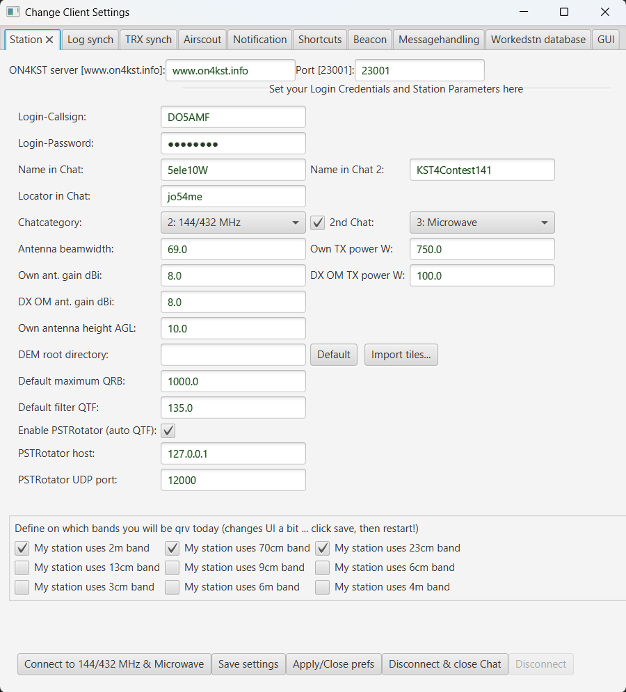

### Wie entsteht eine Bandmöglichkeit?

KST4Contest zeigt `a` oder `B+` nur an, wenn sich eine noch offene gemeinsame Bandmöglichkeit herleiten lässt. Dafür werden folgende Informationen zusammengeführt:

1. die in den Stationseinstellungen aktivierten eigenen Bänder,
2. höchstens 30 Minuten alte QRG-Erkennungen der Gegenstation,
3. eindeutige Bandangaben im Namensfeld der Gegenstation,
4. die pro Band gespeicherten Worked-Markierungen und
5. manuell gesetzte NOT-QRV-Markierungen.

Aktive Chat-Einträge mit demselben normalisierten Rufzeichen werden gemeinsam ausgewertet. Das ist insbesondere bei mehreren Chat-Kategorien oder unterschiedlichen sichtbaren Rufzeichenvarianten wichtig. Eine eindeutige Bandangabe im Namensfeld bleibt dabei so lange nutzbar, wie der betreffende Chat-Eintrag aktiv ist; eine aus einer Nachricht erkannte QRG läuft nach 30 Minuten aus.

Anschließend werden nur die Bänder berücksichtigt, die an der eigenen Station aktiviert, für die Gegenstation bekannt und noch nicht gearbeitet sind. Ein manuelles NOT-QRV-Tag übersteuert die automatisch erkannten Hinweise. Die Chat-Kategorie allein reicht dagegen nicht als Nachweis, dass eine einzelne Station auf einem bestimmten Band QRV ist.

Die globale Worked-Markierung entscheidet nicht darüber, ob eine Bandmöglichkeit besteht. Sie unterscheidet in der Darstellung lediglich zwischen `a` und `B+`. Die eigentliche Bandprüfung arbeitet mit den bandbezogenen Worked-Informationen.

### Bedeutung von `wkdany`

Die Unterspalte **wkdany** fasst den globalen Rufzeichen- und Großfeldstatus zusammen:

| Anzeige | Bedeutung |
|---|---|
| leer | Weder das Rufzeichen noch das vierstellige Großfeld wurden gearbeitet. |
| `x` | Das Rufzeichen wurde auf mindestens einem Band gearbeitet. |
| `o` | Das vierstellige Großfeld wurde auf mindestens einem Band gearbeitet. |
| `xo` | Rufzeichen und Großfeld wurden bereits gearbeitet. |

`wkdany` ist eine bandunabhängige Übersicht. Das kleine `x` darf daher nicht mit dem großen `X` in einer Bandspalte verwechselt werden. Der globale Status wird für die Anzeige und den globalen **wkd**-Filter verwendet, nicht als Ersatz für bandbezogene Worked-Informationen.

### NOT-QRV-Markierungen

Teilt eine Station mit, dass sie auf einem bestimmten Band nicht QRV ist, kann dies im **Further Info**-Bereich der ausgewählten Station markiert werden:

1. Station in der Benutzerliste auswählen.
2. Im Bereich **Not QRV** das betreffende Band aktivieren.
3. **tag not qrv all** nur verwenden, wenn die Station auf keinem der unterstützten Bänder angefragt werden soll.

Angezeigt werden die einzelnen NOT-QRV-Schalter der Bänder, die für die eigene Station aktiviert sind. **tag not qrv all** setzt dagegen alle unterstützten Bänder, auch wenn einzelne davon momentan nicht in der Benutzeroberfläche eingeblendet sind. Die Markierung wird bandbezogen unter dem normalisierten Rufzeichen gespeichert und auf dessen aktive Chat-Varianten übertragen.

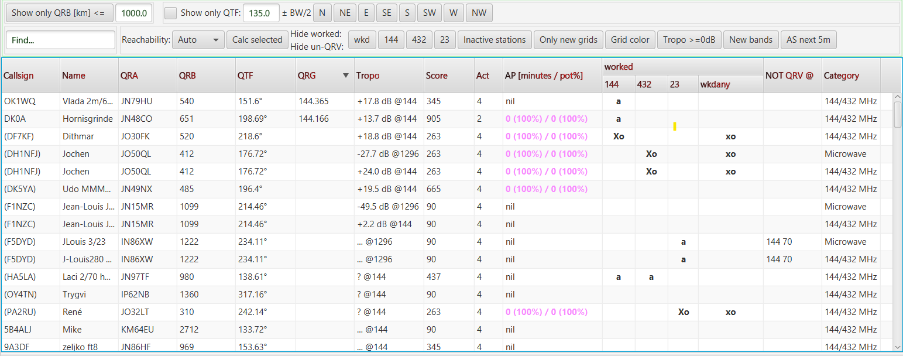

NOT-QRV ist eine manuelle Korrektur und hat deshalb Vorrang vor automatisch erkannten QRGs und Bandangaben im Namensfeld. Das betreffende Band wird nicht mehr als `a` oder `B+` angeboten, vom **New bands**-Filter nicht als Gelegenheit gewertet und von den zugehörigen Bandfiltern ausgeblendet.

Im Klartext: Ein erkannter Hinweis bedeutet „wahrscheinlich auf diesem Band aktiv“. Ein manuelles NOT-QRV-Tag bedeutet „für unsere weitere Auswahl nicht auf diesem Band anfragen“. Diese Entscheidung soll nicht durch die nächste erkannte Zahl wieder aufgehoben werden.

### Speicherung und Lebensdauer

Worked-, NOT-QRV- und Großfeldinformationen werden in der internen SQLite-Datenbank gespeichert und beim nächsten Start wieder geladen. Die Einträge laufen nach drei Tagen automatisch ab. Ein Reset vor jedem Contest ist deshalb normalerweise nicht erforderlich.

Ein manueller Reset unter **Workedstn database** entfernt sämtliche Worked-Markierungen, NOT-QRV-Tags und gespeicherten Worked-Großfelder. Die bekannten Rufzeichenzeilen bleiben dabei in der Datenbank erhalten. Einzelheiten: [Worked Station Database Settings](de-Konfiguration#worked-station-database-settings-gearbeitete-stationen-datenbank).

---

## Richtungsfilter (Direction Filter)

Zeigt in der Benutzerliste nur Stationen an, die sich in einer bestimmten Richtung befinden. Aktivierbar über die Buttons N / NE / E / SE / S / SW / W / NW oder durch manuelle Eingabe von Grad.

Sinnvoll: Während man CQ in eine bestimmte Richtung ruft, nur Stationen in dieser Richtung anzeigen.

---

## Entfernungsfilter (Distance Filter)

Stationen jenseits einer maximalen Entfernung ausblenden. Schaltfläche **„Show only QRB [km] <="** ist ein Toggle-Button.

---

## Filter für Worked-Status, neue Bänder und neue Großfelder

Die Filter oberhalb der Benutzerliste greifen auf dieselben Informationen zurück wie die Worked-Spalten:

- **wkd** blendet Rufzeichen aus, die auf mindestens einem Band gearbeitet wurden.
- Die einzelnen Band-Schaltflächen blenden Stationen aus, wenn das Rufzeichen auf diesem Band bereits gearbeitet oder für dieses Band manuell als NOT QRV markiert wurde.
- **New bands** zeigt nur Stationen, für die mindestens ein eigenes aktiviertes, noch nicht gearbeitetes Band bekannt ist. Berücksichtigt werden aktuelle QRG-Erkennungen und Bandangaben im Namensfeld; NOT-QRV hat Vorrang.
- **Only new grids** zeigt nur Stationen, deren vierstelliges Großfeld auf noch keinem Band gearbeitet wurde. Stationen ohne auswertbaren Locator erfüllen den Filter nicht.
- **Grid color** verändert die Liste nicht. Ist die Funktion aktiv, wird das QRA-Feld eines bereits gearbeiteten Großfelds dezent dunkler dargestellt. Neue Großfelder behalten die normale Tabellenfarbe.

Mehrere aktivierte Filter werden gemeinsam angewendet. Eine Station bleibt nur sichtbar, wenn sie alle gewählten Bedingungen erfüllt. Die Filter reagieren unmittelbar auf neue Logeinträge und geänderte NOT-QRV-Markierungen.

Bedienung und Aufbau der Filterleiste: [Benutzeroberfläche – Filter](de-Benutzeroberflaeche#filter-und-reachability-steuerung).

---

## Farbige PM-Zeilen (ab v1.25)

Neue eingehende Privatnachrichten werden in mehreren grünen Altersstufen hervorgehoben. Mit zunehmendem Alter wird das Grün schrittweise gedämpfter:

| Alter der Nachricht | Darstellung |
|---|---|
| bis einschließlich 30 Sekunden | erste grüne Stufe |
| 31 bis 60 Sekunden | zweite grüne Stufe |
| 61 bis 90 Sekunden | dritte grüne Stufe |
| 91 bis 120 Sekunden | vierte grüne Stufe |
| 121 bis 180 Sekunden | fünfte grüne Stufe |
| 181 bis 300 Sekunden | sechste grüne Stufe |
| ab 301 Sekunden | normale Tabellenfarbe |

Die Tabelle aktualisiert die Altersdarstellung alle fünf Sekunden. Ein Grenzübergang kann deshalb erst beim nächsten Aktualisierungslauf sichtbar werden. Nach fünf Minuten bleibt keine Altersklasse an der Zeile haften; auch wiederverwendete oder leere Tabellenzeilen kehren zu ihrem normalen Stil zurück.

Eigene Nachrichten erhalten weiterhin eine separate Hervorhebung und verwenden nicht die grüne Altersskala.

*(Idee von IU3OAR, Gianluca Costantino – danke!)*

---

## PM-Abfang (Catching Personal Messages, ab v1.1)

Manche Nutzer senden Direktnachrichten versehentlich öffentlich, z. B.:

```
(DM5M) pse ur qrg
```

KST4Contest sucht im Text aller nicht selbst gesendeten Nachrichten ohne Beachtung der Groß- und Kleinschreibung nach dem konfigurierten eigenen Login-Rufzeichen. Ein Treffer erscheint zusätzlich in der **Privatnachrichten-Tabelle**. Das gilt sowohl für öffentliche Nachrichten an `ALL` als auch für gerichtete Nachrichten zwischen anderen Chatteilnehmern.

Gerade bei einer fremden gerichteten Nachricht wirkt das etwas wie **„Lästererkennung“**. Das ist eine flapsige Nebenbezeichnung, kein formaler Funktionsname.

Die ursprüngliche Nachricht bleibt unverändert: Der tatsächliche Empfänger bleibt `ALL` beziehungsweise der andere Chatteilnehmer; auch Text, Chat-Kategorie und Routing bleiben erhalten. PM-Catching ergänzt nur eine weitere Ansicht derselben Nachricht.

Die Textsuche versteht keine Absicht. Ein Schreibfehler oder ein verkürztes Rufzeichen wird nicht erkannt. Umgekehrt kann eine bloße Erwähnung des vollständig geschriebenen Rufzeichens einen Treffer erzeugen, obwohl keine Antwort erwartet wird.

Wird eine eingehende Zeile in der PM-Tabelle ausgewählt, bereitet KST4Contest eine Antwort an ihren Absender vor. Bei einer eigenen ausgehenden Nachricht wird stattdessen der ursprüngliche Empfänger als Ziel wiederhergestellt. Die Auswahl versendet noch keine Nachricht.

Auch abgefangene Zeilen verwenden die normale Altersanzeige der PM-Tabelle. Sie lösen jedoch weder den einfachen PM-Hinweiston noch die CW- oder Sprachausgabe für ein eingehendes Rufzeichen aus. Dasselbe gilt für Nachrichten, die durch das QSO-Monitoring zusätzlich in der PM-Tabelle erscheinen.

---

## Automatische Antworten auf Privatnachrichten (ab v1.25)

Nicht jede im ON4KST-Chat eingeloggte Station nimmt am gerade laufenden Contest teil. Trotzdem werden Sked-Anfragen während größerer Contests teilweise unkoordiniert und in großer Zahl an erreichbare Rufzeichen verteilt. Ohne automatische Antwort müssten diese Stationen immer wieder von Hand erklären, dass sie nicht mitfunken oder keine Skeds fahren.

KST4Contest kann darauf mit einem vorher festgelegten Text reagieren. Die eingehende Privatnachricht bleibt dabei sichtbar; sie wird weder blockiert noch verworfen. Davon getrennt lässt sich eine QRG-Antwort aktivieren, die auf typische Fragen wie `qrg?`, `freq?` oder `pse qrg` reagiert.

Bei zwei gleichzeitig geöffneten Chat-Kategorien bleibt der Zusammenhang erhalten: Die Antwort wird an das vollständige Absenderrufzeichen und in der Kategorie der eingegangenen Nachricht gesendet. Eine QRG-Anfrage erhält außerdem nur die QRG dieser Kategorie und nicht eine Liste aller konfigurierten Frequenzen.

Fehlt die QRG der betreffenden Kategorie, sendet KST4Contest keine inhaltslose Auskunft. Auch ein leerer oder protokollwidriger allgemeiner Antworttext wird nicht in die Sendequeue übernommen.

Automatische Antworten benötigen Grenzen. KST4Contest versieht sie daher mit `[KST4C Automsg]`, ignoriert entsprechend gekennzeichnete Nachrichten und begrenzt weitere Antworten an dasselbe vollständige Rufzeichen in derselben Kategorie auf eine Nachricht innerhalb von zwei Minuten. Der Schutz gilt gemeinsam für die allgemeine und die QRG-bezogene Antwort.

Die Sperrzeit wird nur nach einer vollständigen und lokal gültigen Antwort gestartet. Eine fehlende QRG oder ein verworfener Antworttext verhindert daher keine spätere gültige Antwort.

Im Klartext: Die Funktion verhindert keine Massenanfragen. Sie verhindert aber, dass der Empfänger jede davon einzeln mit derselben Absage beantworten muss. Sie soll keine Unterhaltung simulieren und erst recht keine endlose Diskussion mit einem zweiten automatischen Client beginnen.

Konfiguration, erkannte QRG-Anfragen und genaue Kategorienzuordnung: [Konfiguration – Messagehandling Settings](de-Konfiguration#messagehandling-settings-ab-v125).

---


## Multi-Channel-Login (ab v1.26)

KST4Contest meldet sich mit einem lokalen Rufzeichen, Passwort und Locator einmal bei ON4KST an. Eine zweite Chat-Kategorie (z. B. 144 MHz und 432 MHz) wird per Single Sign-on innerhalb derselben TCP-Sitzung ergänzt. Beide Kategorien werden parallel überwacht; der eigene sichtbare Chat-Name, Nachrichtenkontext, QRG und Beacon bleiben je Kategorie getrennt.

---

## Dark Mode (ab v1.26)

Aktivierbar über **Windows → Use dark mode design**. Mit **Windows → Use default mode design** wird wieder auf das normale helle Farbschema umgeschaltet.

Die grüne Altersskala der Privatnachrichten bleibt in beiden Darstellungen erhalten. Textfarbe, normale Tabellenfarbe und die separate Hervorhebung eigener Nachrichten folgen dem jeweils geladenen Standarddesign.

---

## Opposite Station Multi-Callsign Login-Tagging (ab v1.26)

Unterstützung für Gegenstationen, die mit mehreren vollständigen Rufzeichen gleichzeitig im Chat aktiv sind (z. B. Expedition-Setups). Vollständiges Rufzeichen und Chat-Kategorie bleiben getrennte Teilnehmeridentitäten; Worked-, Band- und Prioritätsdaten werden über das Basisrufzeichen gemeinsam ausgewertet.

---

## QRZ.com und QRZ-CQ Profil-Buttons (ab v1.24)

Für ausgewählte Stationen in der Benutzerliste gibt es direkte Buttons, um das **QRZ.com-Profil** und das **QRZ-CQ-Profil** im Browser zu öffnen.

---

## Skeds und Sked-Erinnerungen

> Verfügbar ab v1.40; Band-, Rufzeichen- und Win-Test-Behandlung erweitert in v1.42.

Ein Sked ist mehr als eine Erinnerung an eine Uhrzeit. Er muss während des laufenden Contestbetriebs rechtzeitig sichtbar werden, die vereinbarte Station priorisieren und – sofern gewünscht – die Gegenstation noch einmal an den Termin erinnern.

KST4Contest behandelt deshalb drei voneinander unabhängige Aufgaben:

1. Der Sked wird intern gespeichert und in die Prioritätsberechnung einbezogen.
2. Der Termin erscheint in der AP- und Sked-Timeline.
3. Optional werden vor dem Termin automatische Privatnachrichten gesendet.

Ist der Win-Test-Netzwerk-Listener aktiviert, versucht KST4Contest zusätzlich, den Sked an Win-Test zu übergeben. Ein Problem bei dieser Übergabe löscht oder verhindert den internen Sked nicht.

### Sked anlegen

Zuerst die gewünschte Station in der Benutzerliste auswählen. Die Bedienelemente befinden sich anschließend unten im Bereich **Further Info**.

| Bedienelement | Funktion |
|---|---|
| **Sked in** | Legt fest, in wie vielen Minuten der Sked stattfinden soll. Verfügbar sind 2 bis 15 sowie 20 Minuten. |
| **Band** | Wählt das Band des Skeds. Angeboten werden die unter **Station → my station uses …** aktivierten eigenen Bänder. |
| **Mode** | Legt den an Win-Test zu übertragenden Mode fest. Verfügbar sind `SSB` und `CW`. Die Auswahl hat keinen Einfluss auf den internen Sked oder die Reminder-PMs. |
| **Create sked** | Legt den internen Sked an und versucht bei aktiviertem Win-Test-Netzwerk-Listener zusätzlich die Übergabe an Win-Test. |
| **Remind-PM in** | Aktiviert die automatischen Privatnachrichten vor dem Termin. |
| **2+1**, **5+2+1**, **10+5+2+1** | Legt fest, wie viele Minuten vor dem Sked die Reminder-PMs gesendet werden. |

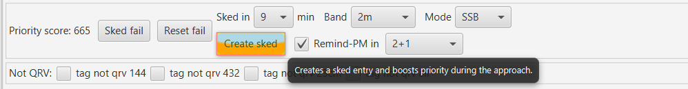

KST4Contest versucht, ein sinnvolles Band vorzuwählen. Dafür werden nacheinander folgende Informationen verwendet:

1. eine höchstens 30 Minuten alte QRG der ausgewählten Station auf einem eigenen aktivierten Band,
2. eine eindeutige Bandangabe im Namensfeld der Station und
3. das erste aktivierte eigene Band.

Aktive Rufzeichenvarianten desselben Basisrufzeichens werden bei der Suche nach einer aktuellen Bandinformation gemeinsam betrachtet. Eine manuelle NOT-QRV-Markierung wird bei der automatischen Vorauswahl berücksichtigt. Das Band kann trotzdem ausdrücklich geändert werden, wenn der Operator bewusst eine andere Vereinbarung getroffen hat.

### Auswirkung auf den Priority Score

Ein eingetragener Sked erhöht den Score des normalisierten Basisrufzeichens:

| Zeitraum | Sked-Anteil am Score |
|---|---:|
| mehr als 15 Minuten vor dem Termin | `+40` |
| 15 bis 3 Minuten vor dem Termin | kontinuierlicher Anstieg von `+300` bis in Richtung `+1200` |
| weniger als 3 Minuten vor bis 1 Minute nach dem Termin | `+5000` |
| später als 1 Minute nach dem Termin | kein Sked-Boost mehr |

Die starke Gewichtung unmittelbar vor dem Termin ist beabsichtigt. Ein vereinbarter Sked soll dann nicht durch eine gerade sehr aktive, aber nicht fest eingeplante Station aus der Prioritätsliste verdrängt werden.

Der Score wird für das Basisrufzeichen berechnet. Ein Sked mit `DN9APW-2` beeinflusst daher auch den gemeinsamen Score weiterer aktiver Varianten von `DN9APW`. Das konkrete Nachrichtenziel bleibt trotzdem `DN9APW-2` in der beim Anlegen ausgewählten Chat-Kategorie.

Fünf Minuten nach dem Termin wird der Sked aus der internen Liste entfernt.

### Reminder-PMs

Reminder-PMs werden nur angelegt, wenn **Remind-PM in** aktiviert ist. Je nach ausgewähltem Muster sendet KST4Contest beispielsweise zwei und eine Minute vor dem Sked folgende Privatnachricht:

```text
[KST4C Autoreminder] sked in 2 min
```

Die Nachricht geht an das vollständige sichtbare KST-Rufzeichen und in die Chat-Kategorie, in der der Sked angelegt wurde. Ein Sked für `DN9APW-2` wird daher nicht versehentlich an `DN9APW`, `DN9APW-70` oder eine gleichnamige Station in einer anderen Kategorie gesendet.

Beim tatsächlichen Reminder zeigt KST4Contest zusätzlich den optischen **SKED**-Hinweis an. Ist die einfache Soundausgabe aktiviert, wird außerdem ein Hinweiston abgespielt. Das bloße Aktivieren des Reminders löst noch kein Blinken aus.

Wird für dasselbe vollständige Rufzeichen ein neuer Satz Reminder aktiviert, ersetzt dieser die zuvor geplanten Reminder dieses Rufzeichens.

### Speicherung und Grenzen

Skeds und Reminder-Zeitpläne werden nur im Arbeitsspeicher geführt. Nach einem Neustart von KST4Contest müssen noch benötigte Termine erneut angelegt werden.

Die automatische Bandvorauswahl ist eine Herleitung aus vorhandenen Chatinformationen. Sie beweist nicht, dass die Station noch auf der zuletzt genannten QRG arbeitet. Band, Uhrzeit und Mode sollten deshalb vor **Create sked** kontrolliert werden.

Bedienung: [Stationsinfo-Panel](de-Benutzeroberflaeche#stationsinfo-panel-further-info)

Darstellung: [AP- und Sked-Timeline](#ap--und-sked-timeline)

Win-Test-Übergabe: [Log-Synchronisation – Win-Test](de-Log-Synchronisation#win-test)


## QSO-Monitoring (ab v1.31)

Während eines Contests kann es sinnvoll sein, die Kommunikation einer bestimmten Station zu verfolgen. Das betrifft nicht nur seltene Stationen oder DXpeditionen. Auch die Sked-Absprachen einer anderen Station des eigenen Teams können im öffentlichen Nachrichtenaufkommen schnell übersehen werden.

KST4Contest kann deshalb alle Nachrichten, die eine überwachte Station sendet oder empfängt, zusätzlich in der PM-Tabelle anzeigen. Die Nachricht bleibt gleichzeitig in ihrer ursprünglichen Tabelle erhalten.

Die Überwachung arbeitet mit dem normalisierten Basisrufzeichen. Ein Eintrag für `DN9APW` erfasst daher auch Nachrichten von oder an:

```text
DN9APW-2
DN9APW-70
DN9APW-144
DN9APW-432
```

Auch wenn `DN9APW-70` in die Monitoring-Liste eingegeben wird, speichert KST4Contest nur `DN9APW`. Eine Station mit mehreren band- oder arbeitsplatzbezogenen KST-Suffixen muss dadurch nur einmal eingetragen werden.

Die eigentliche Nachricht behält trotzdem die vollständigen Rufzeichen:

```text
Sniffed: (DN9APW-70 > 9A0BB-23) pse sked 19:30
```

Das ist ein wichtiger Unterschied. Das Monitoring fasst die Varianten zusammen, damit keine Nachricht übersehen wird. Das Nachrichtenrouting fasst sie nicht zusammen, weil andernfalls nicht mehr eindeutig wäre, welcher Login tatsächlich angesprochen wurde.

Das Basisrufzeichen wird außerdem unabhängig von der Chat-Kategorie ausgewertet. Sind in derselben ON4KST-Sitzung zwei Kategorien aktiv, gilt derselbe Monitoring-Eintrag für beide Nachrichtenströme. Die Kategorie der einzelnen Nachricht bleibt dabei erhalten.

Erfasst werden:

- gerichtete Nachrichten, die eine überwachte Station sendet,
- gerichtete Nachrichten an eine überwachte Station und
- öffentliche Nachrichten, die eine überwachte Station an `ALL` sendet.

Eine bloße Nennung des Rufzeichens im Nachrichtentext löst das Monitoring nicht aus.

Nachrichten, die bereits direkt an das eigene Rufzeichen gerichtet sind, erscheinen als normale Privatnachrichten. Sie werden nicht zusätzlich als `Sniffed:` gekennzeichnet. Das QSO-Monitoring erzeugt außerdem keinen eigenen Hinweiston. Die akustische Benachrichtigung für tatsächlich an die eigene Station gerichtete Privatnachrichten bleibt davon unabhängig.

Die Funktion fordert keine zusätzlichen Nachrichten vom ON4KST-Server an. Sie ordnet lediglich den bereits empfangenen Chatverkehr zusätzlich in die PM-Ansicht ein.

Im Klartext: Das QSO-Monitoring entscheidet nicht, ob eine Nachricht tatsächlich einen Sked enthält oder für den eigenen Contestbetrieb relevant ist. Es sorgt lediglich dafür, dass die Kommunikation der ausgewählten Station nicht zwischen den übrigen Nachrichten verschwindet.

Konfiguration: [Konfiguration – Sniffer-Einstellungen](de-Konfiguration#sniffer-einstellungen-ab-v131)

Trennung vollständiger Rufzeichen und Chat-Kategorien: [Multi-Channel-Login und Rufzeichenvarianten](#multi-channel-login-ab-v126)

---

## Win-Test-Integration

KST4Contest verwendet für Win-Test einen eigenen Listener für das native Win-Test-Netzwerkprotokoll. Darüber werden drei voneinander getrennte Funktionen bereitgestellt:

- neue QSOs einschließlich Band- und gegebenenfalls Locatorinformation übernehmen,
- die aktuelle QRG aus Win-Test-STATUS-Paketen auswerten und
- intern angelegte Skeds als `ADDSKED` an das Win-Test-Netzwerk übergeben.

Bei der Sked-Übergabe wird die QRG nicht durch eine feste Standardfrequenz ersetzt. KST4Contest sendet nur dann einen Win-Test-Sked, wenn eine zum ausgewählten Band passende QRG ermittelt werden konnte. Der interne Sked, die Timeline und die Reminder-PMs funktionieren unabhängig davon weiter.

Ein sichtbarer KST-Suffix wie `-2`, `-70` oder `-144` bleibt innerhalb von KST4Contest erhalten, wird für das Win-Test-Logrufzeichen jedoch entfernt. Portable Bestandteile wie `/P`, `/M` oder ein Länderpräfix bleiben bestehen.

Einrichtung und genaue Datenbehandlung: [Log-Synchronisation – Win-Test](de-Log-Synchronisation#win-test)

Einstellungen: [Win-Test-Netzwerk-Listener](de-Konfiguration#win-test-netzwerk-listener-ab-v131)


## PSTRotator-Interface (ab v1.31, vollständig konfigurierbar ab v1.40)

KST4Contest kann die Antenne über die UDP-Schnittstelle von PSTRotator auf die ausgewählte Gegenstation drehen. Der dafür verwendete Azimut wird aus dem eigenen und dem fremden Locator berechnet.

Nach der Auswahl einer Station steht im **Further Info**-Bereich der Button **Turn ant1 to …** zur Verfügung:

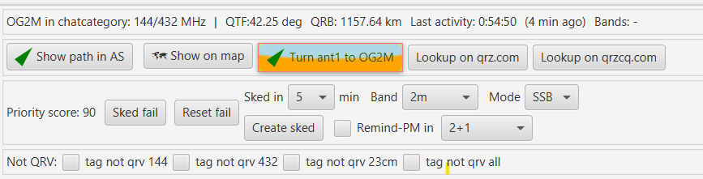

Ein Klick führt folgende Schritte aus:

1. KST4Contest beendet den Tracking-Modus von PSTRotator.
2. Der QTF der ausgewählten Station wird als ganzzahliger Azimut übertragen.
3. PSTRotator steuert den konfigurierten Rotator.
4. Die zurückgemeldete Position wird als aktuelle QTF in KST4Contest übernommen.

Der Button bleibt auch sichtbar, wenn die PSTRotator-Integration deaktiviert ist. In diesem Fall wird kein Rotatorbefehl gesendet.

### Rückmeldung und SPID-Kompatibilität

KST4Contest fragt die aktuelle Azimutposition alle zwei Sekunden ab. Die Rückmeldung aktualisiert das eigene QTF-Feld und damit alle Funktionen, die von der Antennenrichtung abhängen.

Einige SPID-Konfigurationen übernehmen den ersten Richtungsbefehl gelegentlich nicht. KST4Contest prüft deshalb zwei Sekunden nach dem Befehl, ob PSTRotator eine Bewegung beziehungsweise das Erreichen des Ziels gemeldet hat.

Ist die Position unverändert und wurde das Ziel nicht erreicht, sendet KST4Contest einmalig eine Kompatibilitätssequenz über `0°` und anschließend erneut den eigentlichen Zielwert.

Diese Prüfung läuft im Hintergrund. Die Benutzeroberfläche bleibt während der zwei Sekunden bedienbar. Wird zwischenzeitlich ein neuer Drehbefehl ausgelöst, ersetzt er die noch ausstehende Prüfung des vorherigen Befehls.

### Was bestätigt die Positionsanzeige?

Die angezeigte QTF ist die von PSTRotator gemeldete Azimutposition. Sie bestätigt, dass KST4Contest eine auswertbare UDP-Rückmeldung erhalten hat.

Sie beweist nicht in jedem Aufbau, dass die Antenne mechanisch exakt in dieser Richtung steht. Das hängt von PSTRotator, dem angeschlossenen Controller, der Kalibrierung, möglichen Offsets und der tatsächlichen Rückmeldung des Rotors ab.

UDP selbst bestätigt außerdem keine Paketzustellung. Bleibt die QTF unverändert, sollten daher zuerst folgende Punkte geprüft werden:

- **UDP Control** ist in PSTRotator aktiviert.
- Host und Steuerport stimmen überein.
- Der Rückmeldeport `Steuerport + 1` ist frei.
- Die Firewall lässt beide UDP-Richtungen zu.
- PSTRotator zeigt selbst eine plausible Rotorposition an.

Im Klartext: KST4Contest liefert die Zielrichtung und verarbeitet die gemeldete Position. Die mechanische Realität bleibt Aufgabe des Rotators – und gelegentlich der Blick aus dem Fenster.

Konfiguration und Portbelegung: [Konfiguration – PSTRotator-Einstellungen](de-Konfiguration#pstrotator-einstellungen-ab-v131-vollstaendig-konfigurierbar-ab-v140).

---


## Band-Upgrade-Hinweis nach einem Logeintrag

Meldet UCXLog oder Win-Test einen neuen Logeintrag mit Bandinformation, prüft KST4Contest, ob die gearbeitete Station noch ein weiteres gemeinsames Band anbietet.

Die Herleitung verwendet dieselben Regeln wie `a`, `B+` und der Filter **New bands**: aktivierte eigene Bänder, aktuelle QRG-Erkennungen, Bandangaben im Namensfeld, bandbezogene Worked-Markierungen und NOT-QRV-Tags. Ausgewertet werden die aktiven Chat-Varianten desselben normalisierten Rufzeichens.

Bleibt mindestens ein gemeinsames, noch nicht gearbeitetes Band übrig, erscheint für ungefähr zwölf Sekunden ein blinkender Hinweis mit Rufzeichen und den betreffenden Bändern, beispielsweise `BAND+ DL0ABC 432, 1296`. Der Tooltip zeigt zusätzlich die bei der Entscheidung berücksichtigten aktivierten, gearbeiteten und als NOT QRV markierten Bänder. Ist die allgemeine Soundausgabe eingeschaltet, wird außerdem ein kurzer Hinweiston abgespielt.

Der einfache Simplelogfile-Interpreter kann diesen Hinweis nicht zuverlässig auslösen, weil er keine Bandinformation für das gerade geloggte QSO liefert.

Konfiguration: [Band-Upgrade-Hinweis nach einem Logeintrag](de-Konfiguration#band-upgrade-hinweis-nach-einem-logeintrag).

Worked-, NOT-QRV- und Großfelddaten laufen nach drei Tagen automatisch ab. Einzelheiten und manueller Reset: [Worked Station Database Settings](de-Konfiguration#worked-station-database-settings-gearbeitete-stationen-datenbank).

---
## Prioritätsscore und Prioritätsliste (ab v1.40)

### Warum wird überhaupt ein Score benötigt?

Eine klassische Chat-Benutzerliste zeigt zunächst nur, welche Stationen gerade eingeloggt sind. Im Contestbetrieb reicht diese Information nicht aus. Der Operator muss zusätzlich abschätzen, welche Station noch nicht gearbeitet wurde, auf welchem Band ein QSO möglich sein könnte, wohin die Antenne zeigt, ob ein passendes Flugzeug verfügbar ist und ob ein vereinbarter Sked unmittelbar bevorsteht.

Bei einer kurzen Liste lässt sich das noch im Kopf erledigen. Mit zunehmender Contestdauer, mehreren Bändern und zwei gleichzeitig verwendeten Chat-Kategorien wird daraus jedoch eine ständig wiederholte Entscheidung.

KST4Contest führt die bereits vorhandenen Informationen deshalb in einem Prioritätsscore zusammen. Der Score beantwortet nicht die Frage, ob ein QSO sicher möglich ist. Er hilft bei der praktisch wichtigeren Frage:

> Welche der aktuell sichtbaren Stationen sollte ich mir als Nächstes ansehen?

### Wann wird eine Station ausgeschlossen?

Vor der eigentlichen Gewichtung prüft KST4Contest, ob überhaupt eine bekannte Bandmöglichkeit besteht. Dafür werden alle aktiven Chat-Einträge desselben normalisierten Basisrufzeichens gemeinsam ausgewertet.

Berücksichtigt werden:

1. die in den Stationseinstellungen aktivierten eigenen Bänder,
2. höchstens 30 Minuten alte QRG-Erkennungen der Gegenstation,
3. eindeutige Bandangaben im Namensfeld ihrer aktiven Chat-Einträge,
4. die pro Band gespeicherten Worked-Markierungen und
5. manuell gesetzte NOT-QRV-Tags.

NOT QRV hat dabei Vorrang vor automatisch erkannten Frequenzen oder Bandangaben.

Sind Bänder der Gegenstation bekannt, aber keines davon ist lokal aktiviert und noch verfügbar, erhält die Station einen Score von `0`. Dasselbe gilt, wenn alle gemeinsam möglichen Bänder bereits gearbeitet wurden.

Fehlen dagegen sämtliche Bandinformationen, wird die Station nicht allein deshalb ausgeschlossen. Eine unbekannte Bandmöglichkeit ist nicht dasselbe wie eine nachweislich unmögliche Bandmöglichkeit. Erst wenn alle eigenen aktivierten Bänder für die Station manuell als NOT QRV markiert wurden, ist auch in diesem Fall keine aktuelle Contestmöglichkeit mehr vorhanden.

Stationen mit einem Score von `0` bleiben in der Benutzerliste sichtbar, erscheinen aber nicht in der Prioritätsliste.

### Welche Informationen erhöhen oder verringern den Score?

Der Score entsteht aus mehreren voneinander unabhängigen Hinweisen. Ein einzelnes Kriterium entscheidet daher normalerweise nicht über den endgültigen Listenplatz.

| Faktor | Wirkung auf die Priorisierung |
|---|---|
| Worked-Status | Ein noch auf keinem unterstützten Band gearbeitetes Rufzeichen erhält eine höhere Ausgangspriorität. Bereits gearbeitete Stationen werden niedriger bewertet, bleiben bei offenen Bandmöglichkeiten aber Kandidaten. |
| Verfügbare Bänder | Mehrere gemeinsam nutzbare und noch nicht gearbeitete Bänder erhöhen die Priorität. Optional kann für Band-Upgrades ein zusätzlicher Boost aktiviert werden. |
| Entfernung | Entfernungen unter 200 km werden niedriger gewichtet. Der Bereich zwischen 200 km und dem konfigurierten maximalen QRB wird bevorzugt. Stationen jenseits des maximalen QRB werden deutlich herabgestuft. Fehlt der QRB, entfällt dieser Faktor. |
| Antennenrichtung | Liegt der QTF zur Gegenstation innerhalb der Hälfte des konfigurierten Antennen-Öffnungswinkels um den aktuellen eigenen QTF, steigt der Score. Je näher die Richtungen zusammenliegen, desto stärker wirkt der Hinweis. |
| AirScout | Mindestens ein aktuell erreichbares Flugzeug erhöht den Score. Eine erwartete AP-Gelegenheit in null, einer oder zwei Minuten wird zusätzlich zeitlich gewichtet. |
| Aktuelle Chat-Aktivität | Eine Nachricht innerhalb der letzten Minute wirkt stärker als eine Nachricht innerhalb der letzten drei Minuten. Mehrere eingehende Zeilen innerhalb des Aktivitätsfensters erhöhen den Score zusätzlich. |
| Positive Signale | Erkannte Angaben wie `QRV`, `READY`, `RGR`, `OK`, `TNX` oder vergleichbare konfigurierte Textmuster werden für einige Minuten als positiver Hinweis berücksichtigt. |
| Antwortverhalten | Reagiert eine Station nach einer eigenen `/cq`-Nachricht schnell mit einer weiteren sichtbaren Chat-Zeile, wirkt sich die gemittelte Reaktionszeit positiv aus. Bleibt eine solche Zeile aus, entsteht nach dem konfigurierten Timeout eine negative Bewertung. |
| Skeds | Ein eingetragener Sked erhöht die Priorität zunächst leicht. Innerhalb der letzten 15 Minuten vor dem Termin steigt der Einfluss kontinuierlich an. Zwischen drei Minuten vor und einer Minute nach dem Termin erhält der Sked eine sehr hohe Priorität. |
| Fehlgeschlagener Versuch | **Sked fail** reduziert den Score der Station stark, bis die Markierung mit **Reset fail** zurückgesetzt oder KST4Contest neu gestartet wird. |

Das standardmäßige Aktivitätsfenster für die Anzahl eingehender Nachrichten beträgt 180 Sekunden. Eine aktuelle Nachricht innerhalb der letzten 60 Sekunden wird noch einmal gesondert bewertet. Der standardmäßige No-Reply-Timeout beträgt 13 Minuten.

Beim Antwortverhalten kann KST4Contest nicht sicher feststellen, ob eine nachfolgende öffentliche oder private Nachricht tatsächlich die Antwort auf die eigene Anfrage war. Jede anschließend empfangene Zeile derselben Station beendet deshalb den laufenden Antwortzeitversuch. Der Wert ist eine praktische Näherung und keine statistisch belastbare Antwortquote.

### Was bedeutet ein eingetragener Sked?

Ein Sked ist eine zeitlich vereinbarte Arbeitsaufgabe. Deshalb übersteuert ein unmittelbar bevorstehender Sked die meisten normalen Aktivitäts- und Entfernungshinweise. Ohne diese Gewichtung könnte eine gerade sehr aktive Station einen vereinbarten Termin aus der Prioritätsliste verdrängen.

Der starke Sked-Boost ist absichtlich auf den Zeitraum von drei Minuten vor bis eine Minute nach dem eingetragenen Termin begrenzt. Ein weiter in der Zukunft liegender Sked bleibt sichtbar, soll den laufenden Betrieb aber noch nicht dominieren.

Die Bewertung wird für das normalisierte Basisrufzeichen vorgenommen. Ein Sked für eine aktive Variante wie `9A0BB-23` beeinflusst daher den gemeinsamen Score der zu `9A0BB` gehörenden Chat-Einträge.

### Wie werden mehrere SSIDs und Chat-Kategorien behandelt?

Aktive Rufzeichen wie `9A0BB-2`, `9A0BB-70`, `9A0BB-23` und `9A0BB-13` bleiben getrennte Chatmember. Dadurch können Nachrichten weiterhin an das vollständige Rufzeichen und die richtige Chat-Kategorie adressiert werden.

Worked-, Band-, NOT-QRV- und Score-Informationen beziehen sich dagegen auf das gemeinsame Basisrufzeichen `9A0BB`. Der Score wird deshalb einmal berechnet und auf alle aktiven Varianten übertragen. Die Benutzerliste kann mehrere getrennte Zeilen mit demselben Score enthalten; in der Prioritätsliste erscheint das Basisrufzeichen nur einmal.

Als konkretes Nachrichtenziel verwendet KST4Contest den zuletzt passenden aktiven Login in der zuletzt verwendeten Chat-Kategorie. Beim Anklicken eines Kandidaten wird anschließend das vollständige Rufzeichen einschließlich Suffix und Kategorie ausgewählt.

### Aktualisierung und Anzeige

Änderungen durch neue Nachrichten, AirScout-Daten, Skeds, Worked-Informationen oder manuelle NOT-QRV- und Sked-fail-Markierungen fordern unmittelbar eine Neuberechnung an. Zusätzlich wird der Score regelmäßig im Hintergrund aktualisiert, weil Aktivitäts-, AP- und Sked-Informationen auch ohne neues Ereignis altern.

Eine kurze Verzögerung von einigen Sekunden zwischen einem Ereignis und der sichtbaren neuen Reihenfolge ist daher normal.

Die Benutzeroberfläche zeigt den Score an drei Stellen:

- als numerisch sortierbare Spalte **Score** in der Benutzerliste,
- für die ausgewählte Station im Bereich **Further Info** und
- als kompakte Liste der beiden derzeit höchstbewerteten Kandidaten mit einem zusätzlichen Fenster für bis zu 15 Kandidaten.

Bedienung: [Prioritätsliste in der Benutzeroberfläche](de-Benutzeroberflaeche#prioritätsliste).

### Was sagt der Score nicht aus?

Der Zahlenwert ist weder eine Erfolgswahrscheinlichkeit noch eine Signalprognose. Ein doppelt so hoher Score bedeutet nicht, dass ein QSO doppelt so wahrscheinlich ist.

Die Berechnung kennt unter anderem nicht:

- die tatsächliche Antennenrichtung der Gegenstation,
- deren momentane Betriebssituation,
- lokale Störungen,
- kurzfristige Ausbreitungsänderungen,
- Geländeabschattungen außerhalb der jeweils angebundenen Funktionen oder
- die Frage, ob eine im Chat aktive Station tatsächlich gerade am Funkgerät sitzt.

Auch bekannte Eingabedaten können veraltet oder missverständlich sein. Eine erkannte Frequenz belegt beispielsweise nur, dass diese QRG kürzlich im Zusammenhang mit der Station aufgetreten ist.

Im Klartext: Der Score ersetzt nicht die Entscheidung des Operators. Er sorgt dafür, dass die dafür bereits vorhandenen Informationen nicht bei jedem Kandidaten erneut im Kopf zusammengesucht werden müssen.

Zugehörige Einstellungen:

- [Aktivierte Bänder](de-Konfiguration#aktivierte-bänder)
- [Antennen-Öffnungswinkel](de-Konfiguration#antennen-öffnungswinkel-antenna-beamwidth)
- [Standard-Maximum-QRB](de-Konfiguration#standard-maximum-qrb)
- [AirScout-Einstellungen](de-Konfiguration#airscout-einstellungen)
- [Band-Upgrade-Hinweis und Priority Boost](de-Konfiguration#band-upgrade-hinweis-nach-einem-logeintrag)

---

## AP- und Sked-Timeline

Die Timeline stellt bevorstehende Aircraft-Scatter-Gelegenheiten und eingetragene Skeds für die nächsten 30 Minuten gemeinsam dar. Sie beantwortet damit zwei Fragen auf einen Blick:

- Wann entsteht voraussichtlich eine interessante AP-Gelegenheit?
- Welcher bereits vereinbarte Sked nähert sich unabhängig davon?

Weiter in der Zukunft liegende Ereignisse erscheinen rechts. Mit ablaufender Zeit wandern sie nach links in Richtung des aktuellen Zeitpunkts.

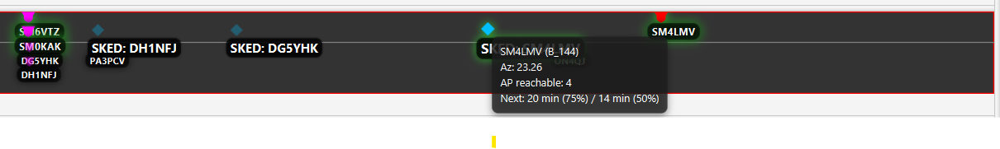

### AP-Kandidaten

AP-Kandidaten erscheinen in den oberen Spuren. Pro Ankunftsminute können bis zu vier ausgewählte Kandidaten dargestellt werden. Die Auswahl berücksichtigt den Priority Score und das von AirScout gemeldete Reflexionspotenzial.

Die Farbe des AP-Symbols kennzeichnet das Reflexionspotenzial:

| Farbe | Reflexionspotenzial |
|---|---:|
| Magenta | mindestens 95 % |
| Rot | mindestens 75 % |
| Gelb | mindestens 50 % |
| Blau | unter 50 % |

Die Farbe ist keine QSO-Wahrscheinlichkeit. Sie gibt den von AirScout übernommenen Wert für die berechnete Reflexionsgeometrie wieder.

Ein Klick auf einen AP-Kandidaten wählt den dazugehörigen aktiven Chatmember einschließlich Rufzeichensuffix und Chat-Kategorie aus. Dadurch kann unmittelbar eine passende Nachricht vorbereitet werden.

### Skeds

Skeds erscheinen als Rauten in der unteren Spur. Die Beschriftung verwendet das vollständige KST-Rufzeichen, beispielsweise `SKED: DN9APW-2`. Dadurch bleibt erkennbar, welcher konkrete Login für den Termin ausgewählt wurde.

Der Tooltip eines Skeds zeigt mindestens:

- das vollständige KST-Rufzeichen,
- das vereinbarte Band und
- den QTF zur Gegenstation.

Sind passende AirScout-Daten vorhanden, werden zusätzlich die aktuelle AP-Erreichbarkeit und die nächste berechnete AP-Gelegenheit angezeigt.

### Berücksichtigung der Antennenrichtung

Liegt der QTF eines Ereignisses deutlich außerhalb der aktuellen Antennenrichtung, wird dessen Symbol transparenter dargestellt. Die Beschriftung bleibt lesbar. Liegt das Ziel nahe der Mitte des konfigurierten Antennenbereichs, wird das Symbol zusätzlich hervorgehoben.

Diese Darstellung verändert weder den Sked noch den Priority Score. Sie ist eine optische Hilfe, um Kandidaten in der aktuellen Antennenrichtung schneller zu erkennen.

Die Timeline ist eine Vorschau. AirScout-Daten können sich ändern, und ein eingetragener Sked garantiert weder eine freie Frequenz noch eine tatsächlich vorhandene Ausbreitungsverbindung.

## Intervall-Beacon

KST4Contest kann wiederkehrende CQ-Nachrichten in den öffentlichen Chat senden. Der Beacon ist für längeres CQ-Rufen auf einer festen Frequenz gedacht: Die eigene QRG wird regelmäßig veröffentlicht, ohne dass derselbe Text von Hand wiederholt werden muss.

Beide Chat-Kategorien verwenden ein gemeinsames Intervall, besitzen aber jeweils einen eigenen Aktivierungsschalter und Nachrichtentext. Der zweite Beacon wird nur gesendet, wenn die zweite Kategorie in derselben ON4KST-Sitzung aktiviert und vollständig synchronisiert ist.

Globale Variablen wie `MYQRG`, `SECONDQRG`, `MYLOCATOR` oder `MYQTF` werden unmittelbar vor jeder Aussendung neu aufgelöst. Eine zwischenzeitlich vom Logprogramm aktualisierte QRG kann dadurch bereits im nächsten Beacon erscheinen.

Vor dem Versand prüft KST4Contest den vollständig aufgelösten Nachrichtentext. Leere Nachrichten, Zeilenumbrüche, das Protokoll-Trennzeichen `|` und Texte mit mehr als 120 Zeichen werden nicht gesendet.

Beim Absuchen oder häufigen Wechseln der QRG sollte der Beacon ausgeschaltet werden. Eine automatisch verbreitete Frequenz ist nur dann hilfreich, wenn dort tatsächlich jemand hört und ruft.

Konfiguration, Timer-Verhalten und verfügbare Variablen: [Konfiguration – Beacon Settings](de-Konfiguration#beacon-settings-automatischer-beacon).

---


## Simplelogfile

Details: [Log-Synchronisation](de-Log-Synchronisation#methode-1-universal-file-based-callsign-interpreter-simplelogfile).

---

## Globale Nachrichtenansichten

Das Stationsinfo-Panel und die PM-Tabelle beantworten Fragen zu einer bestimmten Station oder zur eigenen Kommunikation. Daneben gibt es Nachrichtenströme, die unabhängig von der aktuell ausgewählten Station betrachtet werden müssen.

KST4Contest fasst diese globalen Informationen in drei Ansichten zusammen:

| Ansicht | Inhalt |
|---|---|
| **Public messages** | Öffentliche Chatnachrichten, CQ-Rufe und Beacons |
| **DXCluster messages** | Vom ON4KST-Server gelieferte DX-Cluster-Meldungen |
| **QSO of the other** | Gerichtete Chatnachrichten zwischen zwei anderen Stationen |

Die Ansichten befinden sich als Tabs im unteren Bereich des Hauptfensters. **Public messages** ist nach dem Programmstart vorausgewählt.

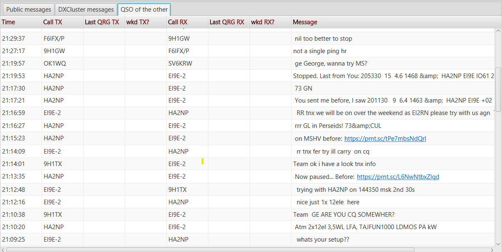

### DXCluster messages

Der Tab **DXCluster messages** zeigt DX-Cluster-Meldungen, die über die bestehende ON4KST-Verbindung empfangen werden. Je nach Inhalt der Meldung stehen folgende Informationen zur Verfügung:

- Zeitpunkt,
- sendende beziehungsweise meldende Station,
- deren Locator,
- gemeldete Station,
- deren Locator,
- QRG,
- Meldungstext und
- globaler Worked-Status der gemeldeten Station.

Nicht jede vom Server übertragene Meldung enthält alle Felder. Ein leeres Locator- oder Nachrichtenfeld bedeutet deshalb nicht zwangsläufig einen Verarbeitungsfehler.

Diese Anzeige darf nicht mit dem [integrierten lokalen DX-Cluster-Server](de-DX-Cluster-Server) verwechselt werden. Der Tab zeigt empfangene ON4KST-Clusterinformationen. Der lokale Server erzeugt dagegen aus einer erkannten Richtungsgelegenheit einen Spot und gibt ihn an ein verbundenes Logprogramm weiter.

### QSO of the other

Der Tab **QSO of the other** zeigt gerichtete Chatnachrichten, bei denen weder Absender noch Empfänger die eigene Station sind. Öffentliche Nachrichten an `ALL` werden nicht aufgenommen.

Die Tabelle enthält:

| Spalte | Bedeutung |
|---|---|
| **Time** | Zeitpunkt der Chatnachricht |
| **Call TX** | Absender der Nachricht |
| **Last QRG TX** | zuletzt für den Absender bekannte QRG |
| **wkd TX?** | globaler Worked-Status des Absenders |
| **Call RX** | Empfänger der Nachricht |
| **Last QRG RX** | zuletzt für den Empfänger bekannte QRG |
| **wkd RX?** | globaler Worked-Status des Empfängers |
| **Message** | Inhalt der gerichteten Nachricht |
| **Category** | Chat-Kategorie der Nachricht |

Die beiden QRG-Spalten zeigen den zuletzt in KST4Contest bekannten Wert der jeweiligen Station. Das ist nicht zwangsläufig die Frequenz, auf der sich die beiden Stationen gerade verabreden. Die QRG kann aus einer früheren Nachricht stammen und sich inzwischen geändert haben.

Auch die Worked-Spalten sind bewusst bandunabhängig. Ein `X` bedeutet, dass das betreffende Basisrufzeichen auf mindestens einem Band gearbeitet wurde. Daraus folgt nicht, dass es auf der in der Tabelle sichtbaren oder vermuteten QRG bereits gearbeitet wurde.

Die Bezeichnung **QSO of the other** ist eine praktische Kurzform. Eine gerichtete Nachricht beweist weder, dass anschließend ein Funkkontakt zustande kam, noch dass beide Stationen tatsächlich auf derselben Frequenz arbeiten. Die Ansicht zeigt beobachtbare Koordination im Chat – nicht das Logbuch der anderen Stationen.

### Zusätzliches Monitorfenster

Dieselben DX-Cluster-Meldungen und gerichteten Nachrichten stehen weiterhin im separaten Fenster **Cluster & QSO of the other** zur Verfügung. Dort erscheinen die DX-Cluster-Tabelle oben und die Nachrichten zwischen anderen Stationen darunter.

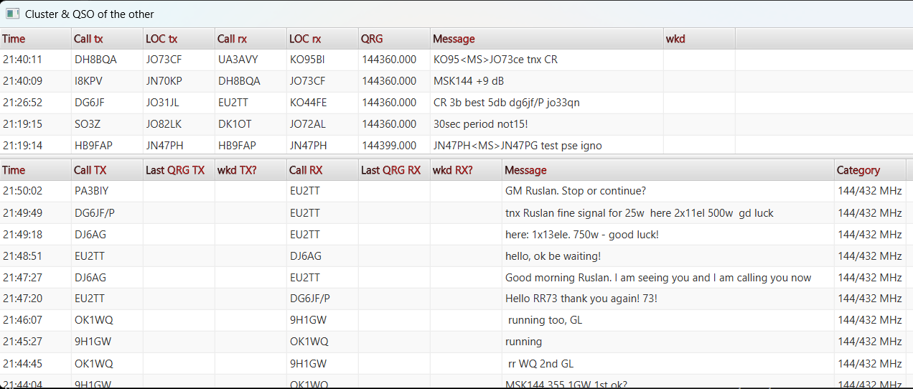

Das separate Fenster und die Tabs verwenden dieselben zugrunde liegenden Listen. Eine Meldung wird dadurch nicht doppelt empfangen oder doppelt gespeichert. Es handelt sich lediglich um zwei Darstellungen derselben Daten.

Das Monitorfenster kann über **Windows → Hide cluster / stranger QSOs** ausgeblendet und mit **Show cluster / stranger QSOs** wieder eingeblendet werden. Wer den Platz nicht benötigt, kann das Fenster daher schließen oder minimieren, ohne auf die entsprechenden Tabs im Hauptfenster verzichten zu müssen.

Die vollständigen Texte abgeschnittener Nachrichten erscheinen als Tooltip. Erkannte Webadressen können wie in den übrigen Nachrichtentabellen angeklickt und im Standardbrowser geöffnet werden.

Die Ansichten helfen dabei, Aktivität und Koordination anderer Stationen zu erkennen. Bei hohem Chat-Aufkommen entsteht daraus allerdings schnell mehr Information als Erkenntnis. Das separate Fenster ist deshalb vor allem dann nützlich, wenn ein bestimmter Kommunikationsfluss gezielt beobachtet werden soll.

---

## Stationskarte und Streckenanalyse (ab v1.41)

Eine lange Benutzerliste beantwortet zwei geografische Fragen nur unzureichend: Wo befinden sich die eingeloggten Stationen, und welche davon liegen ungefähr in der aktuellen Antennenrichtung? Die Stationskarte überträgt deshalb die bereits bekannten Locator-, Richtungs-, Band- und Worked-Informationen in eine interaktive Kartenansicht.

Die Karte ist keine zweite, unabhängig verwaltete Stationsliste. Sie verwendet die aktuell durch die Filter der Benutzerliste sichtbaren Chatmember. Wird beispielsweise nach Entfernung, Richtung, Worked-Status oder einem bestimmten Band gefiltert, wirkt sich dies auch auf die dargestellten Stationen aus. In der Kopfzeile der Karte wird angezeigt, wie viele Stationen sichtbar sind und ob eine gefilterte Ansicht aktiv ist.

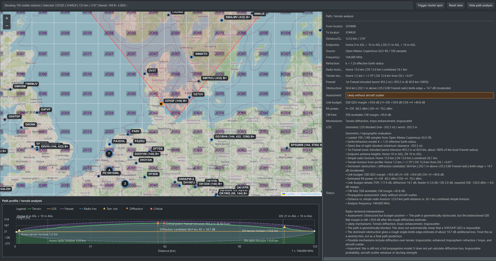

### Welche Stationen werden dargestellt?

Für einen Kartenmarker benötigt KST4Contest einen brauchbaren sechsstelligen Locator. Chatmember ohne einen solchen Locator können in der Benutzerliste vorhanden sein, erscheinen aber nicht auf der Karte.

Mehrere aktive Chat-Einträge desselben Basisrufzeichens werden für die Kartenansicht zusammengefasst. Das verhindert, dass beispielsweise getrennte Logins in mehreren Chat-Kategorien mehrere Marker an derselben geografischen Position erzeugen. Als sichtbares Rufzeichen und für die Detailinformationen wird die zuletzt geeignete aktive Variante verwendet.

Die Beschriftung eines Markers kann zusätzlich enthalten:

- die für die Station erkannten aktiven Bänder,
- `B+`, wenn mindestens ein eigenes aktiviertes und noch nicht gearbeitetes Band angeboten wird.

Die Bandangaben verwenden dieselbe Herleitung wie die Bandspalten, der Filter **New bands** und der Priority Score. Aktuelle QRG-Erkennungen, Bandangaben im Namensfeld, Worked-Informationen und manuelle NOT-QRV-Markierungen werden daher auch in der Kartenansicht konsistent berücksichtigt.

### Bedeutung der Markerfarben

| Darstellung | Bedeutung |
|---|---|
| Blauer Rand | Station ohne eine der nachfolgenden besonderen Markierungen |
| Gelber Rand | Das Basisrufzeichen wurde bereits auf mindestens einem Band gearbeitet |
| Grün | Für die Station besteht eine aus gerichteten Chatnachrichten hergeleitete Richtungsgelegenheit |
| Orange | Aktuell ausgewählte Station |

Treffen mehrere Zustände gleichzeitig zu, hat die für den Betrieb wichtigere Markierung Vorrang. Eine ausgewählte Station bleibt deshalb orange; eine Richtungsgelegenheit wird grün dargestellt, auch wenn das Rufzeichen bereits gearbeitet wurde.

Bei niedrigen Zoomstufen werden räumlich dicht beieinanderliegende Stationen zu einem Cluster zusammengefasst. Die Zahl im Cluster gibt die Anzahl der enthaltenen Stationen an. Ein Klick zoomt weiter hinein, wählt aber noch keine einzelne Station aus. Die aktuell ausgewählte Station und grün markierte Richtungsgelegenheiten bleiben auch bei niedriger Zoomstufe als einzelne Marker sichtbar.

### Auswahl und geografische Hilfen

Ein Klick auf einen einzelnen Stationsmarker:

1. wählt den dazugehörigen aktiven Chatmember aus,
2. scrollt die Benutzerliste zu diesem Eintrag,
3. aktualisiert den **Further Info**-Bereich und
4. bereitet das Rufzeichen wie bei einer Auswahl in der Benutzerliste als Nachrichtenziel vor.

Für die ausgewählte Station zeichnet KST4Contest eine Verbindungslinie von der eigenen Station zum Ziel. Der eingezeichnete Antennensektor verwendet:

- den aktuellen eigenen QTF,
- den konfigurierten Antennen-Öffnungswinkel und
- das konfigurierte Standard-Maximum-QRB.

Das Maidenhead-Raster passt seine Genauigkeit an die Zoomstufe und den sichtbaren Kartenausschnitt an. Es dient der räumlichen Orientierung; die Position eines Stationsmarkers wird aus dem sechsstelligen Locator abgeleitet und ist deshalb keine exakte GPS-Position.

### Strecken- und Geländeprofil

Nach Auswahl einer Station fordert KST4Contest ein Höhenprofil zwischen dem eigenen und dem fremden Locator an. Die aktive Online-Datenquelle ist die Open-Meteo Elevation API mit Geländedaten auf Basis von **Copernicus GLO-90**.

Die Online-Abfrage ist auf höchstens 100 gleichmäßig über die Strecke verteilte Höhenpunkte begrenzt. Eine 100 Kilometer lange Strecke wird damit grob im Abstand von etwa einem Kilometer abgetastet. Bei kürzeren Strecken wird der Abstand entsprechend kleiner, schmale Hindernisse können trotzdem zwischen zwei Abfragepunkten liegen.

Aus den Höhenpunkten berechnet KST4Contest unter anderem:

- das Geländeprofil,
- die geometrische Sichtlinie,
- die Erdkrümmung mit einem festen effektiven Erdradiusfaktor von `k = 4/3`,
- den geometrischen Radiohorizont beider Stationen,
- relevante Geländehorizonte,
- die erste Fresnel-Zone,
- die geringste Fresnel-Freiheit,
- den stärksten erkannten Eingriff in die Fresnel-Zone und
- eine grobe Einzelhindernis- beziehungsweise Knife-Edge-Abschätzung.

Die eingestellte eigene Antennenhöhe wird zur lokalen Geländehöhe addiert. Für die Gegenstation wird derzeit eine feste angenommene Antennenhöhe von 10 Metern über Grund verwendet.

Bewegst du die Maus über das Profil, wird der dazugehörige Abfragepunkt zusätzlich auf der Karte markiert. Dadurch lässt sich ein auffälliger Berg oder Geländeeinschnitt leichter einer geografischen Position zuordnen.

### Welche Frequenz wird für die Berechnung verwendet?

Die Frequenz beeinflusst insbesondere die Größe der Fresnel-Zone, die Freiraumdämpfung und das Link-Budget. KST4Contest versucht deshalb, für die ausgewählte Station eine passende Analysefrequenz zu bestimmen.

Vorrangig wird eine aktuell bekannte QRG auf einem eigenen aktivierten und für die Gegenstation nutzbaren Band verwendet. Fehlt eine geeignete QRG, wird aus den vorhandenen Bandinformationen ein automatisches Analyseband hergeleitet und dessen Standardfrequenz verwendet. Manuelle NOT-QRV-Markierungen werden dabei berücksichtigt.

Die tatsächlich verwendete Frequenz steht im Feld **Frequency** der Streckenanalyse. Sie sollte kontrolliert werden, wenn die automatische Zuordnung nicht zur vorgesehenen Funkverbindung passt. Eine Berechnung auf 144 MHz ist für eine geplante Verbindung auf 1296 MHz keine gleichwertige Näherung.

### Link-Budget und Tropo-Spalte

Zusätzlich zur geometrischen Bewertung erstellt KST4Contest eine vereinfachte Link-Budget-Abschätzung. Verwendet werden:

- die konfigurierte eigene Sendeleistung,
- der eigene Antennengewinn,
- die angenommene Sendeleistung der Gegenstation,
- der angenommene Antennengewinn der Gegenstation,
- eine frequenzabhängig geschätzte Speiseleitungsdämpfung,
- die Freiraumdämpfung und
- gegebenenfalls eine grobe zusätzliche Hindernisdämpfung.

Antennengewinne werden in `dBi` eingegeben. Ein in `dBd` bekannter Wert muss deshalb vor der Eingabe um `2,15 dB` erhöht werden.

Die Berechnung betrachtet beide Übertragungsrichtungen. Der daraus abgeleitete ungünstigere SSB-Wert wird als Tropo-Marge für die Station gespeichert und kann anschließend in der **Tropo**-Spalte, beim Sortieren und durch den Filter **Tropo >=0dB** verwendet werden.

Karte und Benutzerliste führen keine voneinander unabhängigen Berechnungen durch. Sie verwenden denselben Reachability-Service und denselben Ergebnisspeicher. Eine über die Karte oder mit **Calc selected** angestoßene Berechnung kann deshalb anschließend auch in der Benutzerliste erscheinen.

Es wird absichtlich keine automatische Online-Geländeabfrage für jeden sichtbaren Chatmember gestartet. Eine Berechnung erfolgt durch eine ausdrückliche Auswahl in der Karte oder über **Calc selected**. Das begrenzt API-Anfragen und verhindert, dass jede Tabellenaktualisierung eine neue Serie von Höhenabfragen auslöst.

### Pfadanalyse ausblenden

Das Geländeprofil und die ausführliche Analyse benötigen einen erheblichen Teil der Fensterhöhe. Werden sie gerade nicht gebraucht, können beide Bereiche gemeinsam mit **Hide path analysis** ausgeblendet werden. Die Karte nutzt den frei werdenden Platz unmittelbar.

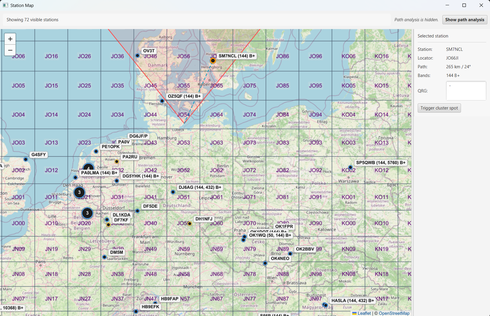

Mit **Show path analysis** werden Profil und Detailwerte wieder eingeblendet. Das zuletzt berechnete Ergebnis bleibt erhalten. Die gewählte Sichtbarkeit wird in den Einstellungen gespeichert und beim nächsten Programmstart wiederhergestellt.

Der rechte Detailbereich ist über einen Divider in der Breite verstellbar. Er kann so weit verkleinert werden, dass mehr Platz für die Karte entsteht, ohne ein Rufzeichen mit üblicher Länge vollständig zu verdecken.

### Was sagt die Streckenanalyse nicht aus?

Die Auswertung ist ein geometrisches und rechnerisches Modell. Sie misst weder die tatsächliche Feldstärke noch die momentanen Ausbreitungsbedingungen.

Insbesondere kennt KST4Contest nicht:

- die wirkliche Antennenhöhe und den tatsächlichen Antennengewinn der Gegenstation,
- deren Sendeleistung und Speiseleitungsverluste,
- Gebäude, Bewuchs und andere Hindernisse, die im Höhenmodell nicht enthalten sind,
- lokale Störungen und Empfängereigenschaften,
- den aktuellen atmosphärischen K-Faktor,
- Inversionsschichten oder Ducting und
- die tatsächliche Antennenrichtung der Gegenstation.

Die unter **Mechanisms** genannten Ausbreitungswege sind eine allgemeine Einordnung anhand der Geländegeometrie. Eine Nennung von Aircraft Scatter bedeutet nicht, dass aktuelle Flugzeuge aus AirScout in die Geländeanalyse eingerechnet wurden.

Im Klartext: Ein freier Weg ist ein nützlicher positiver Hinweis. Ein geometrisch versperrter Weg bedeutet im VHF-, UHF- und Mikrowellenbereich aber nicht automatisch „unmöglich“. Ebenso garantiert ein positives Link-Budget kein QSO.

Bedienung: [Stationskarte in der Benutzeroberfläche](de-Benutzeroberflaeche#stationskarte)

Konfiguration: [Streckenanalyse und Link-Budget](de-Konfiguration#streckenanalyse-und-link-budget)

---

## Begrenzte Nachrichtenspeicher (ab v1.41)

Während eines längeren Contests können mehrere zehntausend Chat- und DX-Cluster-Meldungen eintreffen. Würden diese Listen während der gesamten Programmlaufzeit unbegrenzt wachsen, stiege nicht nur der Speicherverbrauch. Auch das Filtern, Sortieren und Aktualisieren der darauf aufbauenden Tabellen würde zunehmend aufwendiger.

KST4Contest verwendet deshalb zwei getrennte, begrenzte Nachrichtenspeicher:

| Nachrichtenspeicher | Aufräumen ab | Größe nach dem Aufräumen |
|---|---:|---:|
| Chatnachrichten | mehr als 30.000 Einträge | 25.000 Einträge |
| DX-Cluster-Meldungen | mehr als 10.000 Einträge | 8.000 Einträge |

Neue Nachrichten werden am Anfang der jeweiligen Liste eingefügt. Wird der obere Grenzwert überschritten, entfernt KST4Contest die ältesten Einträge am Ende der Liste, bis die angegebene Zielgröße erreicht ist.

### Warum gibt es zwei Grenzwerte?

Der Speicher wird nicht nach jeder einzelnen Nachricht wieder exakt auf seine Maximalgröße verkleinert. Nach dem Aufräumen bleiben bei den Chatnachrichten 5.000 und bei den DX-Cluster-Meldungen 2.000 freie Plätze.

Dadurch muss KST4Contest nicht für jede anschließend eintreffende Nachricht erneut Listeneinträge entfernen. Das Aufräumen erfolgt blockweise und damit deutlich seltener.

### Welche Tabellen teilen sich einen Speicher?

Die folgenden Ansichten sind gefilterte Darstellungen derselben globalen Chatnachrichtenliste:

- **Public messages**,
- die PM-Tabelle,
- die Nachrichten im Bereich **Further Info** und
- **QSO of the other**.

Diese Tabellen speichern nicht jeweils zusätzlich bis zu 30.000 Nachrichten. Wird eine alte Chatnachricht aus dem gemeinsamen Speicher entfernt, verschwindet sie gleichzeitig aus allen darauf basierenden Ansichten.

Ebenso verwenden der Tab **DXCluster messages** und die DX-Cluster-Tabelle im separaten Monitorfenster denselben Cluster-Speicher. Das zusätzliche Fenster erzeugt weder eine zweite Nachrichtenverbindung noch eine Kopie der empfangenen Meldungen.

Chatnachrichten und DX-Cluster-Meldungen besitzen dagegen voneinander unabhängige Speicher und Grenzwerte. Ein hohes Aufkommen an öffentlichen Chatnachrichten verkleinert deshalb nicht den DX-Cluster-Speicher und umgekehrt.

### Keine dauerhafte Historie

Beide Nachrichtenspeicher liegen ausschließlich im Arbeitsspeicher. Sie werden weder in die interne Worked-Datenbank noch in eine andere lokale Nachrichtendatei geschrieben.

Nach einem Neustart beginnen die Tabellen wieder mit leeren Listen und werden ausschließlich aus den neu empfangenen Meldungen aufgebaut. Die Ansichten sind damit ein Arbeitsmittel für die laufende Sitzung und kein dauerhaftes Chatarchiv.

---

## Bildschirmgerechte Größe des Hauptfensters (ab v1.41)

KST4Contest speichert die zuletzt verwendete Größe des Hauptfensters. Das ist praktisch, solange das Programm beim nächsten Start auf einem vergleichbaren Bildschirm läuft. Wurde die Anwendung zuvor auf einem größeren Monitor verwendet, kann die gespeicherte Größe auf einem kleineren Bildschirm jedoch außerhalb des sichtbaren Bereichs liegen.

KST4Contest prüft die gespeicherte Größe deshalb beim Programmstart gegen den nutzbaren Bereich des primären Bildschirms.

### Wie wird die Startgröße bestimmt?

Sofern die gespeicherten Werte gültig sind, verwendet KST4Contest zunächst die zuletzt gespeicherte Höhe und Breite. Fehlen brauchbare Werte, gilt eine Standardgröße von:

- 1.234 Pixel Breite und
- 768 Pixel Höhe.

Als verfügbare Fläche verwendet KST4Contest nicht die vollständige Bildschirmauflösung, sondern den von JavaFX gemeldeten sichtbaren Bereich des primären Bildschirms. Taskleiste, Dock und vergleichbare Bereiche des Betriebssystems sind darin bereits ausgenommen.

Von dieser Fläche wird zusätzlich ein Sicherheitsabstand von 40 Pixeln abgezogen. Überschreitet die gespeicherte Breite oder Höhe den verbleibenden Platz, wird nur der betreffende Wert verkleinert.

Nachdem die Oberfläche mit dieser Scene-Größe aufgebaut wurde, prüft KST4Contest zusätzlich das tatsächliche native Fenster einschließlich seiner vom Betriebssystem erzeugten Rahmen und Titelleiste. Das Fenster wird bei Bedarf noch einmal verkleinert oder in den sichtbaren Bereich verschoben.

Damit werden zwei unterschiedliche Fälle abgefangen:

1. Die gespeicherte Inhaltsfläche ist größer als der aktuelle Bildschirm.
2. Die Inhaltsfläche passt, das vollständige native Fenster ragt durch Rahmen oder Position trotzdem über den sichtbaren Bereich hinaus.

### Was passiert mit dem Layout?

Die Oberfläche wird nicht als Ganzes proportional skaliert. Stattdessen erhält das Hauptfenster weniger Platz, und die dafür vorgesehenen UI-Bereiche reagieren auf die verfügbare Breite.

Die Filterleiste bleibt bei normaler Fensterbreite kompakt. Erst wenn der tatsächlich benötigte Platz nicht mehr ausreicht, werden Bedienelemente in zusätzliche Zeilen umgebrochen. Divider können weiterhin verwendet werden, um den Platz zwischen den Nachrichten- und Stationsbereichen aufzuteilen.

### Grenzen der automatischen Korrektur

Die Prüfung verwendet immer den **primären Bildschirm**. Sie stellt nicht die frühere Position auf einem bestimmten sekundären Monitor wieder her.

Die automatische Größenbegrenzung gilt derzeit außerdem nur für das Hauptfenster. Das Einstellungsfenster, das separate Cluster- und QSO-Monitorfenster sowie weitere Zusatzfenster verwenden weiterhin ihre jeweils gespeicherten Größen, ohne dieselbe zusätzliche Prüfung gegen den primären Bildschirm.

Im Klartext: Die Schutzfunktion verhindert vor allem, dass das zentrale Hauptfenster nach einem Wechsel auf einen kleineren Bildschirm unbenutzbar startet. Sie ist keine vollständige Verwaltung aller Fensterpositionen in einem wechselnden Mehrmonitor-Setup.
