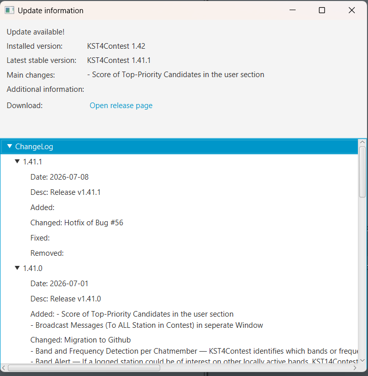

# Installation

> 🇬🇧 [English version](en-Installation) | 🇩🇪 Du liest gerade die deutsche Version

## Voraussetzungen

Es wird eine Mindestauflösung von 1200px mal 720px empfohlen

### ON4KST-Account

Um den Chat zu nutzen, ist ein registrierter Account beim ON4KST-Chat-Dienst erforderlich:

- Registrierung unter: http://www.on4kst.info/chat/register.php

### Verhaltensregeln im Chat

Die offizielle Sprache im ON4KST-Chat ist **Englisch**. Auch bei Kommunikation mit Stationen aus dem eigenen Land bitte Englisch verwenden. Übliche HAM-Abkürzungen (agn, dir, pse, rrr, tnx, 73 …) sind gang und gäbe.

### Persönliche Nachrichten

Um eine Privatnachricht an eine andere Station zu senden, immer folgendes Format verwenden:

```
/CQ RUFZEICHEN Nachrichtentext
```

Beispiel: `/CQ DL5ASG pse sked 144.205?`

Bei starkem Chat-Verkehr (5–6 Nachrichten pro Sekunde im Contest) gehen öffentliche Nachrichten, die an ein bestimmtes Rufzeichen gerichtet sind, leicht unter. KST4Contest fängt solche Nachrichten aber auch dann ab, wenn sie fälschlicherweise öffentlich gepostet werden (siehe [Funktionen – PM-Abfang](Funktionen#catching-personal-messages)).

---

## Download

### Windows

Die aktuelle Version kann als ZIP-Datei heruntergeladen werden:

**https://github.com/praktimarc/kst4contest/releases/latest**

Der Dateiname hat das Format `praktiKST-v<Versionsnummer>-windows-x64.zip `.

### Linux

Mehrere Paketformate stehen auf der Releases-Seite zur Verfügung:

**https://github.com/praktimarc/kst4contest/releases/latest**

| Format | Dateiname | Geeignet für |
|---|---|---|
| AppImage | `KST4Contest-v<Version>-linux-x86_64.AppImage` | Alle Distributionen |
| Debian-Paket | `KST4Contest-v<Version>-debian-amd64.deb` | Debian, Ubuntu, Linux Mint, … |
| RPM-Paket | `KST4Contest-v<Version>-fedora-x86_64.rpm` | Fedora, RHEL, openSUSE, … |
| Arch-Paket | `KST4Contest-v<Version>-archlinux-x86_64.pkg.tar.zst` | Arch Linux, Manjaro, … |
| Flatpak | `de.x08.KST4Contest.flatpakref` | Alle Distributionen mit Flatpak |

> **Empfehlung für Linux:** Die Flatpak-Installation ist der einfachste Weg, immer aktuell zu bleiben – `flatpak update` erledigt alle zukünftigen Updates automatisch. Das Repository ist GPG-signiert.

### macOS

> ⚠️ **Best-Effort-Support:** macOS-Builds werden als zusätzliche Option bereitgestellt, sind aber **nicht umfassend getestet**. Wir bauen und veröffentlichen macOS-Binaries mit jedem Release, können allerdings nicht alle Szenarien unter macOS testen. Bei Problemen freuen wir uns über eine Rückmeldung – wir versuchen unser Bestes, können aber nicht den gleichen Support-Umfang wie für Windows und Linux garantieren.

Die aktuelle Version kann als DMG-Disk-Image heruntergeladen werden (für Apple-Silicon- und Intel-Macs verfügbar):

**https://github.com/praktimarc/kst4contest/releases/latest**

Der Dateiname hat das Format `KST4Contest-v<Versionsnummer>-macos-<Architektur>.dmg`, wobei `<Architektur>` entweder `arm64` (Apple Silicon) oder `x86_64` (Intel) ist.


---

## Installation

### Windows

1. ZIP-Datei herunterladen.
2. ZIP-Datei in einen gewünschten Ordner entpacken.
3. `praktiKST.exe` ausführen.

Die Einstellungen werden unter `%USERPROFILE%\.praktikst\preferences.xml` gespeichert.

### Linux

Die Einstellungen werden immer unter `~/.praktikst/preferences.xml` gespeichert.

#### AppImage

1. AppImage herunterladen.
2. Ausführbar machen: `chmod +x KST4Contest-v<Version>-linux-x86_64.AppImage`
3. Starten.

#### Debian / Ubuntu

```bash
sudo apt install ./KST4Contest-v<Version>-debian-amd64.deb
```

Oder die `.deb`-Datei im Dateimanager doppelklicken.

#### Fedora / RHEL

```bash
sudo dnf install ./KST4Contest-v<Version>-fedora-x86_64.rpm
```

#### Arch Linux

```bash
sudo pacman -U KST4Contest-v<Version>-archlinux-x86_64.pkg.tar.zst
```

#### Flatpak

Die Datei `de.x08.KST4Contest.flatpakref` aus dem [aktuellen Release](https://github.com/praktimarc/kst4contest/releases/latest) herunterladen und öffnen, oder:
```bash
flatpak install de.x08.KST4Contest.flatpakref
```

Oder den Remote manuell hinzufügen:
```bash
flatpak remote-add kst4contest https://praktimarc.github.io/kst4contest/
flatpak install kst4contest de.x08.KST4Contest
```

### macOS
1. DMG-Datei für die eigene Architektur herunterladen (Apple Silicon oder Intel).
2. DMG-Datei öffnen.
3. `KST4Contest.app` in den **Programme**-Ordner ziehen.
4. Beim ersten Start zeigt macOS ggf. eine Warnung, da die App nicht notarisiert ist. Zum Öffnen:
   - Rechtsklick (oder Ctrl-Klick) auf `KST4Contest.app` im Finder → **Öffnen** wählen.
   - Alternativ: **Systemeinstellungen → Datenschutz & Sicherheit** → **Trotzdem öffnen** klicken.
5. KST4Contest aus dem Programme-Ordner oder dem Launchpad starten.

Die Einstellungen werden unter `~/.praktikst/preferences.xml` gespeichert.

---

## Update

KST4Contest enthält einen **automatischen Update-Hinweis-Dienst**: Sobald eine neue Version verfügbar ist, erscheint beim Start ein Fenster mit:
- der Information, dass eine neue Version vorliegt,
- einem Changelog,
- dem Download-Link zur neuen Version.



### Update-Prozess

#### Windows

Derzeit gibt es nur einen Weg zum Aktualisieren:

1. Den alten Ordner löschen.
2. Das neue ZIP entpacken.

Die Einstellungsdatei (`preferences.xml`) bleibt erhalten, da sie im Benutzerordner gespeichert ist – nicht im Programmordner.

#### Linux

- **AppImage**: Neues AppImage herunterladen, ausführbar machen (`chmod +x`), altes optional löschen.
- **Debian/Ubuntu**: `sudo apt install ./KST4Contest-v<Version>-debian-amd64.deb`
- **Fedora/RHEL**: `sudo dnf upgrade ./KST4Contest-v<Version>-fedora-x86_64.rpm`
- **Arch Linux**: `sudo pacman -U KST4Contest-v<Version>-archlinux-x86_64.pkg.tar.zst`
- **Flatpak (Repository)**: `flatpak update` – aktualisiert alle Flatpak-Apps einschließlich KST4Contest.

#### macOS

1. Neue DMG-Datei herunterladen.
2. DMG öffnen.
3. Die neue `KST4Contest.app` in den **Programme**-Ordner ziehen und die alte Version ersetzen.


---

## Bekannte Probleme beim Start

### Norton 360

Norton 360 stuft `praktiKST.exe` als gefährlich ein (Fehlalarm). Es muss eine Ausnahme für die Datei eingerichtet werden:

1. Norton 360 öffnen.
2. Sicherheit → Verlauf → Das entsprechende Ereignis suchen.
3. „Wiederherstellen & Ausnahme hinzufügen" wählen.

*(Gemeldet von PE0WGA, Franz van Velzen – danke!)*
