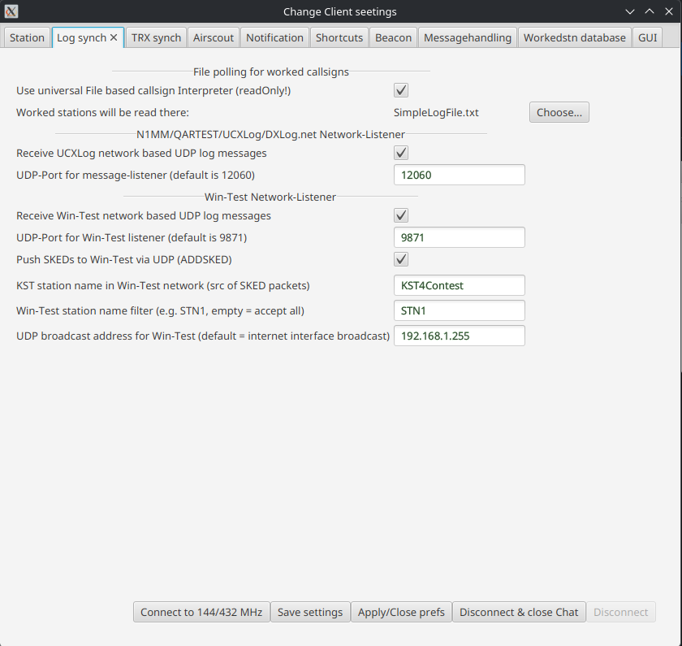
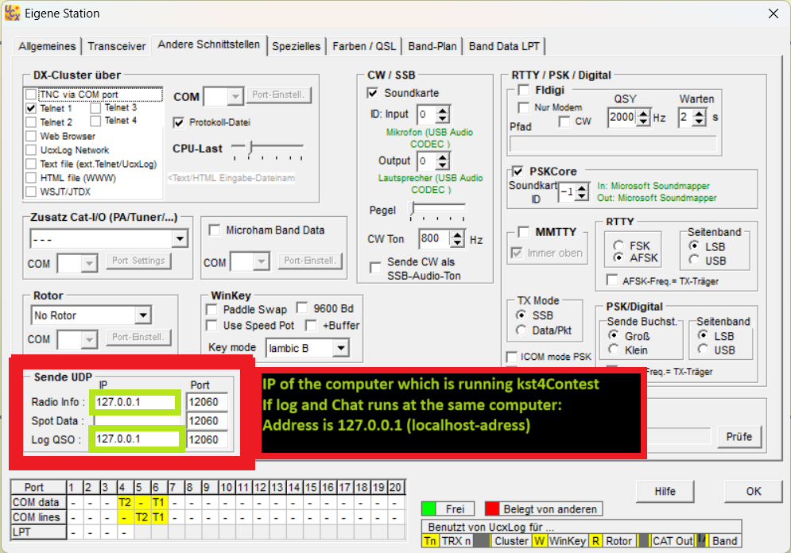
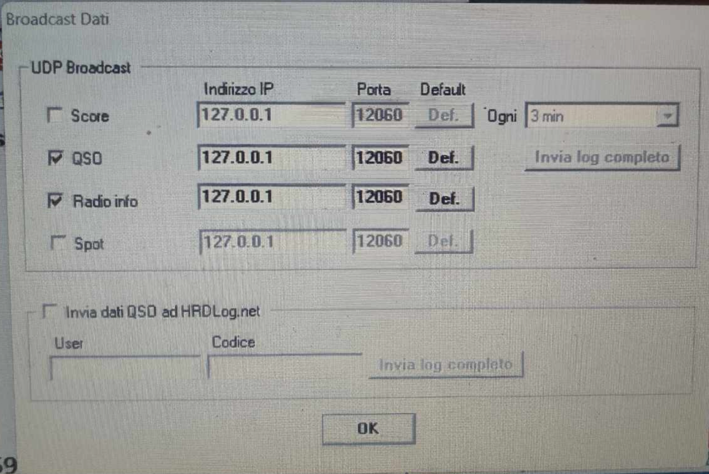
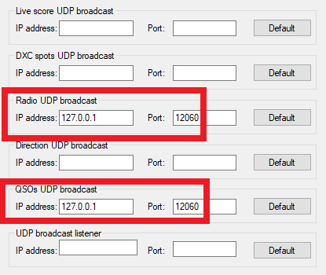

# Log-Synchronisation

> 🇬🇧 [English version](en-Log-Sync) | 🇩🇪 Du liest gerade die deutsche Version

KST4Contest markiert gearbeitete Stationen automatisch in der Chat-Benutzerliste. Dafür gibt es zwei grundlegende Methoden:

---

## Methode 1: Universal File Based Callsign Interpreter (Simplelogfile)

KST4Contest liest eine Log-Datei und sucht mittels regulärem Ausdruck nach Rufzeichen-Mustern. Dabei werden auch binäre Logdateien unterstützt – unlesbarer Binärinhalt wird einfach ignoriert.

**Vorteil**: Funktioniert mit nahezu jedem Logprogramm, das eine Datei schreibt.
**Nachteil**: Keine Bandinformation möglich – es wird nur „gearbeitet" markiert, nicht auf welchem Band.

Pfad der Log-Datei in den Preferences eintragen. Die Datei wird nur gelesen, nie verändert (read-only).

> **Tipp**: Die Simplelogfile-Funktion kann auch genutzt werden, um Stationen zu markieren, die definitiv nicht erreichbar sind (z. B. eigene Notizen). Das wird in einer späteren Version durch ein besseres Tagging-System ersetzt.

---

## Methode 2: Netzwerk-Listener (UDP-Broadcast) – Empfohlen

Das Logprogramm sendet beim Speichern eines QSOs ein UDP-Paket an die Broadcast-Adresse des Heimnetzwerks. KST4Contest empfängt dieses Paket und markiert die Station inklusive **Bandinformation** in der internen SQLite-Datenbank.

> **Wichtig**: KST4Contest muss **parallel zum Logprogramm laufen**. QSOs, die während einer Abwesenheit von KST4Contest geloggt werden, werden nicht erfasst – außer bei QARTest (kann das komplette Log senden).

**Standard UDP-Port**: 12060 (entspricht dem Standard der meisten Logprogramme)

---

## Unterstützte Logprogramme

### UCXLog (DL7UCX)

UCXLog sendet QSO-UDP-Pakete und Transceiver-Frequenzpakete.

**Einstellungen in UCXLog:**
- UDP-Broadcast aktivieren
- IP-Adresse des KST4Contest-Computers eintragen (bei lokalem Betrieb: `127.0.0.1`)
- Port: 12060 (Standard)

Grün markierte Felder in den UCXLog-Einstellungen beachten: IP und Port müssen eingetragen werden.

Hinweis für Multi-Setup (2 Computer, 2 Radios, eine KST4Contest-Instanz): Beide Logprogramme müssen die QSO-Pakete an die IP des KST4Contest-Computers senden. Dann ist mindestens eine IP nicht `127.0.0.1`.

### QARTest (IK3QAR)

**Besonderheit**: QARTest kann das **vollständige Log** an KST4Contest senden (Schaltfläche „Invia log completo" in den QARTest-Einstellungen). Damit werden auch QSOs erfasst, die vor dem Start von KST4Contest geloggt wurden.

**Einstellungen in QARTest:**
- UDP-Broadcast und IP/Port wie UCXLog konfigurieren
- „Invia log completo" für den vollständigen Log-Upload verwenden

*(„Buona funzionalità caro IK3QAR!" – DO5AMF)*

### N1MM+

**Einstellungen in N1MM+:**

In N1MM+ unter `Config → Configure Ports, Mode Control, Winkey, etc. → Broadcast Data`:
- `Radio Info` aktivieren (für TRX-Sync/QRG)
- `Contact Info` aktivieren (für QSO-Sync)
- IP: `127.0.0.1` (oder IP des KST4Contest-Computers)
- Port: 12060

Für den integrierten DX-Cluster-Server: N1MM+ als DX-Cluster-Client konfigurieren (Server: `127.0.0.1`, Port wie in KST4Contest eingestellt).

### DXLog.net

**Einstellungen in DXLog.net:**
- UDP-Broadcast aktivieren
- IP des KST4Contest-Computers eintragen (grün markierte Felder)
- Port: 12060

### Win-Test

Win-Test wird mit einem dedizierten UDP-Netzwerk-Listener unterstützt, der das native Win-Test Netzwerkprotokoll versteht.

**Vorteile der Win-Test Integration:**
- Automatische QSO-Synchronisation zur Markierung gearbeiteter Stationen.
- **Sked-Übergabe (ADDSKED):** Über den Button "Create sked" im Stationsinfo-Panel wird nicht nur in KST4Contest ein Sked angelegt, sondern dieser auch *direkt per UDP an das Win-Test Netzwerk als ADDSKED-Paket gesendet* – automatisch, sobald der Listener aktiv ist.
- Es kann zwischen den Sked-Modi "AUTO", "SSB" oder "CW" gewählt werden.
- **Automatische QRG-Auflösung für SKEDs:** KST4Contest wählt die Sked-Frequenz intelligent:
  1. Hat die Gegenstation in einer Chat-Nachricht ihre QRG genannt, wird diese verwendet.
  2. Sonst wird die eigene aktuelle QRG verwendet (aus Win-Test STATUS oder manueller Eingabe).

**Einstellungen im Reiter „Log-Synchronisation":**
- `Receive Win-Test network based UDP log messages` aktivieren.
- `UDP-Port for Win-Test listener` (Standard: 9871).
- `KST station name in Win-Test network (src of SKED packets)`: Legt fest, unter welchem Stationsnamen KST4Contest im WT-Netzwerk auftritt (z.B. "KST").
- `Win-Test network broadcast address`: Wird i.d.R. automatisch erkannt; erforderlich für das Senden von Sked-Paketen.

**Einstellungen im Reiter „TRX-Synchronisation":**
- `Win-Test STATUS QRG Sync`: Wenn aktiviert, übernimmt KST4Contest die aktuelle Transceiverfrequenz aus dem Win-Test STATUS-Paket als eigene QRG (MYQRG).
- `Use pass frequency from Win-Test STATUS`: Statt der eigenen TRX-QRG wird die im STATUS-Paket enthaltene Pass-Frequenz als MYQRG verwendet (für Multi-Op-Setups, bei denen mit einer Pass-QRG gearbeitet wird).
- `Win-Test station name filter`: Wird hier ein Name eingetragen (z.B. "STN1"), verarbeitet KST4Contest nur Pakete dieser Win-Test-Instanz. Leer lassen, um alle zu akzeptieren.

**Einstellungen in Win-Test:**
- Das Netzwerk in Win-Test muss aktiv sein.
- Win-Test muss so konfiguriert sein, dass es seine Broadcasts an den entsprechenden Port (Standard 9871) sendet bzw. empfängt.

---

## TRX-Frequenz-Synchronisation

Neben der QSO-Synchronisation übertragen UCXLog und andere Programme auch die **aktuelle Transceiverfrequenz** via UDP. KST4Contest verarbeitet diese Information und stellt sie als Variable `MYQRG` bereit.

**Ergebnis**: Die eigene QRG muss im Chat nie mehr manuell eingegeben werden – ein Klick auf den MYQRG-Button oder die Verwendung der Variable im Beacon genügt.

**Quellen für die eigene QRG (MYQRG):**
- UCXLog, N1MM+, DXLog.net, QARTest via UDP-Port 12060
- Win-Test STATUS-Paket (optional, konfigurierbar im Reiter „TRX-Synchronisation" unter „Win-Test STATUS QRG Sync")
- Manuelle Eingabe im QRG-Feld

> **Hinweis für Multi-Setup**: Bei zwei Logprogrammen an zwei Computern sollte nur **eines** die Frequenzpakete senden. KST4Contest kann nicht zwischen den Quellen unterscheiden und verarbeitet alle eingehenden Pakete.

---

## Multi-Setup: 2 Radios, 2 Computer

Für DM5M-typische Setups (2 Radios, 2 Computer, eine KST4Contest-Instanz oder zwei separate):

**Variante A – Eine gemeinsame KST4Contest-Instanz:**
- Beide Logprogramme senden QSO-Pakete an die IP des KST4Contest-Computers
- Nur ein Logprogramm sendet Frequenzpakete (empfohlen: das VHF-Logprogramm)

**Variante B – Zwei separate KST4Contest-Instanzen (empfohlen):**
- Jedes Logprogramm kommuniziert mit seiner eigenen KST4Contest-Instanz via `127.0.0.1`
- Zwei separate Chat-Logins
- Bessere Trennung und weniger Konflikte

---

## Interne Datenbank

KST4Contest speichert die Worked-Information in einer internen **SQLite-Datenbank**. Diese ist von der Logprogramm-Datenbank unabhängig und wird nur über den UDP-Broadcast befüllt.

Vor jedem neuen Contest: Datenbank zurücksetzen! → [Konfiguration – Worked Station Database Settings](Konfiguration#worked-station-database-settings)
