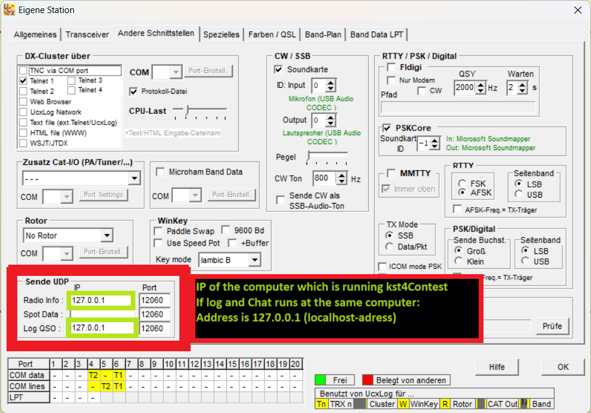
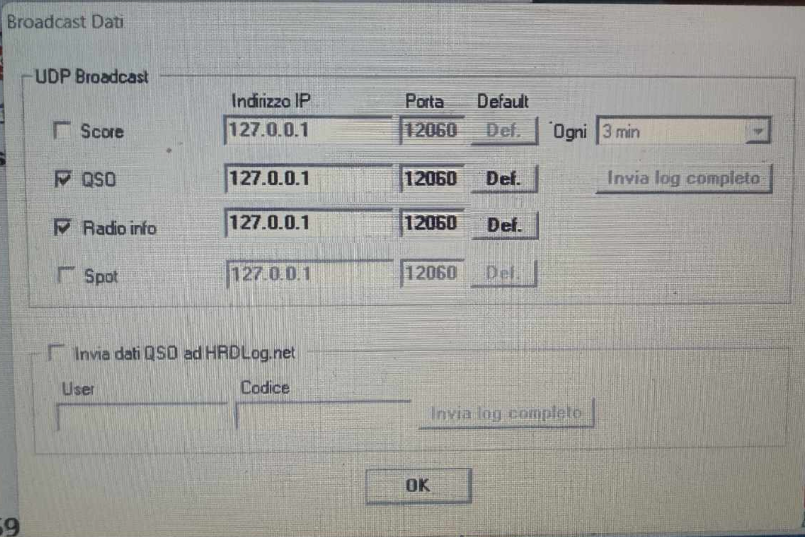
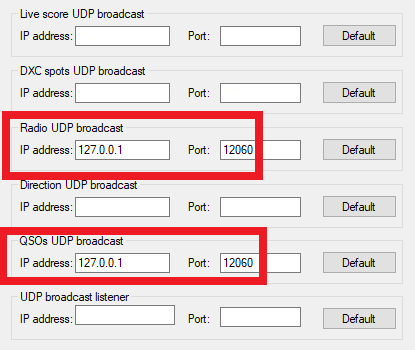
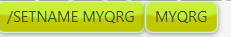

# Log-Synchronisation

> 🇬🇧 [English version](en-Log-Sync) | 🇩🇪 Du liest gerade die deutsche Version

KST4Contest übernimmt gearbeitete Stationen aus dem Logprogramm und stellt daraus den globalen Worked-Status, bandbezogene Worked-Markierungen und – sofern ein Locator übertragen wurde – gearbeitete Großfelder bereit. Dafür gibt es drei Wege: den dateibasierten Simplelogfile-Interpreter, den allgemeinen QSO-UDP-Listener und den eigenen Win-Test-Netzwerk-Listener.

---

## Methode 1: Universal File Based Callsign Interpreter (Simplelogfile)

KST4Contest liest eine Logdatei und sucht mit einem konfigurierbaren regulären Ausdruck nach Rufzeichen. Die Datei wird ausschließlich gelesen und nicht verändert. Auch binäre Logdateien können verwendet werden; nicht als Text interpretierbare Inhalte werden übersprungen.

Der Vorteil liegt in der breiten Kompatibilität: Die Funktion benötigt keine besondere Netzwerkschnittstelle des Logprogramms.

Die Grenze ist ebenso eindeutig: Aus einem reinen Rufzeichentreffer lassen sich weder Band noch Locator zuverlässig ableiten. Der Simplelogfile-Interpreter kann deshalb nur den globalen Worked-Status setzen. Er erzeugt keine bandbezogene `X`-Markierung, kein Worked-Großfeld und keine belastbare Grundlage für den Band-Upgrade-Hinweis nach einem Logeintrag.

Den Pfad der Logdatei und den regulären Ausdruck im Reiter **Log sync** eintragen. Für bandbezogene Auswertungen sollte nach Möglichkeit eine der Netzwerkschnittstellen verwendet werden.

---

## Methode 2: Netzwerk-Listener für QSO-UDP-Pakete – empfohlen

UCXLog, QARTest, N1MM+ und DXLog.net können beim Speichern eines QSOs ein UDP-Paket senden. KST4Contest empfängt diese Pakete standardmäßig auf Port `12060` und übernimmt das Rufzeichen sowie die enthaltenen Band- und Locatorinformationen.

Liegt eine Bandinformation vor, wird das Rufzeichen für dieses Band als gearbeitet markiert. Enthält das Paket zusätzlich einen gültigen Locator, speichert KST4Contest dessen vierstelliges Großfeld für das betreffende Band. Fehlende Informationen werden nicht aus anderen Feldern geraten.

KST4Contest muss zum Zeitpunkt der Übertragung laufen. Einige Logprogramme können jedoch das vorhandene Log erneut senden: QARTest bietet dafür **Invia log completo**; DXLog.net sendet beim Broadcast des vollständigen Logs `contactreplace`-Pakete, die KST4Contest ebenfalls verarbeitet.

**Standardport:** `12060`

---

## Unterstützte Logprogramme

### UCXLog (DL7UCX)

UCXLog sendet QSO-UDP-Pakete und Transceiver-Frequenzpakete.

**Einstellungen in UCXLog:**
- UDP-Broadcast aktivieren
- IP-Adresse des KST4Contest-Computers eintragen (bei lokalem Betrieb: `127.0.0.1`)
- Port: 12060 (Standard)

Grün markierte Felder in den UCXLog-Einstellungen beachten: IP und Port müssen eingetragen werden.

Hinweis für Multi-Setup (2 Computer, 2 Radios, eine KST4Contest-Instanz): Beide Logprogramme müssen die QSO-Pakete an die IP des KST4Contest-Computers senden. Dann ist mindestens eine IP nicht `127.0.0.1`.

### QARTest (IK3QAR)

**Besonderheit**: QARTest kann das **vollständige Log** an KST4Contest senden (Schaltfläche „Invia log completo" in den QARTest-Einstellungen). Damit werden auch QSOs erfasst, die vor dem Start von KST4Contest geloggt wurden.

**Einstellungen in QARTest:**
- UDP-Broadcast und IP/Port wie UCXLog konfigurieren
- „Invia log completo" für den vollständigen Log-Upload verwenden

*(„Buona funzionalità caro IK3QAR!" – DO5AMF)*

### N1MM+

**Einstellungen in N1MM+:**

In N1MM+ unter `Config → Configure Ports, Mode Control, Winkey, etc. → Broadcast Data`:
- `Radio Info` aktivieren (für TRX-Sync/QRG)
- `Contact Info` aktivieren (für QSO-Sync)
- IP: `127.0.0.1` (oder IP des KST4Contest-Computers)
- Port: 12060

Für den integrierten DX-Cluster-Server: N1MM+ als DX-Cluster-Client konfigurieren (Server: `127.0.0.1`, Port wie in KST4Contest eingestellt).

### DXLog.net

**Einstellungen in DXLog.net:**
- UDP-Broadcast aktivieren
- IP des KST4Contest-Computers eintragen (grün markierte Felder)
- Port: 12060

Beim Broadcast des vollständigen Logbuchs verwendet DXLog.net `contactreplace` anstelle von `contactinfo`. KST4Contest verarbeitet beide Pakettypen. Damit können auch ältere QSOs übernommen werden, wenn der vollständige Broadcast ausgelöst wird, während KST4Contest läuft.

### Win-Test

Win-Test wird mit einem dedizierten UDP-Netzwerk-Listener unterstützt, der das native Win-Test Netzwerkprotokoll versteht.

Bei einem neuen QSO übernimmt KST4Contest das Rufzeichen und löst die native Win-Test-Band-ID auf. Dabei werden auch 50 und 70 MHz verarbeitet. Ist im Paket ein gültiger Locator enthalten, wird zusätzlich das gearbeitete Großfeld für das erkannte Band gespeichert.

**Vorteile der Win-Test Integration:**
- **Bandbezogene Worked-Daten:** Neue QSOs setzen die Worked-Markierung des von Win-Test gemeldeten Bandes und aktualisieren – sofern vorhanden – den Großfeldstatus.
- Automatische QSO-Synchronisation zur Markierung gearbeiteter Stationen.
- **Sked-Übergabe (ADDSKED):** Über den Button "Create sked" im Stationsinfo-Panel wird nicht nur in KST4Contest ein Sked angelegt, sondern dieser auch *direkt per UDP an das Win-Test Netzwerk als ADDSKED-Paket gesendet* – automatisch, sobald der Listener aktiv ist.
- Es kann zwischen den Sked-Modi "AUTO", "SSB" oder "CW" gewählt werden.
- **Automatische QRG-Auflösung für SKEDs:** KST4Contest wählt die Sked-Frequenz intelligent:
  1. Hat die Gegenstation in einer Chat-Nachricht ihre QRG genannt, wird diese verwendet.
  2. Sonst wird die eigene aktuelle QRG verwendet (aus Win-Test STATUS oder manueller Eingabe).

**Einstellungen im Reiter „Log-Synchronisation":**
- `Receive Win-Test network based UDP log messages` aktivieren.
- `UDP-Port for Win-Test listener` (Standard: 9871).
- `KST station name in Win-Test network (src of SKED packets)`: Legt fest, unter welchem Stationsnamen KST4Contest im WT-Netzwerk auftritt (z.B. "KST").
- `Win-Test network broadcast address`: Wird i.d.R. automatisch erkannt; erforderlich für das Senden von Sked-Paketen.

**Einstellungen im Reiter „TRX-Synchronisation":**
- `Win-Test STATUS QRG Sync`: Wenn aktiviert, übernimmt KST4Contest die aktuelle Transceiverfrequenz aus dem Win-Test STATUS-Paket als eigene QRG (MYQRG).
- `Use pass frequency from Win-Test STATUS`: Statt der eigenen TRX-QRG wird die im STATUS-Paket enthaltene Pass-Frequenz als MYQRG verwendet (für Multi-Op-Setups, bei denen mit einer Pass-QRG gearbeitet wird).
- `Win-Test station name filter`: Wird hier ein Name eingetragen (z.B. "STN1"), verarbeitet KST4Contest nur Pakete dieser Win-Test-Instanz. Leer lassen, um alle zu akzeptieren.

**Einstellungen in Win-Test:**
- Das Netzwerk in Win-Test muss aktiv sein.
- Win-Test muss so konfiguriert sein, dass es seine Broadcasts an den entsprechenden Port (Standard 9871) sendet bzw. empfängt.

---

## TRX-Frequenz-Synchronisation

Neben der QSO-Synchronisation übertragen UCXLog und andere Programme auch die **aktuelle Transceiverfrequenz** via UDP. KST4Contest verarbeitet diese Information und stellt sie als Variable `MYQRG` bereit.

**Ergebnis**: Die eigene QRG muss im Chat nie mehr manuell eingegeben werden – ein Klick auf den MYQRG-Button oder die Verwendung der Variable im Beacon genügt.

**Quellen für die eigene QRG (MYQRG):**
- UCXLog, N1MM+, DXLog.net, QARTest via UDP-Port 12060
- Win-Test STATUS-Paket (optional, konfigurierbar im Reiter „TRX-Synchronisation" unter „Win-Test STATUS QRG Sync")
- Manuelle Eingabe im QRG-Feld

> **Hinweis für Multi-Setup**: Bei zwei Logprogrammen an zwei Computern sollte nur **eines** die Frequenzpakete senden. KST4Contest kann nicht zwischen den Quellen unterscheiden und verarbeitet alle eingehenden Pakete.

---

## Multi-Setup: 2 Radios, 2 Computer

Für DM5M-typische Setups (2 Radios, 2 Computer, eine KST4Contest-Instanz oder zwei separate):

**Variante A – Eine gemeinsame KST4Contest-Instanz:**
- Beide Logprogramme senden QSO-Pakete an die IP des KST4Contest-Computers
- Nur ein Logprogramm sendet Frequenzpakete (empfohlen: das VHF-Logprogramm)

**Variante B – Zwei separate KST4Contest-Instanzen (empfohlen):**
- Jedes Logprogramm kommuniziert mit seiner eigenen KST4Contest-Instanz via `127.0.0.1`
- Zwei separate Chat-Logins
- Bessere Trennung und weniger Konflikte

---

## Interne Datenbank

KST4Contest speichert Worked-, NOT-QRV- und Großfeldinformationen in einer eigenen SQLite-Datenbank. Sie ist von der Datenbank des Logprogramms unabhängig.

Die Datenquellen liefern unterschiedlich genaue Informationen:

| Quelle | Rufzeichen global | Bandbezogen | Großfeld |
|---|---:|---:|---:|
| Simplelogfile | ja | nein | nein |
| QSO-UDP-Listener | ja | ja, wenn im Paket enthalten | ja, wenn Band und Locator enthalten sind |
| Win-Test-Netzwerk-Listener | ja | ja | ja, wenn ein Locator enthalten ist |

Die Daten werden beim Programmstart wieder geladen und bei neuen Logeinträgen während des Betriebs aktualisiert. Sie laufen nach drei Tagen automatisch ab. Ein Reset vor jedem Contest ist daher normalerweise nicht erforderlich.

Ein vollständiger manueller Reset entfernt Worked-Markierungen, NOT-QRV-Tags und Worked-Großfelder gemeinsam. Weitere Einzelheiten: [Worked Station Database Settings](de-Konfiguration#worked-station-database-settings-gearbeitete-stationen-datenbank).