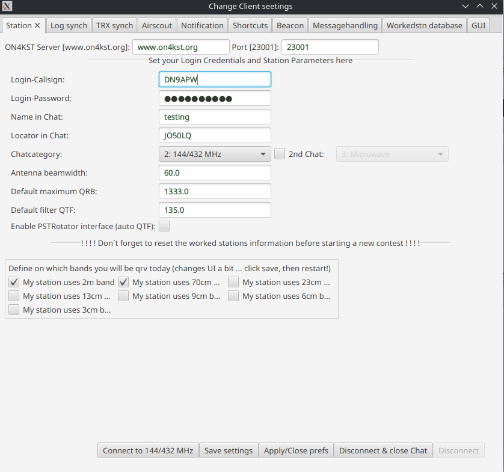

# Configuration

> 🇬🇧 You are reading the English version | 🇩🇪 [Deutsche Version](de-Konfiguration)

After the first start, the **settings window** opens – this is the central starting point for all configuration. It is recommended to keep the settings window open during operation (e.g. to quickly toggle the beacon on and off).

> **Important**: Always click **"Save Settings"** after any change! Settings are stored in `~/.praktikst/preferences.xml` on Linux and in `%USERPROFILE%\.praktikst\preferences.xml` (or `C:\Users\<Username>\.praktikst\preferences.xml`) on Windows. From v1.21 onwards, window sizes and divider positions are also saved when you click Save.

---

## Station Settings

### Login and Chat Categories

Enter your ON4KST chat credentials here (callsign and password).
Also, select the **primary chat category** (e.g., IARU Region 1 VHF/Microwave).

With the option for a **second chat** (Multi-Channel Login), you can log in to another category simultaneously (e.g., UHF/SHF). Both chats will then be monitored in parallel. You can optionally specify a different login name for the second chat (useful for Opposite Station Multi-Callsign Logging).

### Callsign and Locator

Enter your own callsign and Maidenhead locator (6 characters, e.g., `JN49IJ`). These values are needed for distance and direction calculations.

### Active Bands

Use the **"my station uses band"** checkboxes to select the active bands. Buttons and table rows will only appear in the user interface for selected bands. The software must be restarted after making changes.

### Antenna Beamwidth

Enter a realistic value for your antenna's beamwidth (in degrees). This value is used for the [Sked Direction Highlighting](Features#sked-direction-highlighting). A test value of 50° has proven effective; DM5M uses quads with 69°.

> **Do not** enter fantasy values – the direction calculations will become useless.

### Default Maximum QRB

Maximum distance (in km) for which direction warnings should be triggered. A realistic value for DM5M is 900 km. Stations farther away are ignored for highlighting purposes.

---

## Log Sync Settings

Two methods are available for automatically marking worked stations. Details: [Log Synchronisation](en-Log-Sync).

### Universal File Based Callsign Interpreter (Simplelogfile)

Interprets any log file using regex for callsign patterns. No band information is available. Suitable as a fallback or for log programs that are not directly supported.

### Network Listener for Logger's QSO UDP Broadcast

**Recommended method.** KST4Contest listens for UDP packets sent by the logging software to the broadcast address when a QSO is saved. Stations are marked with band information. UDP port: default **12060**. (Used by UCXLog, N1MM+, QARTest, DXLog.net, etc.).

### Win-Test Network Listener (Additional UDP Listener)

A dedicated network listener for Win-Test. KST4Contest receives and processes Win-Test-specific UDP packets (including sked handovers) on the configured port.

---

## TRX Sync Settings

Receives the current transceiver frequency from the logging software via UDP. This enables the automatic population of the `MYQRG` variable. Useful for:

- Quickly inserting your own QRG into chat messages.
- Automatic CQ beacon with current frequency.

> **Note for multi-setup**: When running two logging programs on two computers but only one KST4Contest instance, only one logging program should send frequency packets. KST4Contest cannot distinguish between sources.

---

## AirScout Settings

Configuration of the interface to AirScout for aircraft scatter detection. Details: [AirScout Integration](en-AirScout-Integration).

---

## Notification Settings

Three notification types are available:

1. **Simple sounds**: TADA sound for incoming messages, tick for sked direction detection, etc.
2. **CW announcement**: The callsign of a station sending a private message is output as a CW signal.
3. **Phonetic announcement**: The callsign is pronounced phonetically.

---

## Shortcut Settings

Configuration of quick-access buttons that appear directly in the main window. Clicking a button inserts the configured text into the send field. All [variables](Macros-and-Variables#variables) can be used.

---

## Snippet Settings

Text snippets are accessible via:

- **Right-click** on a callsign in the user list
- **Right-click** in the CQ message table
- **Right-click** in the PM message table
- **Keyboard shortcuts**: `Ctrl+1` to `Ctrl+0` for the first 10 snippets

If a callsign is selected in the user list, the snippet is addressed as a direct message:
`/CQ CALLSIGN <snippet text>`

---

## Beacon Settings

Configuration of an automatic interval beacon in the public chat channel. Recommended: use the `MYQRG` variable in the text so the current frequency is always up to date. Interval and text are freely configurable.

> **Tip**: Enable the beacon when calling CQ and quickly disable it in the settings window when not calling.

---

## Messagehandling Settings (from v1.25)

New settings section with the following options:

- **Auto-reply to all incoming messages**: Configurable automatic reply to private messages.
- **Auto-reply with own CQ QRG**: When someone asks for your QRG, KST4Contest automatically replies with the content of the `MYQRG` variable.
- **Default filter for the userinfo window**: Pre-configured message filter for the station info window *(for Gianluca :-) )*.

---

## Worked Station Database Settings

Reset the internal worked database before each contest! It contains:

- Worked status of all stations (per band)
- NOT-QRV tags (since v1.2)

Use the **"Reinitialize"** button below the table. A planned feature is an automatic expiration time for the worked status.

---

## Dark Mode (from v1.26)

Toggle via the menu: **Window → Use Dark Mode**. The colors can be individually customized via CSS.

---

## Saving Settings

Click **"Save Settings"** after **every** change! Without saving, all changes will be lost on the next start.

- Storage location: `~/.praktikst/preferences.xml` on Linux and `%USERPROFILE%\.praktikst\preferences.xml` (or `C:\Users\<Username>\.praktikst\preferences.xml`) on Windows
- From v1.21: Window sizes and divider positions are also saved.
- If you encounter problems: delete the configuration file → KST4Contest will create a new one with default values.
