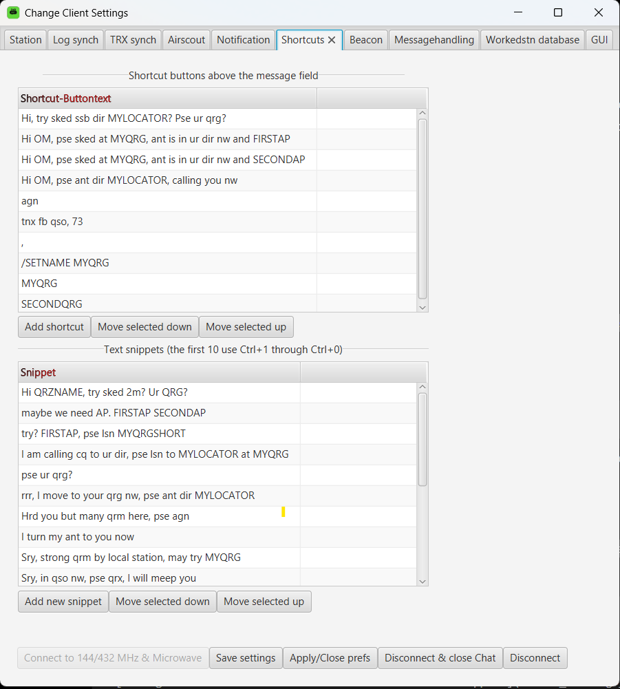
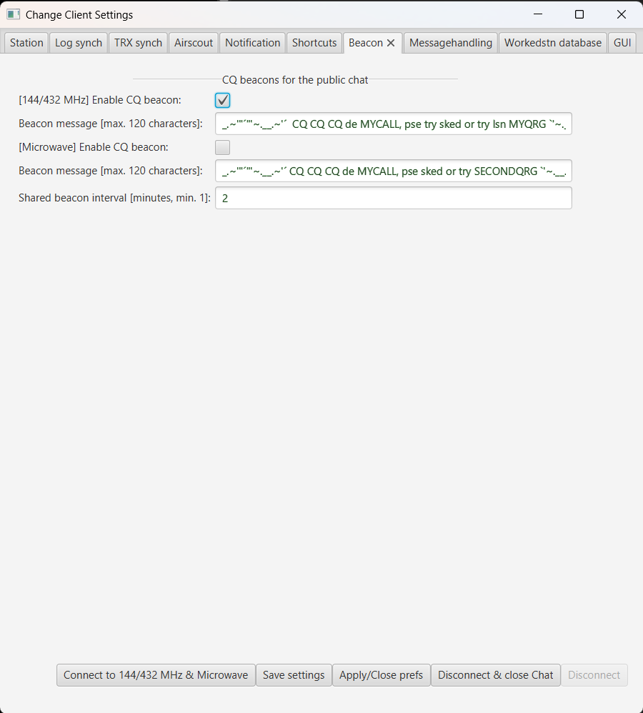
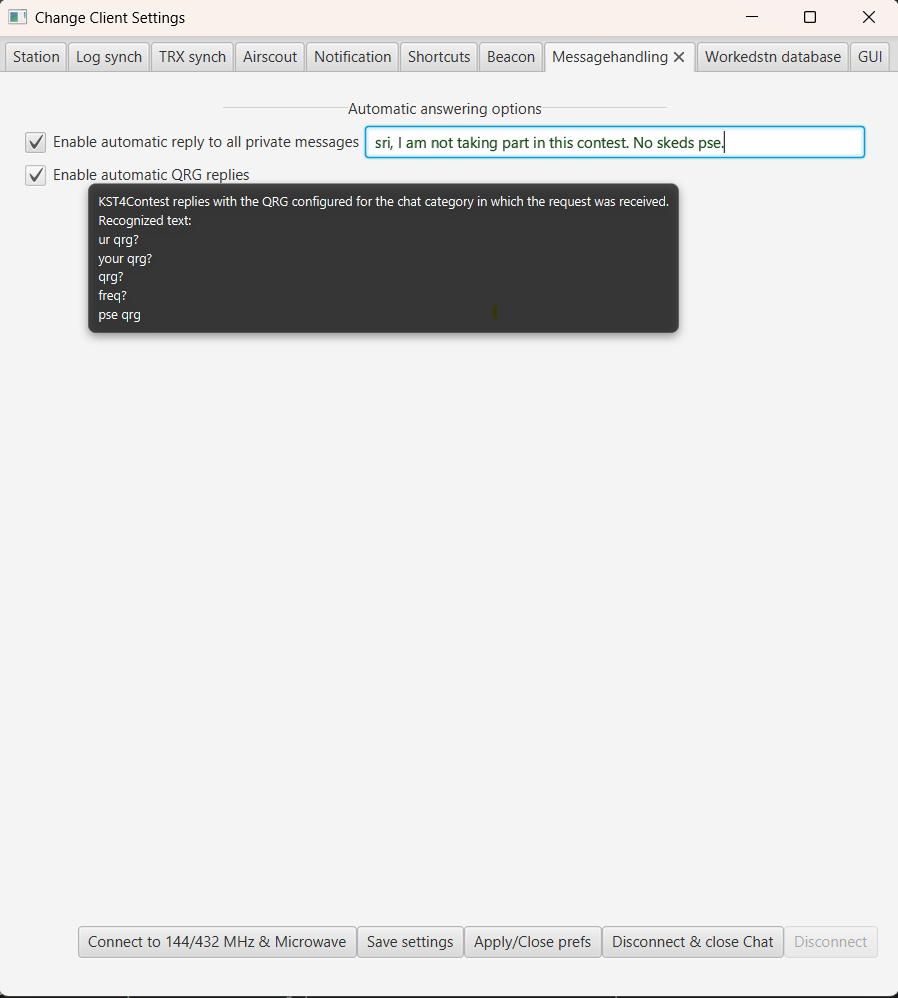

# Configuration

> 🇬🇧 You are reading the English version | 🇩🇪 [Deutsche Version](de-Konfiguration)

After the first start, the **settings window** opens – this is the central starting point for all configuration. It is recommended to keep the settings window open during operation (e.g. to quickly toggle the beacon on and off).

> **Important**: Use **Save Settings** for functional settings which should remain in effect after the next start. KST4Contest saves layout changes such as window sizes, divider positions and table-column widths automatically. The shared file is `~/.praktiKST/preferences.xml` on Linux and macOS and `%USERPROFILE%\.praktiKST\preferences.xml` (or `C:\Users\<Username>\.praktiKST\preferences.xml`) on Windows.

---

## Station Settings


### Login and Chat Categories

Enter the one local login callsign and password used for the ON4KST chat. Also select the **primary chat category** (e.g. IARU Region 1 VHF/Microwave).

The **second chat** option (Multi-Channel Login) adds another category (e.g. UHF/SHF) to the same ON4KST TCP session through Single Sign-on. KST4Contest does not open a second TCP connection and does not use another local login callsign or password.

**Name in Chat 2** configures only the visible, category-specific name field for the second category. It is neither another login nor a message destination. The visible name field, message context, QRG and beacon remain separate for each category. **Opposite Station Multi-Callsign Login Tagging**, by contrast, refers exclusively to remote stations which appear in the chat under several complete visible callsign variants.

### Callsign and Locator

Enter your own callsign and Maidenhead locator (6 characters, e.g. `JN49IJ`). The locator is not part of authentication. ON4KST shares it between both categories in the one TCP session, and KST4Contest also uses it for distance and direction calculations.

### Active Bands

The **My station uses …** checkboxes define the bands available in the current local station setup. Supported choices are 50 MHz, 70 MHz, 144 MHz, 432 MHz, 1296 MHz, 2320 MHz, 3400 MHz, 5760 MHz and 10 GHz.

This selection controls more than the visible band columns. It is also used for:

- the per-band Worked and NOT-QRV filters,
- the NOT-QRV controls visible in the **Further Info** panel,
- the `a` and `B+` band-opportunity calculation,
- the **New bands** filter,
- the band-upgrade hint after a log entry, and
- band-specific priority and Reachability functions.

After a change, click **Save Settings** and restart KST4Contest. Band columns and several related controls are created while the user interface is being built and are therefore not added or removed completely during the current session.

### Antenna Beamwidth

Enter the complete horizontal beamwidth of the local antenna in degrees. KST4Contest applies half of this value to either side of the selected or derived antenna direction. A configured value of `70°` therefore produces a corridor of `±35°`.

The value is used for:

- the QTF filter in the user list;
- the display of the local antenna corridor; and
- the assumed beamwidth of a remote station when [deriving directional opportunities](en-Features#directional-opportunities-from-directed-messages).

The final use is deliberately an approximation. ON4KST transmits neither the antenna being used nor its beamwidth. KST4Contest therefore uses the local value as a practical assumption for the remote station.

Choose a realistic value for the actual station setup. A value which is too large produces many geometrical matches with little practical meaning. A value which is too small may hide useful directional opportunities.

### Default Maximum QRB

Enter the maximum distance in kilometres within which KST4Contest should consider directional opportunities. The relevant distance is between the local station and the sender of the directed message, not between sender and receiver.

If the sender is farther away, the situation is neither highlighted nor forwarded as an automatic directional opportunity to the local DX Cluster server, even if the calculated angle would match.

### Path Analysis and Link Budget

The station map uses several values from the **Station** tab to calculate the terrain profile and link budget for the selected remote station. Enter the local station data as realistically as possible. The remote-station values remain global assumptions unless more accurate information is available.

| Setting | Use |
|---|---|
| **Own antenna height AGL** | Height of the local antenna above the surrounding terrain in metres |
| **Own TX power W** | Local transmit power in watts |
| **Own ant. gain dBi** | Gain of the local antenna in dBi |
| **DX OM TX power W** | Assumed transmit power of the remote station in watts |
| **DX OM ant. gain dBi** | Assumed antenna gain of the remote station in dBi |

**AGL** means *Above Ground Level*. Do not enter the height above sea level. The terrain elevation at the local station already comes from the elevation profile; KST4Contest adds the configured antenna height to this value.

For the remote station, KST4Contest currently uses a fixed antenna height of 10 metres above the local terrain. Its transmit power and antenna gain come from the two **DX OM** fields. These values are deliberately assumptions: ON4KST provides neither the actual antenna height nor the complete station data of the remote operator.

Antenna gains must be entered in `dBi`. Add `2.15 dB` before entering a value specified in `dBd`:

```text
dBi = dBd + 2.15 dB
```

The current QTF, configured antenna beamwidth and default maximum QRB affect the map display. The bands enabled for the local station and the frequency derived for the remote station also affect the selection of the analysis frequency.

For the terrain profile, KST4Contest uses the antenna heights, elevation model and Earth curvature with a fixed effective Earth-radius factor of `k = 4/3`. The link budget additionally includes:

- distance and the current analysis frequency,
- transmit powers and antenna gains in both directions,
- frequency-dependent estimated feeder losses,
- free-space path loss, and
- a rough additional loss caused by the relevant obstruction in the terrain profile.

The calculation is performed in both directions. The weaker direction determines the common SSB or CW margin. Optimistic power or antenna values therefore improve the displayed result, but they do not improve the real radio path.

The results remain engineering estimates. Current propagation conditions, local obstructions, vegetation, buildings, interference and unknown station parameters can change the actual result considerably. Operation, frequency selection and the limits of the calculation are described under [Station Map and Path Analysis](en-Features#station-map-and-path-analysis-from-v141).

---

## Server Settings (from v1.31)

The connection details for the ON4KST chat server are shown at the top of the **Station** tab. They normally do not need to be changed.

| Setting | Meaning |
|---|---|
| **ON4KST server** | DNS name or IP address of the chat server; the software default is `www.on4kst.org` |
| **Port** | TCP port of the chat server; the default is `23001` |

`www.on4kst.info` may also remain in an existing, working configuration. There is no reason to change it merely because the displayed name differs from the software default, provided that the chat connection remains reliable.

These values apply only to the outgoing ON4KST chat connection. They do not change the local DX cluster server or any connection to AirScout, PSTRotator or logging software.

The port must be between `1` and `65535`. An invalid entry is rejected and replaced with the last valid value. An incorrect server name or port, on the other hand, prevents KST4Contest from connecting to the chat.

Changing either value does not alter an existing TCP connection. Disconnect and reconnect the chat, or restart KST4Contest. Then use **Save Settings** so that the values are retained for the next program start.

---

## Log Sync Settings

The **Log sync** tab selects the sources from which KST4Contest imports worked stations. The three input paths provide different levels of detail:


| Input path | Data used | Result in KST4Contest |
|---|---|---|
| **Simplelogfile** | Callsigns read from a selected file | global Worked status, but no band or locator information |
| **General QSO UDP listener** | QSO packets from UCXLog, QARTest, N1MM+ and DXLog.net | global and per-band Worked status plus worked grid square where both band and locator are transmitted |
| **Win-Test network listener** | native Win-Test network packets | global and per-band Worked status, locator information and, depending on the settings, QRG synchronisation and sked handover |

The file-based interpreter reads the selected text file once per minute using a fixed callsign pattern. Matches are normalised to base callsigns and set only the global Worked status for all active variants. It is mainly useful when the logging application provides no supported network interface. A callsign match alone contains neither a reliable band nor a locator, so use one of the network listeners wherever possible if per-band information is required.

If the selected file does not exist, KST4Contest creates it and displays its full path together with checks for initial setup and the next contest. The file itself is the durable source; Worked marks derived from it are not stored in SQLite and are not reset automatically for a new contest.

The general QSO UDP listener is the recommended interface for UCXLog, QARTest, N1MM+ and DXLog.net. QSO and `RadioInfo` packets use the same configurable UDP port; the default is `12060`. Separate options in **Log sync** and **TRX sync** determine whether the received QSO and frequency information is processed.

Win-Test uses its own network protocol and therefore has a separate listener. Its default port is `9871`. If this port is changed while the listener is enabled, KST4Contest restarts the Win-Test listener on the new port. After changing the shared UDP port `12060`, KST4Contest must instead be restarted completely.

All enabled input paths may be used in parallel and identical reports do not create separate Worked states. Network-derived Worked information is stored in the internal database. Simplelogfile marks remain runtime state derived from the selected file. Before using Simplelogfile, check whether the logging application already provides one of the supported network interfaces. KST4Contest must be running when a network QSO is transmitted unless the logging application can resend the existing log.

Configuration of the individual logging applications, band and locator handling, and the Win-Test sked handover are described under [Log Synchronisation](en-Log-Sync).

---

## TRX Sync Settings

TRX synchronisation imports the current frequency from the logging application and makes it available in KST4Contest as the local QRG of the first chat category. QSO and frequency synchronisation may use the same UDP receiver, but they remain separate functions: receiving a `RadioInfo` packet does not mark a station as worked, and receiving a QSO packet does not automatically change the local QRG.


### Available QRG Sources

| Source | Setting | Behaviour |
|---|---|---|
| **General RadioInfo listener** | `Update MYQRG from RadioInfo messages received on the shared log-sync port` | Processes compatible `RadioInfo` packets on the UDP port shared with QSO synchronisation. The default port is `12060`. |
| **Win-Test STATUS** | `Win-Test STATUS QRG Sync` | Processes the main or pass frequency from native Win-Test `STATUS` packets. The Win-Test listener uses its separately configured port, which defaults to `9871`. |
| **Manual entry** | Disable both automatic QRG sources | The local QRG can be entered manually in the main window. |

The general listener is intended for logging applications which transmit compatible `RadioInfo` packets. Depending on their individual configuration, this includes UCXLog, N1MM+, QARTest and DXLog.net. QSO and `RadioInfo` packets use the same port configured under **Log sync**, but separate options determine whether KST4Contest processes QSO information, TRX information or both packet types. An automatic QRG source must be enabled and actually supply valid packets; enabling it alone does not update `MYQRG`.

Restart KST4Contest after changing the shared UDP port. Changes to the two QRG-sync checkboxes take effect immediately.

### Which QRG Is Updated?

Both automatic sources update `MYQRG` only. This is the local QRG of the first or primary chat category.

If a second chat is enabled, its QRG remains independent. It is not derived from incoming TRX packets and is available through `SECONDQRG`. The first category can therefore follow the logging application's frequency automatically while a separate QRG is entered manually for the second category.

When at least one automatic QRG source is enabled and supplies a valid value, the first category's QRG field in the main window follows the received frequency. If the expected packets do not arrive, verify the interface before the contest. Manual entry is available when both the general RadioInfo listener and Win-Test STATUS synchronisation are disabled.

### Main or Pass Frequency from Win-Test

By default, KST4Contest uses the main frequency contained in the Win-Test `STATUS` packet.

Enable `Use pass frequency from Win-Test STATUS` to use the packet's pass frequency instead. This is useful, for example, when Win-Test maintains a different frequency during split operation and that is the frequency which should be announced in the chat.

If the packet does not contain a valid pass frequency, KST4Contest automatically falls back to the main frequency. A missing pass frequency therefore neither clears `MYQRG` nor replaces it with an obviously incorrect number.

Frequencies use a consistent KST4Contest display format, for example:

```text
50.300.00
144.300.00
1296.100.00
10368.100.00
```

The number of digits before the first dot is derived from the frequency. Microwave frequencies with four or five MHz digits are therefore formatted correctly as well.

### Selecting the Win-Test Station

Several stations in a Win-Test network may transmit `STATUS` packets at the same time. `Win-Test station name filter` selects the station which is allowed to update the local QRG in KST4Contest.

Example:

```text
STN1
```

The comparison is case-insensitive. If the field is empty, `STATUS` packets from every Win-Test station are accepted.

In a multi-operator setup, set the filter to the station name of the operating position which actually belongs to this KST4Contest instance. Otherwise, a packet from another position may replace the QRG currently being displayed.

### Using MYQRG and SECONDQRG

The synchronised QRG can be used in every text processed by the common KST4Contest variable resolver. This includes:

- the send field,
- shortcuts,
- snippets, and
- automatic beacons.

`MYQRG` contains the complete QRG of the first chat category. `MYQRGSHORT` uses only its first seven characters. `SECONDQRG` contains the separately entered QRG of the second chat category.

Examples:

```text
I am calling cq at MYQRG
cq on MYQRGSHORT
second chat qrg SECONDQRG
```

The values are inserted when the message text is resolved. If the logging application changes frequency between two beacon runs, the next message already uses the updated value.

The local QRG may also be used as a fallback when handing a sked over to Win-Test. This only happens if the QRG can be parsed and belongs to the band explicitly selected for the sked. See [Log Synchronisation](en-Log-Sync#handing-skeds-over-to-win-test) for details.

Further information about text variables: [Macros and Variables](en-Macros-and-Variables#variables).

### Multiple Loggers or Radios

Every enabled QRG source writes to the same `MYQRG` value. KST4Contest does not currently assign incoming `RadioInfo` or `STATUS` packets to a particular radio or chat category.

If the general RadioInfo listener and Win-Test synchronisation are enabled at the same time, the most recently processed packet therefore determines the displayed QRG. The same applies when several logging applications send frequency packets to one KST4Contest instance.

For a setup containing several radios:

- QSO packets may be received from several logging applications.
- Frequency packets should only be transmitted by the source which is intended to control `MYQRG`.
- A Win-Test network should additionally use the station-name filter.
- If two completely independent QRG synchronisations are required, two separate KST4Contest instances provide the clearer arrangement.

In other words, combining several Worked sources is useful. Combining several simultaneously transmitting frequency sources merely creates a contest over which packet arrived last.

Click **Save Settings** after completing the configuration.

---

## AirScout Settings

The **AirScout** tab configures the UDP connection between KST4Contest and AirScout. KST4Contest does not request a general aircraft feed. It submits the station paths which are currently relevant, while AirScout calculates the matching aircraft and returns the result to the requesting KST4Contest instance.

AirScout `0.9.9.5` or newer is required.

{ width=85% }

### UDP Connection Settings

| Setting | Default | Use |
|---|---:|---|
| **Enable AirScout UDP integration** | disabled | Enables AirScout requests and the processing of returned information |
| **AirScout server identifier** | `AS` | Logical name of the AirScout instance being addressed |
| **KST4Contest client identifier** | `KST` | Logical name of this KST4Contest instance |
| **AirScout UDP port** | `9872` | Shared UDP port for requests and responses |
| **Select AirScout frequency automatically per station** | enabled | Derives a suitable band and frequency from the current context of each remote station |
| **Forced AirScout band value** | `1440000` | Uses one fixed AirScout band value for every station when automatic selection is disabled |

When **Enable AirScout UDP integration** is disabled, KST4Contest neither sends AirScout requests nor processes incoming AirScout responses. The UDP receiver may remain bound so that the integration can be enabled again during the current connection.

KST4Contest sends AirScout packets to the broadcast address `255.255.255.255`. No separate destination IP address is therefore configured. AirScout and KST4Contest must be able to receive the same UDP broadcast; routers do not normally forward this type of broadcast into another network. If communication fails, check the UDP port, local firewall and network assignment first.

### Automatic Band Selection per Station

**Auto per station** is the recommended setting. Instead of using one fixed band value for every remote station, KST4Contest derives a suitable frequency from the available operating context.

The sources are evaluated in this order:

1. the most recently detected QRG of the remote station, provided that it is no more than 30 minutes old,
2. one unambiguous complete QRG in the name field of an active chat entry,
3. unambiguous band designators in the name field,
4. 432 MHz if the same station is active in both the VHF/UHF and Microwave categories and 432 MHz is enabled for the local station,
5. the lowest locally enabled band belonging to the supported chat category.

Active chat variants of the same base callsign are evaluated together. Entries such as `CALLSIGN`, `CALLSIGN-2` and `CALLSIGN-432` can therefore contribute to the same band decision while remaining separate chat members for message processing.

Only bands enabled under **My station uses …** are eligible for automatic selection. A manually assigned NOT-QRV mark excludes the corresponding band and takes precedence over automatically detected QRG or name information.

The 50/70 MHz, VHF/UHF, Microwave and EME/JT65 chat categories are supported. Other ON4KST categories do not participate in AirScout band resolution. If no sufficiently reliable frequency can be determined, KST4Contest omits the request for that station. An arbitrary fallback to 144 MHz would produce a syntactically complete packet, but not necessarily a useful calculation.

Automatic AirScout selection uses the same propagation-frequency resolver as the internal path analysis. Both functions therefore evaluate the station path from the same technical basis.

### Fixed AirScout Band

When **Auto per station** is disabled, KST4Contest uses the value entered under **Forced AirScout band value** for every station.

Enter the value in the unit used by the AirScout UDP interface:

| Band | AirScout value |
|---|---:|
| 50 MHz | `500000` |
| 70 MHz | `700000` |
| 144 MHz | `1440000` |
| 432 MHz | `4320000` |
| 1296 MHz | `12960000` |
| 2320 MHz | `23200000` |
| 3400 MHz | `34000000` |
| 5760 MHz | `57600000` |
| 10368 MHz | `103680000` |
| 24048 MHz | `240480000` |

In fixed mode, neither the remote station's recently detected QRG nor a band stated in its name is considered. This option is therefore mainly useful for a station setup which is clearly limited to one band, or for troubleshooting.

### Server and Client Identifiers

The identifiers belong to the AirScout protocol. They are not DNS names or IP addresses.

Outgoing requests contain the client identifier followed by the server identifier:

```text
"KST" "AS"
```

AirScout returns them in the opposite order:

```text
"AS" "KST"
```

KST4Contest processes a response only if both identifiers exactly match the current configuration. The comparison is case-sensitive.

Identifiers must not be empty and must not contain quotation marks or line breaks.

If several KST4Contest instances operate in the same network, assign a distinct client identifier to each one, for example:

```text
KST-144
KST-432
```

If several AirScout instances are present, use distinct server identifiers as well. This prevents a response intended for one operating position from being processed by another KST4Contest instance.

### Which Stations Are Requested?

KST4Contest starts the first periodical AirScout request approximately ten seconds after the chat connection has been established. Further requests follow every 60 seconds.

An active station is included only if:

- a usable callsign is available,
- a locator is available,
- its distance has been calculated,
- its distance is below the configured **Maximum QRB**, and
- a usable band can be determined.

Several active chat entries of the same base callsign do not create a separate identical path calculation for every suffix. The returned AirScout information is subsequently assigned to the corresponding active chat variants.

This selection does more than reduce network traffic. It also prevents AirScout from continuously calculating paths outside the intended working range of the local station.

### Applying Changed Settings

The following changes are used for new packets immediately after leaving the input field or changing the checkbox:

- enabling or disabling the AirScout integration,
- server identifier,
- client identifier,
- automatic or fixed band selection, and
- the forced band value.

After changing the UDP port, disconnect and reconnect the chat or restart KST4Contest. The existing UDP receiver otherwise remains bound to the previous port.

Click **Save Settings** afterwards to retain the configuration.

AirScout setup, aircraft display and the meaning of the returned AP information are described under [AirScout Integration](en-AirScout-Integration).

---

## Notification Settings


The three audio functions work independently:

1. **Simple sounds**: Plays short cues for new private messages, detected directional opportunities, sked reminders and `BAND+` hints.
2. **CW announcement**: Spells the sender's callsign in CW for a new private message.
3. **Phonetic announcement**: Speaks the sender's callsign phonetically for a new private message.

Each function can be enabled separately. CW and phonetic output can also be active at the same time.

PM-related audio output is triggered only by messages actually directed to the local login callsign. Messages shown additionally through PM Catching and messages added through QSO Monitoring remain silent.

### Fallback Band for Relative QRG Detection

The **Fallback band for relative QRG detection** dropdown selects the band used when a relative QRG cannot be assigned to a recent station-specific band context.

Only band prefixes supported by the frequency parser are available:

```text
50 MHz
70 MHz
144 MHz
432 MHz
1296 MHz
2320 MHz
3400 MHz
5760 MHz
10368 MHz (10G)
24048 MHz (24G)
```

The dropdown is neither a filter nor an override for complete frequencies. `432.088` is recognised as a frequency in the 432 MHz band regardless of the selection. The fallback is needed for relative values such as `.205`, `,205` or `qrg 205`.

Before using the fallback, KST4Contest checks the sender's recent band context. If a complete frequency has been detected for the same station during the previous 30 minutes, that band takes precedence. A fallback setting of `144 MHz` therefore still turns `.100` into `432.100 MHz` if the station mentioned `432.088` shortly before.

Although this setting is located in the Notification tab, it affects the general QRG parser. It therefore influences the QRG column, detected active bands, priority calculations, band-upgrade hints and other functions which use a known station frequency – not only DX cluster spots.

Further details, including numbers which are deliberately ignored, are described under [QRG Detection](en-Features#qrg-detection).

### Local DX Cluster Output

KST4Contest can forward detected directional opportunities to logging software as DX cluster spots. A frequency recognised in the chat can therefore appear directly in the logger's band map without being entered manually.

The **Enable the local DX Cluster server …** checkbox starts or stops the local TCP server. When KST4Contest is connected to the chat, the change takes effect immediately.

The following settings and controls belong to the local DX cluster output:

- **TCP port**: Port on which KST4Contest accepts connections from DX cluster clients. The default is `8000`. Changing the port while the server is running restarts it on the new port. The logger must then reconnect to that port.
- **Fallback band for relative QRG detection**: The global fallback band described above. The test spot uses `.300` on this band. Actual spots use the QRG detected for the respective sender.
- **Spotter callsign**: Callsign shown as the spotter in generated DX cluster entries. A callsign different from the contest callsign should be used. Some logging programs filter spots apparently sent by the local station or treat them differently from external spots.
- **Send test spot**: Sends the following entry to every currently connected DX cluster client:

```text
Spotted callsign: DO5AMF
Comment: DXC test: You donated $100!
Frequency: .300 on the selected fallback band
```

With `144 MHz` selected as the fallback band, the resulting frequency is approximately `144.300 MHz`.

All spots use a fixed, DXSpider-compatible 75-character payload line with a 30-character comment field. Longer comments are deliberately truncated at this protocol boundary; the DX callsign is not. A callsign longer than twelve characters causes the affected spot to be rejected and logged.

The comment is a deliberately retained Easter egg. It has no technical meaning and, despite being remarkably specific, does not initiate a payment. Its practical purpose is to make the test spot easy to identify in the logging software.

The test works only if

1. KST4Contest is connected to the ON4KST chat,
2. the local DX cluster server is enabled, and
3. at least one DX cluster client is connected to KST4Contest.

KST4Contest does not generate a spot for every frequency found in the chat. An actual spot is created only when a directed message between two stations indicates a relevant antenna direction for the local station and a usable frequency is known for the sender.

The complete derivation and logger setup are described under [Built-in DX Cluster Server](en-DX-Cluster-Server).

---

### Band Upgrade Hint after a Log Entry

After receiving a log entry from UCXLog or Win-Test, KST4Contest can check whether the station which has just been worked still offers another common and unworked band.

The check uses the same derivation as the `a` and `B+` display:

1. the bands enabled in the local station settings,
2. QRGs detected for the remote station during the previous 30 minutes,
3. explicit band designators in the name fields of its active chat entries,
4. stored per-band Worked marks, and
5. manually assigned NOT-QRV marks.

Active chat variants of the same normalised callsign are evaluated together. NOT-QRV takes precedence over an automatically detected QRG or band designator.

If at least one common and unworked band remains, the main window displays a blinking **BAND+** hint for approximately twelve seconds. The callsign and remaining bands are included in the button text; the tooltip contains the complete derivation. If general notification sounds are enabled, KST4Contest also plays a short sound.

The two options serve different purposes:

- **Blink + sound …** enables the hint after a matching log entry.
- **Priority boost …** additionally raises the score of stations which have already been worked on at least one band but still offer another common and unworked band.

The Priority Boost is only one factor in the complete calculation. Distance, antenna direction, recent activity, AirScout data, skeds and negative hints may still change the final order. Enabling the option therefore guarantees neither a particular score nor a particular position in the priority list.

The other score weights currently have no separate user-interface controls. Several existing settings nevertheless provide input data for the calculation, particularly the [active bands](#active-bands), [antenna beamwidth](#antenna-beamwidth), [default maximum QRB](#default-maximum-qrb) and [AirScout settings](#airscout-settings).

The complete calculation is described under [Priority Score and Priority List](en-Features#priority-score-and-priority-list-from-v140).


The hint requires a log-synchronisation source which provides band information. The file-based callsign interpreter sees callsigns only and cannot reliably identify the band of the QSO which has just been logged.

Further explanation: [Band Upgrade Hint after a Log Entry](en-Features#band-upgrade-hint-after-a-log-entry).

---

## Shortcut Settings



Each entry in the upper part of the **Shortcuts** tab creates one button above the message field in the main window. Pressing the button appends its configured text to the current contents of the send field.

If the shortcut contains a [variable](en-Macros-and-Variables#variables), it is replaced with its current value when the text is inserted. A shortcut such as

```text
pse call me at MYQRGSHORT
```

may therefore insert:

```text
pse call me at 144.388
```

The exact entries `MYQRG` and `SECONDQRG` are additionally highlighted as QRG buttons. They insert the current frequency of the primary or secondary chat category respectively.

The shortcut `/SETNAME MYQRG` is highlighted as well. When it is pressed, KST4Contest resolves `MYQRG` and inserts the complete server command into the send field. The command is not transmitted automatically and can still be checked before it is sent with `Enter` or **TX**.


The order of the table determines the order of the buttons in the main window. Manage the entries as follows:

1. **Add shortcut** creates a new entry at the beginning of the list and immediately opens it for editing.
2. Double-click an existing entry to edit it. Press `Enter` to accept the change.
3. To remove an entry, delete its complete contents and confirm with `Enter`.
4. Use **Move selected up** and **Move selected down** to change the position of the selected entry.

Changes appear in the main window immediately. Use **Save Settings** afterwards if they should remain available after the next program start.

---

## Snippet Settings

Snippets are longer text blocks intended primarily for messages to a selected station. They can be opened through:

- a right-click on a station in the user list;
- a right-click on a message in the public chat table;
- a right-click on a message in the PM table; or
- `Ctrl+1` through `Ctrl+0` for the first ten entries in the snippet list.

The keyboard mapping follows the order of the table:

| Key combination | Snippet |
|---|---:|
| `Ctrl+1` | first entry |
| `Ctrl+2` | second entry |
| … | … |
| `Ctrl+9` | ninth entry |
| `Ctrl+0` | tenth entry |

A snippet selected from a context menu is appended to the message already prepared in the send field. Selecting a station or message will normally have inserted the appropriate `/cq` destination first.

A keyboard shortcut behaves differently: it replaces the current contents of the send field with a complete directed message:

```text
/cq CALLSIGN snippet text
```

The complete visible callsign, including any suffix, is retained. Selecting `9A0BB-70` may therefore produce:

```text
/cq 9A0BB-70 pse ur qrg?
```

The selected station's chat category is retained for transmission. If no station is selected, or no snippet is assigned to the chosen key combination, nothing is inserted.

Variables are resolved when the snippet is inserted. Station-specific variables such as `QRZNAME`, `FIRSTAP` and `SECONDAP` refer to the currently selected station. The prepared message is not sent automatically and can still be checked or edited. Press `Enter` or **TX** to send it; `Esc` clears the send field.

The snippet list is edited in the same way as the shortcut list:

1. **Add new snippet** creates a new entry at the beginning of the list.
2. Double-click an existing entry to edit it.
3. Press `Enter` to accept the change.
4. Confirming an empty entry removes it.
5. **Move selected up** and **Move selected down** change both the displayed order and the assignment to `Ctrl+1` through `Ctrl+0`.

The context menus and keyboard mappings are updated immediately. Use **Save Settings** afterwards to store the modified list permanently.

The complete list of available placeholders and their limitations is described under [Macros and Variables](en-Macros-and-Variables).

---

## Beacon Settings



A beacon sends a public CQ message at regular intervals. It is intended for operating situations in which the local station calls CQ on a fixed frequency for an extended period. Other stations receive current QRG information without requiring the operator to enter the same message repeatedly.

KST4Contest uses one shared timer for both chat categories. Each category nevertheless has its own enable setting and message template:

- **Enable CQ beacon** enables the beacon for the respective category.
- **Beacon message** contains the public message for that category.
- **Shared beacon interval** sets the common interval used by both categories.

When both beacons are enabled, they are sent one after the other in their respective categories during the same timer run. The second beacon is only considered while the second category is enabled and fully synchronised in the same ON4KST session.

### Interval and timer behaviour

The interval is entered in whole minutes. The minimum permitted value is one minute.

After the chat connection has been established, KST4Contest performs the first beacon check after approximately ten seconds. The configured interval applies after that initial check.

Changing the interval while connected restarts the countdown with the new value. The change itself does not cause an immediate beacon message.

Both categories use the same timer. Separate intervals for the primary and secondary chat cannot be configured.

### Message text and variables

A beacon may use the [global variables](en-Macros-and-Variables#variables-in-the-beacon) which depend only on the local station:

- `MYQRG`
- `MYQRGSHORT`
- `SECONDQRG`
- `MYLOCATOR`
- `MYLOCATORSHORT`
- `MYCALL`
- `MYQTF`

A suitable message for the primary chat category is:

```text
calling cq at MYQRGSHORT, ant MYQTF deg, loc MYLOCATOR
```

Use `SECONDQRG` for the second chat if it operates on a different frequency:

```text
calling cq at SECONDQRG, ant MYQTF deg, loc MYLOCATOR
```

Variables are resolved again on every timer run. If the logging software changes the QRG stored in `MYQRG`, the next beacon can already contain the updated value. The message template does not have to be edited.

`MYQRG` and `MYQRGSHORT` always refer to the primary chat category. Enabling or selecting the second chat does not change this assignment.

Station-specific variables such as `QRZNAME`, `FIRSTAP` and `SECONDAP` require a selected remote station. A public beacon has no such destination, so these variables are not resolved in beacon messages.

### Message validation

KST4Contest validates both the configured template and the message which remains after all variables have been resolved.

The following restrictions apply:

- The final message must not be empty.
- It must not exceed 120 characters.
- The protocol separator `|` is not permitted.
- Line breaks are not permitted.

An invalid entry is not accepted as the new beacon configuration. If a template becomes invalid only after resolving its variables, for example because the resulting text exceeds 120 characters, that beacon run is skipped.

A template which consists only of a temporarily empty global variable may still be stored. This can happen during startup before the first QRG has been received from the logger. KST4Contest does not send an empty message while the variable has no usable value.

### When should the beacon be disabled?

The beacon is useful only while its QRG matches the actual operation. Leaving it enabled while searching the band or changing frequencies frequently may cause other stations to look for the local station on an obsolete frequency.

In plain terms: the beacon saves work while calling CQ on a fixed QRG. It should be disabled while moving around the band.

Changes take effect during the current connection. Use **Save Settings** afterwards to retain the enable settings, message templates and interval for the next program start.

---

## Messagehandling Settings (from v1.25)



The most important use of the general automatic reply concerns stations which are logged into the ON4KST chat but are not taking part in the current contest. During larger contests, sked requests are sometimes sent to many logged-in stations without first checking whether they are participating. Without an automatic reply, the recipients would have to enter the same refusal repeatedly.

KST4Contest can answer these requests with a predefined message. A separate function provides the local QRG when a private message contains a recognised frequency request. Both functions can be enabled independently.

### General automatic reply

**Enable automatic reply to all private messages** answers incoming private messages with the text entered in the adjacent field. One common text is used for both chat categories. The configured capitalisation is preserved.

A suitable message is:

```text
Sri, I am not taking part in this contest. No skeds.
```

Do not add the `[KST4C Automsg]` prefix to the configured text. KST4Contest inserts it automatically.

The message received by the remote station may therefore be:

```text
[KST4C Automsg] Sri, I am not taking part in this contest. No skeds.
```

The incoming private message remains visible. The function neither blocks nor discards the request; it merely avoids entering the same answer repeatedly.

The reply is addressed to the sender's complete callsign, including any visible suffix, and sent through the chat category in which the private message was received. This distinction matters when two categories are connected at the same time: a request received through the microwave chat must not be answered accidentally through the VHF/UHF chat.

An empty or whitespace-only answer does not produce an automatic message. A configured text containing the protocol separator `|` or a line break is rejected as well.

### Automatic QRG reply

**Enable automatic QRG replies** reacts to common QRG requests. Matching is case-insensitive and looks for the following text fragments:

```text
ur qrg?
your qrg?
qrg?
freq?
pse qrg
```

The answer contains only the QRG belonging to the category in which the request was received:

| Incoming private message | QRG used for the reply |
|---|---|
| Primary category | current QRG of the primary category |
| Second chat category | current QRG of the second category |

A possible reply is:

```text
[KST4C Automsg] QRG is: 144.300.00
```

The values come from the same QRG fields used by `MYQRG` and `SECONDQRG`. The primary QRG may be entered manually or updated through [TRX synchronisation](#trx-sync-settings). The second category uses the value configured or entered for that category.

If no QRG is available for the incoming category, KST4Contest does not send an incomplete reply. A message containing `QRG is:` without a frequency would technically answer the request while providing no useful information. It is therefore rejected before reaching the transmit queue.

When both automatic-reply functions are enabled, the QRG reply takes precedence. A recognised QRG request does not additionally produce the general reply. If the required QRG is missing, KST4Contest does not fall back to the general answer.

### Protection against repeated replies

Every automatically generated reply contains the fixed prefix:

```text
[KST4C Automsg]
```

The general and QRG-specific functions ignore messages which already contain this prefix. This prevents two clients with automatic replies enabled from answering each other indefinitely.

A common two-minute cooldown additionally applies to both reply types. The cooldown is tracked separately for each complete callsign and chat category.

This means:

- `CALLSIGN-2` and `CALLSIGN-70` have separate cooldowns.
- The same complete callsign can still receive an independent reply in another chat category.
- A general reply also suppresses a QRG reply to the same callsign in the same category for two minutes.
- A QRG reply likewise suppresses the general reply.

The cooldown starts only after KST4Contest has produced a complete, locally valid message and placed it in the transmit queue. A missing QRG, an empty general reply or a message rejected because of invalid characters does not start the cooldown. Once the missing information has been corrected, a valid reply can therefore be generated immediately.

> **Note**: The configured text should describe the actual operating status clearly. If the station is only observing the contest and does not accept skeds, say exactly that. A vague automatic message is likely to produce another question – which is precisely the work this function is intended to avoid.

Changes take effect during the current connection. Use **Save Settings** afterwards to retain the enable settings and general reply text for the next program start.

Further background: [Automatic Replies to Private Messages](en-Features#automatic-replies-to-private-messages-from-v125).

---


## Win-Test Network Listener (from v1.31)

The Win-Test network listener processes the native Win-Test UDP protocol. It is independent of the general QSO UDP listener on port `12060` and has three separate tasks:

- processing QSOs including band and locator information,
- processing STATUS packets for the local QRG, and
- handing skeds over to the Win-Test network.

### Log sync settings

| Setting | Function |
|---|---|
| **Receive Win-Test network based UDP log messages** | Enables the Win-Test network listener. When the listener is enabled, pressing **Create sked** also attempts the Win-Test handover. |
| **UDP-Port for Win-Test listener** | Port used by the Win-Test network. The default is `9871`. The same port is used for the sked handover. |
| **KST station name in Win-Test network (src of SKED packets)** | Station name used by KST4Contest when sending sked packets. A unique name should be used in a network containing several clients. |
| **Win-Test network broadcast address** | Destination address for outgoing Win-Test network packets. In a local network, the address must be reachable by the Win-Test computer. |

The broadcast address is configurable because `255.255.255.255` is not forwarded reliably through every station network or network interface. In a multi-computer setup, the directed broadcast address belonging to the station network may be required instead.

### TRX sync settings

| Setting | Function |
|---|---|
| **Win-Test STATUS QRG Sync** | Takes the current frequency from Win-Test STATUS packets and uses it as the local QRG. |
| **Use pass frequency from Win-Test STATUS** | Uses the transmitted pass frequency instead of the normal TRX QRG. |
| **Win-Test station name filter** | Only processes STATUS packets from the specified Win-Test station. An empty field accepts every station name. |

The station filter is particularly useful when several Win-Test clients are active. Without a filter, the most recently received STATUS packet from another operating position can overwrite the local QRG in KST4Contest.

### Sked handover

There is no separate internal sked mode for the Win-Test handover. When the listener is enabled, **Create sked** attempts the Win-Test transfer in addition to creating the internal sked.

KST4Contest only sends an `ADDSKED` packet when it can determine a QRG which belongs to the explicitly selected band. If no matching QRG is available, the internal sked remains intact and the Win-Test handover is omitted.

`SSB` or `CW` is selected directly in the Further Info section when the sked is created. No automatic mode inference is used.

Click **Save Settings** after making changes so that the port, station name, broadcast address and TRX options are restored at the next start.

Data handling and QRG selection: [Log Synchronisation – Win-Test](en-Log-Sync#win-test)

---

## PSTRotator Settings (from v1.31, fully configurable from v1.40)

KST4Contest can set an antenna direction through the PSTRotator UDP interface and use the current position reported by PSTRotator as the local QTF.

The settings are located in the **Station** tab:

| Setting | Default | Purpose |
|---|---:|---|
| **Enable PSTRotator** | disabled | Starts UDP communication with PSTRotator |
| **PSTRotator host** | `127.0.0.1` | Hostname or IP address of the computer running PSTRotator |
| **PSTRotator UDP port** | `12000` | UDP port on which PSTRotator receives control commands |

When both applications run on the same computer, `127.0.0.1` is normally the clearest setting. If PSTRotator runs on another computer in the station network, enter its reachable IP address or DNS name.

The port must be between `1` and `65534`. Port `65535` cannot be used because PSTRotator reports its position on the following port.

### Preparing PSTRotator

Configure the same UDP port under **Communication → UDP Control Port** in PSTRotator and enable **UDP Control**.

The default configuration uses the following pair:

| Direction | UDP port |
|---|---:|
| KST4Contest → PSTRotator | `12000` |
| PSTRotator → KST4Contest | `12001` |

KST4Contest binds the return port automatically. It is not configured separately.

When the programs run on different computers, the local firewalls and station network must permit UDP traffic in both directions. KST4Contest cannot receive position reports if another program already occupies the return port.

The complete UDP protocol is documented in the [PSTRotatorAz User Manual](https://www.qsl.net/yo3dmu/ANT/PstRotatorAz%20User%20Manual.pdf).

### Updating the local QTF

KST4Contest asks PSTRotator for the current azimuth and operating mode every two seconds. The reported azimuth becomes `actualQTF`.

While PSTRotator integration is enabled, the QTF field in the main window is therefore read-only. It displays the most recent position reported by PSTRotator.

This QTF is used by:

- the direction filter;
- the derivation of direction opportunities;
- the Priority Score;
- the antenna sector on the station map;
- the AP and sked timeline; and
- the `MYQTF` variable.

A received rotator position is therefore more than a displayed value. It changes several functions which depend on the current antenna direction.

The current integration uses azimuth only. Elevation control and complete azimuth/elevation tracking are outside its present scope.

### Applying changed settings

The enable setting, host and port are evaluated when the rotator connection is started. After changing them, disconnect and reconnect the ON4KST session or restart KST4Contest.

Use **Save Settings** afterwards so that the values are restored at the next program start.

---

## Sniffer Settings (from v1.31)

QSO monitoring is intended for stations whose communication should remain visible during busy chat activity. This may be a rare station, a DXpedition or another station in the same contest team whose sked arrangements should not disappear in the general message traffic.

The callsign list is maintained under **QSO monitoring** in the **Notification** tab.

For every monitored base callsign, KST4Contest additionally shows messages in the PM table when a variant of that callsign is either the sender or the receiver. Both connected chat categories are included.

The list intentionally uses the normalised base callsign. The following entries therefore produce the same monitoring entry:

```text
DN9APW
DN9APW-2
DN9APW-70
DN9APW-144
```

In every case, KST4Contest stores and displays:

```text
DN9APW
```

The different KST suffixes of one station do not have to be entered separately. A later message sent by `DN9APW-2` or addressed to `DN9APW-70` is covered by the same entry.

This aggregation applies to QSO monitoring only. Active ChatMember objects, complete message destinations and chat categories remain separate. A message addressed to `DN9APW-70` is therefore not redirected to `DN9APW-2`.

A monitored message is marked in the PM table using the complete visible callsigns of its sender and receiver:

```text
Sniffed: (DN9APW-2 > DL0ABC-70) Message text
```

The original message remains in its normal table. Monitoring changes neither its contents nor its routing.

A message is included only when the monitored station is actually its sender or receiver. Merely mentioning the callsign in the message text is not sufficient. Public messages sent by a monitored station are included as well; their receiver is displayed as `ALL`.

A message which is already addressed directly to the local callsign remains a normal private message and does not receive an additional `Sniffed:` marker.

Manage the list as follows:

1. Press **Add monitored callsign** to add an entry.
2. Double-click an existing entry to edit it and press `Enter` to apply the change.
3. To remove an entry, delete the complete cell contents and press `Enter`.

The entered value may contain a visible KST suffix or portable components. KST4Contest normalises it to the base callsign before storing it. Different variants of the same base callsign are therefore treated as duplicates.

Changes to the list take effect immediately. Press **Save Settings** afterwards to retain them. The base callsigns are stored in `preferences.xml` and restored at the next program start.

> Base-callsign monitoring across KST suffixes is included from v1.42 onwards.

Further background and the distinction from message routing: [QSO Sniffer](en-Features#qso-sniffer-from-v131).

---

## GUI Settings: Band-Column Hints

Two optional additions to the band columns can be enabled or disabled in the **GUI** tab:

- **Show "o" in band columns …** displays an `o` if the four-character grid square has already been worked on the relevant band. Disabling the option does not delete any database records; it only hides the additional indicator in the band columns. `wkdany` is unaffected.
- **Show "a" in band columns …** distinguishes a completely new callsign from a band opportunity involving a callsign already worked elsewhere. When disabled, both cases are displayed as `B+`. The band-opportunity calculation itself remains unchanged.

Changes are reflected in the current user interface immediately. Click **Save Settings** afterwards if they should persist after the next start.


---

## Worked Station Database Settings

The internal SQLite database stores contest-related state independently of the logging application's database:

- the global Worked status of a callsign,
- Worked status per band,
- manually assigned NOT-QRV marks per band, and
- worked four-character grid squares per band.

Worked marks from the Simplelogfile interpreter are the exception. They are copied from the selected file into runtime state only and are not persisted in SQLite. The file is the durable source and has no automatic contest reset. A database reset does not change or empty it; callsigns contained in the file are marked as worked again during the next periodic evaluation.

The normalised callsign, without visible chat brackets or category formatting, is used as the key. This allows active variants of the same callsign to be evaluated consistently.

Worked and NOT-QRV information expires automatically three days after its most recent change. Stored grid squares expire three days after the corresponding log entry. A manual reset before every contest is therefore normally unnecessary.

The **Reset worked, NOT-QRV and grid data...** button removes every Worked mark, NOT-QRV mark and stored worked grid square. A confirmation dialog is displayed first. Known callsign rows remain in the database; only the contest-related state is reset.

A reset is useful when you deliberately want to start with an empty contest state or have imported test data. It is not intended as a daily maintenance step.

Display and derivation: [Worked Callsigns, New Bands and New Grid Squares](en-Features#worked-callsigns-new-bands-and-new-grid-squares).

---

## Dark Mode (from v1.26)

Enable Dark Mode through **Windows → Use dark mode design**. Use **Windows → Use default mode design** to restore the normal light colour scheme.

---

## Saving Settings

**Save Settings** stores functional settings and the complete current layout. Changes to window sizes and positions, relevant dividers, managed table-column widths and the **Group nearby stations** map setting are also saved automatically after a short delay. Any pending layout update is written when the programme exits.

- Storage location: `~/.praktiKST/preferences.xml` on Linux and macOS and `%USERPROFILE%\.praktiKST\preferences.xml` (or `C:\Users\<Username>\.praktiKST\preferences.xml`) on Windows
- The automatic layout writer does not copy functional changes which have not yet been confirmed with **Save Settings**.
- Configuration version 6 adds optional column-width entries below `guiOptions`. Older `preferences.xml` files remain readable. Missing or invalid widths simply cause KST4Contest to calculate useful initial widths again.
- Configuration version 7 adds `GUIstationMapClusteringEnabled` below `guiOptions`. If the entry is missing or unusable, spatial map clustering remains enabled.
- Older programme versions ignore the additional XML entries. If an older version rewrites the complete file, column widths and the stored **Group nearby stations** choice may be lost.
- If you encounter problems: delete the configuration file → KST4Contest will create a new one with default values.
