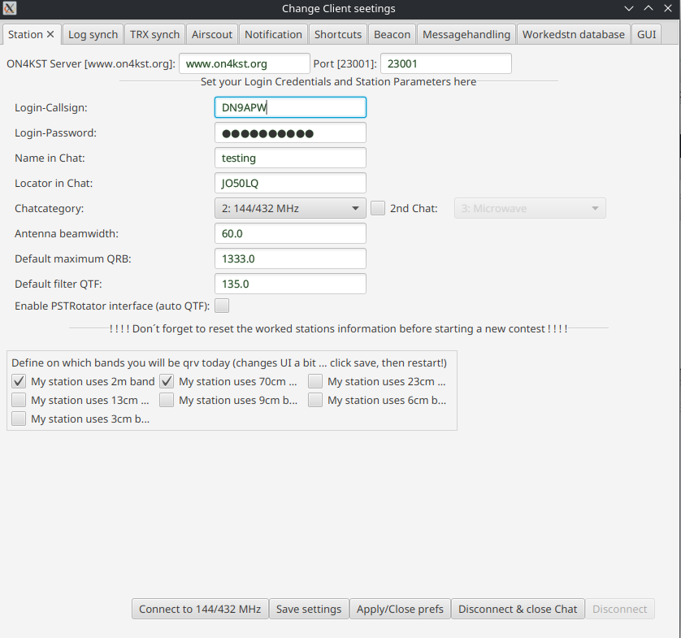
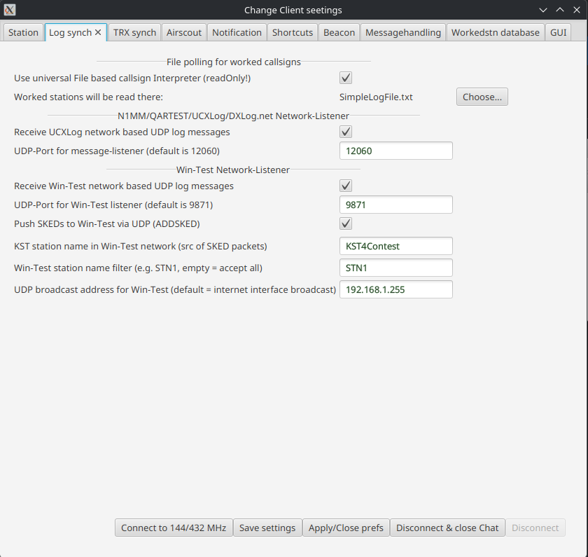
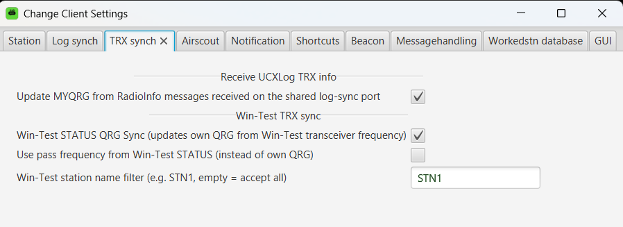
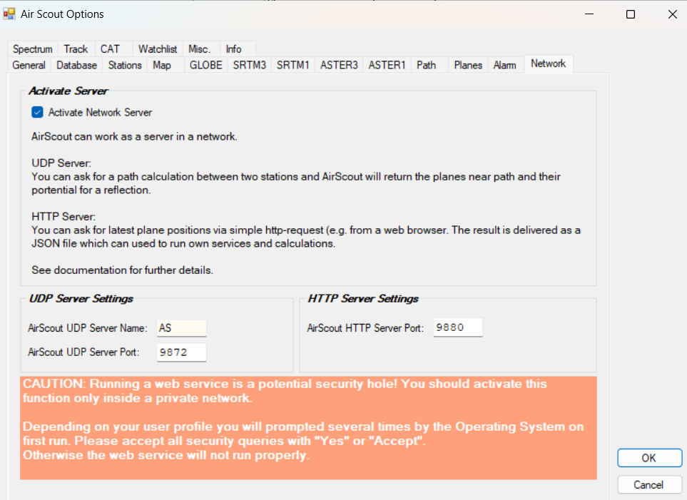
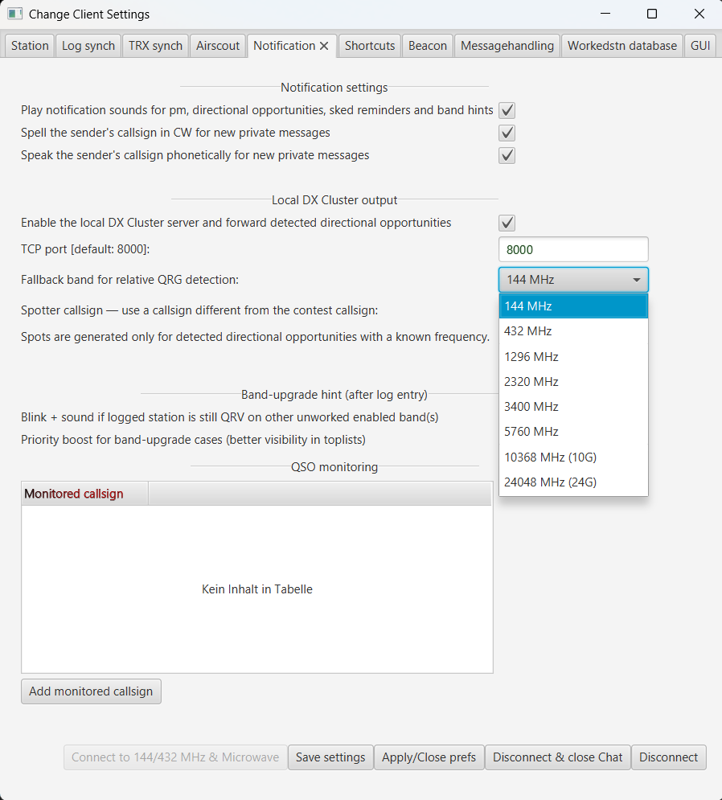
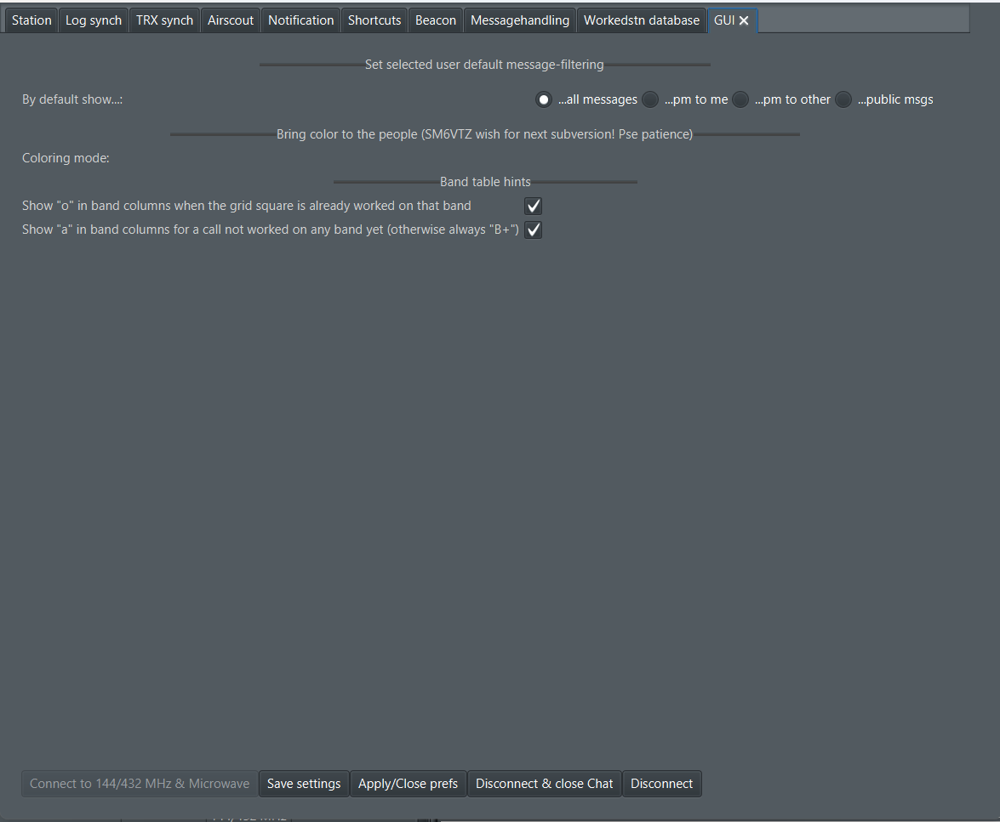

# Configuration

> 🇬🇧 You are reading the English version | 🇩🇪 [Deutsche Version](de-Konfiguration)

After the first start, the **settings window** opens – this is the central starting point for all configuration. It is recommended to keep the settings window open during operation (e.g. to quickly toggle the beacon on and off).

> **Important**: Always click **"Save Settings"** after any change! Settings are stored in `~/.praktikst/preferences.xml` on Linux and in `%USERPROFILE%\.praktikst\preferences.xml` (or `C:\Users\<Username>\.praktikst\preferences.xml`) on Windows. From v1.21 onwards, window sizes and divider positions are also saved when you click Save.

---

## Station Settings



### Login and Chat Categories

Enter your ON4KST chat credentials here (callsign and password).
Also, select the **primary chat category** (e.g., IARU Region 1 VHF/Microwave).

With the option for a **second chat** (Multi-Channel Login), you can log in to another category simultaneously (e.g., UHF/SHF). Both chats will then be monitored in parallel. You can optionally specify a different login name for the second chat (useful for Opposite Station Multi-Callsign Logging).

### Callsign and Locator

Enter your own callsign and Maidenhead locator (6 characters, e.g., `JN49IJ`). These values are needed for distance and direction calculations.

### Active Bands

The **My station uses …** checkboxes define the bands available in the current local station setup. Supported choices are 50 MHz, 70 MHz, 144 MHz, 432 MHz, 1296 MHz, 2320 MHz, 3400 MHz, 5760 MHz and 10 GHz.

This selection controls more than the visible band columns. It is also used for:

- the per-band Worked and NOT-QRV filters,
- the NOT-QRV controls visible in the **Further Info** panel,
- the `a` and `B+` band-opportunity calculation,
- the **New bands** filter,
- the band-upgrade hint after a log entry, and
- band-specific priority and Reachability functions.

After a change, click **Save Settings** and restart KST4Contest. Band columns and several related controls are created while the user interface is being built and are therefore not added or removed completely during the current session.

### Antenna Beamwidth

Enter a realistic value for your antenna's beamwidth (in degrees). This value is used for the [Sked Direction Highlighting](en-Features#sked-direction-highlighting). A test value of 50° has proven effective; DM5M uses quads with 69°.

> **Do not** enter fantasy values – the direction calculations will become useless.

### Default Maximum QRB

Maximum distance (in km) for which direction warnings should be triggered. A realistic value for DM5M is 900 km. Stations farther away are ignored for highlighting purposes.

### Path Analysis and Link Budget

The station map uses several values from the **Station** tab to calculate the terrain profile and link budget for the selected remote station. Enter the local station data as realistically as possible. The remote-station values remain global assumptions unless more accurate information is available.

| Setting | Use |
|---|---|
| **Own antenna height AGL** | Height of the local antenna above the surrounding terrain in metres |
| **Own TX power W** | Local transmit power in watts |
| **Own ant. gain dBi** | Gain of the local antenna in dBi |
| **DX OM TX power W** | Assumed transmit power of the remote station in watts |
| **DX OM ant. gain dBi** | Assumed antenna gain of the remote station in dBi |

**AGL** means *Above Ground Level*. Do not enter the height above sea level. The terrain elevation at the local station already comes from the elevation profile; KST4Contest adds the configured antenna height to this value.

For the remote station, KST4Contest currently uses a fixed antenna height of 10 metres above the local terrain. Its transmit power and antenna gain come from the two **DX OM** fields. These values are deliberately assumptions: ON4KST provides neither the actual antenna height nor the complete station data of the remote operator.

Antenna gains must be entered in `dBi`. Add `2.15 dB` before entering a value specified in `dBd`:

```text
dBi = dBd + 2.15 dB
```

The current QTF, configured antenna beamwidth and default maximum QRB affect the map display. The bands enabled for the local station and the frequency derived for the remote station also affect the selection of the analysis frequency.

For the terrain profile, KST4Contest uses the antenna heights, elevation model and Earth curvature with a fixed effective Earth-radius factor of `k = 4/3`. The link budget additionally includes:

- distance and the current analysis frequency,
- transmit powers and antenna gains in both directions,
- frequency-dependent estimated feeder losses,
- free-space path loss, and
- a rough additional loss caused by the relevant obstruction in the terrain profile.

The calculation is performed in both directions. The weaker direction determines the common SSB or CW margin. Optimistic power or antenna values therefore improve the displayed result, but they do not improve the real radio path.

The results remain engineering estimates. Current propagation conditions, local obstructions, vegetation, buildings, interference and unknown station parameters can change the actual result considerably. Operation, frequency selection and the limits of the calculation are described under [Station Map and Path Analysis](en-Features#station-map-and-path-analysis-from-v141).

---

## Server Settings (from v1.31)

The connection details for the ON4KST chat server are shown at the top of the **Station** tab. They normally do not need to be changed.

| Setting | Meaning |
|---|---|
| **ON4KST server** | DNS name or IP address of the chat server; the software default is `www.on4kst.org` |
| **Port** | TCP port of the chat server; the default is `23001` |

`www.on4kst.info` may also remain in an existing, working configuration. There is no reason to change it merely because the displayed name differs from the software default, provided that the chat connection remains reliable.

These values apply only to the outgoing ON4KST chat connection. They do not change the local DX cluster server or any connection to AirScout, PSTRotator or logging software.

The port must be between `1` and `65535`. An invalid entry is rejected and replaced with the last valid value. An incorrect server name or port, on the other hand, prevents KST4Contest from connecting to the chat.

Changing either value does not alter an existing TCP connection. Disconnect and reconnect the chat, or restart KST4Contest. Then use **Save Settings** so that the values are retained for the next program start.

---

## Log Sync Settings

The **Log sync** tab selects the sources from which KST4Contest imports worked stations. The three input paths provide different levels of detail:



| Input path | Data used | Result in KST4Contest |
|---|---|---|
| **Simplelogfile** | Callsigns read from a selected file | global Worked status, but no band or locator information |
| **General QSO UDP listener** | QSO packets from UCXLog, QARTest, N1MM+ and DXLog.net | global and per-band Worked status plus worked grid square where both band and locator are transmitted |
| **Win-Test network listener** | native Win-Test network packets | global and per-band Worked status, locator information and, depending on the settings, QRG synchronisation and sked handover |

The file-based interpreter is mainly useful when the logging application provides no supported network interface. A callsign match alone, however, contains neither a reliable band nor a locator. Use one of the network listeners wherever possible if per-band information is required.

The general QSO UDP listener is the recommended interface for UCXLog, QARTest, N1MM+ and DXLog.net. QSO and `RadioInfo` packets use the same configurable UDP port; the default is `12060`. Separate options in **Log sync** and **TRX sync** determine whether the received QSO and frequency information is processed.

Win-Test uses its own network protocol and therefore has a separate listener. Its default port is `9871`. If this port is changed while the listener is enabled, KST4Contest restarts the Win-Test listener on the new port. After changing the shared UDP port `12060`, KST4Contest must instead be restarted completely.

All enabled input paths may be used in parallel. Their Worked information is merged into the same internal database; identical reports do not create separate Worked states. KST4Contest must be running when a QSO is saved unless the logging application can resend the existing log.

Configuration of the individual logging applications, band and locator handling, and the Win-Test sked handover are described under [Log Synchronisation](en-Log-Sync).

---

## TRX Sync Settings

TRX synchronisation imports the current frequency from the logging application and makes it available in KST4Contest as the local QRG of the first chat category. QSO and frequency synchronisation may use the same UDP receiver, but they remain separate functions: receiving a `RadioInfo` packet does not mark a station as worked, and receiving a QSO packet does not automatically change the local QRG.



### Available QRG Sources

| Source | Setting | Behaviour |
|---|---|---|
| **General RadioInfo listener** | `Update MYQRG from RadioInfo messages received on the shared log-sync port` | Processes compatible `RadioInfo` packets on the UDP port shared with QSO synchronisation. The default port is `12060`. |
| **Win-Test STATUS** | `Win-Test STATUS QRG Sync` | Processes the main or pass frequency from native Win-Test `STATUS` packets. The Win-Test listener uses its separately configured port, which defaults to `9871`. |
| **Manual entry** | Disable both automatic QRG sources | The local QRG can be entered manually in the main window. |

The general listener is intended for logging applications which transmit compatible `RadioInfo` packets. Depending on their individual configuration, this includes UCXLog, N1MM+, QARTest and DXLog.net. QSO and `RadioInfo` packets use the same port configured under **Log sync**, but separate options determine whether KST4Contest processes QSO information, TRX information or both packet types.

Restart KST4Contest after changing the shared UDP port. Changes to the two QRG-sync checkboxes take effect immediately.

### Which QRG Is Updated?

Both automatic sources update `MYQRG` only. This is the local QRG of the first or primary chat category.

If a second chat is enabled, its QRG remains independent. It is not derived from incoming TRX packets and is available through `SECONDQRG`. The first category can therefore follow the logging application's frequency automatically while a separate QRG is entered manually for the second category.

As soon as at least one automatic QRG source is enabled, the first category's QRG field in the main window is bound to the received value. Manual entry becomes available again when both the general RadioInfo listener and Win-Test STATUS synchronisation are disabled.

### Main or Pass Frequency from Win-Test

By default, KST4Contest uses the main frequency contained in the Win-Test `STATUS` packet.

Enable `Use pass frequency from Win-Test STATUS` to use the packet's pass frequency instead. This is useful, for example, when Win-Test maintains a different frequency during split operation and that is the frequency which should be announced in the chat.

If the packet does not contain a valid pass frequency, KST4Contest automatically falls back to the main frequency. A missing pass frequency therefore neither clears `MYQRG` nor replaces it with an obviously incorrect number.

Frequencies use a consistent KST4Contest display format, for example:

```text
50.300.00
144.300.00
1296.100.00
10368.100.00
```

The number of digits before the first dot is derived from the frequency. Microwave frequencies with four or five MHz digits are therefore formatted correctly as well.

### Selecting the Win-Test Station

Several stations in a Win-Test network may transmit `STATUS` packets at the same time. `Win-Test station name filter` selects the station which is allowed to update the local QRG in KST4Contest.

Example:

```text
STN1
```

The comparison is case-insensitive. If the field is empty, `STATUS` packets from every Win-Test station are accepted.

In a multi-operator setup, set the filter to the station name of the operating position which actually belongs to this KST4Contest instance. Otherwise, a packet from another position may replace the QRG currently being displayed.

### Using MYQRG and SECONDQRG

The synchronised QRG can be used in every text processed by the common KST4Contest variable resolver. This includes:

- the send field,
- shortcuts,
- snippets, and
- automatic beacons.

`MYQRG` contains the complete QRG of the first chat category. `MYQRGSHORT` uses only its first seven characters. `SECONDQRG` contains the separately entered QRG of the second chat category.

Examples:

```text
I am calling cq at MYQRG
cq on MYQRGSHORT
second chat qrg SECONDQRG
```

The values are inserted when the message text is resolved. If the logging application changes frequency between two beacon runs, the next message already uses the updated value.

The local QRG may also be used as a fallback when handing a sked over to Win-Test. This only happens if the QRG can be parsed and belongs to the band explicitly selected for the sked. See [Log Synchronisation](en-Log-Sync#handing-skeds-over-to-win-test) for details.

Further information about text variables: [Macros and Variables](en-Macros-and-Variables#variables).

### Multiple Loggers or Radios

Every enabled QRG source writes to the same `MYQRG` value. KST4Contest does not currently assign incoming `RadioInfo` or `STATUS` packets to a particular radio or chat category.

If the general RadioInfo listener and Win-Test synchronisation are enabled at the same time, the most recently processed packet therefore determines the displayed QRG. The same applies when several logging applications send frequency packets to one KST4Contest instance.

For a setup containing several radios:

- QSO packets may be received from several logging applications.
- Frequency packets should only be transmitted by the source which is intended to control `MYQRG`.
- A Win-Test network should additionally use the station-name filter.
- If two completely independent QRG synchronisations are required, two separate KST4Contest instances provide the clearer arrangement.

In other words, combining several Worked sources is useful. Combining several simultaneously transmitting frequency sources merely creates a contest over which packet arrived last.

Click **Save Settings** after completing the configuration.

---

## AirScout Settings

The **AirScout** tab configures the UDP connection between KST4Contest and AirScout. KST4Contest does not request a general aircraft feed. It submits the station paths which are currently relevant, while AirScout calculates the matching aircraft and returns the result to the requesting KST4Contest instance.

AirScout `0.9.9.5` or newer is required.

{ width=85% }

### UDP Connection Settings

| Setting | Default | Use |
|---|---:|---|
| **Enable AirScout UDP integration** | disabled | Enables AirScout requests and the processing of returned information |
| **AirScout server identifier** | `AS` | Logical name of the AirScout instance being addressed |
| **KST4Contest client identifier** | `KST` | Logical name of this KST4Contest instance |
| **AirScout UDP port** | `9872` | Shared UDP port for requests and responses |
| **Select AirScout frequency automatically per station** | enabled | Derives a suitable band and frequency from the current context of each remote station |
| **Forced AirScout band value** | `1440000` | Uses one fixed AirScout band value for every station when automatic selection is disabled |

When **Enable AirScout UDP integration** is disabled, KST4Contest neither sends AirScout requests nor processes incoming AirScout responses. The UDP receiver may remain bound so that the integration can be enabled again during the current connection.

KST4Contest sends AirScout packets to the broadcast address `255.255.255.255`. No separate destination IP address is therefore configured. AirScout and KST4Contest must be able to receive the same UDP broadcast; routers do not normally forward this type of broadcast into another network. If communication fails, check the UDP port, local firewall and network assignment first.

### Automatic Band Selection per Station

**Auto per station** is the recommended setting. Instead of using one fixed band value for every remote station, KST4Contest derives a suitable frequency from the available operating context.

The sources are evaluated in this order:

1. the most recently detected QRG of the remote station, provided that it is no more than 30 minutes old,
2. one unambiguous complete QRG in the name field of an active chat entry,
3. unambiguous band designators in the name field,
4. 432 MHz if the same station is active in both the VHF/UHF and Microwave categories and 432 MHz is enabled for the local station,
5. the lowest locally enabled band belonging to the supported chat category.

Active chat variants of the same base callsign are evaluated together. Entries such as `CALLSIGN`, `CALLSIGN-2` and `CALLSIGN-432` can therefore contribute to the same band decision while remaining separate chat members for message processing.

Only bands enabled under **My station uses …** are eligible for automatic selection. A manually assigned NOT-QRV mark excludes the corresponding band and takes precedence over automatically detected QRG or name information.

The 50/70 MHz, VHF/UHF, Microwave and EME/JT65 chat categories are supported. Other ON4KST categories do not participate in AirScout band resolution. If no sufficiently reliable frequency can be determined, KST4Contest omits the request for that station. An arbitrary fallback to 144 MHz would produce a syntactically complete packet, but not necessarily a useful calculation.

Automatic AirScout selection uses the same propagation-frequency resolver as the internal path analysis. Both functions therefore evaluate the station path from the same technical basis.

### Fixed AirScout Band

When **Auto per station** is disabled, KST4Contest uses the value entered under **Forced AirScout band value** for every station.

Enter the value in the unit used by the AirScout UDP interface:

| Band | AirScout value |
|---|---:|
| 50 MHz | `500000` |
| 70 MHz | `700000` |
| 144 MHz | `1440000` |
| 432 MHz | `4320000` |
| 1296 MHz | `12960000` |
| 2320 MHz | `23200000` |
| 3400 MHz | `34000000` |
| 5760 MHz | `57600000` |
| 10368 MHz | `103680000` |
| 24048 MHz | `240480000` |

In fixed mode, neither the remote station's recently detected QRG nor a band stated in its name is considered. This option is therefore mainly useful for a station setup which is clearly limited to one band, or for troubleshooting.

### Server and Client Identifiers

The identifiers belong to the AirScout protocol. They are not DNS names or IP addresses.

Outgoing requests contain the client identifier followed by the server identifier:

```text
"KST" "AS"
```

AirScout returns them in the opposite order:

```text
"AS" "KST"
```

KST4Contest processes a response only if both identifiers exactly match the current configuration. The comparison is case-sensitive.

Identifiers must not be empty and must not contain quotation marks or line breaks.

If several KST4Contest instances operate in the same network, assign a distinct client identifier to each one, for example:

```text
KST-144
KST-432
```

If several AirScout instances are present, use distinct server identifiers as well. This prevents a response intended for one operating position from being processed by another KST4Contest instance.

### Which Stations Are Requested?

KST4Contest starts the first periodical AirScout request approximately ten seconds after the chat connection has been established. Further requests follow every 60 seconds.

An active station is included only if:

- a usable callsign is available,
- a locator is available,
- its distance has been calculated,
- its distance is below the configured **Maximum QRB**, and
- a usable band can be determined.

Several active chat entries of the same base callsign do not create a separate identical path calculation for every suffix. The returned AirScout information is subsequently assigned to the corresponding active chat variants.

This selection does more than reduce network traffic. It also prevents AirScout from continuously calculating paths outside the intended working range of the local station.

### Applying Changed Settings

The following changes are used for new packets immediately after leaving the input field or changing the checkbox:

- enabling or disabling the AirScout integration,
- server identifier,
- client identifier,
- automatic or fixed band selection, and
- the forced band value.

After changing the UDP port, disconnect and reconnect the chat or restart KST4Contest. The existing UDP receiver otherwise remains bound to the previous port.

Click **Save Settings** afterwards to retain the configuration.

AirScout setup, aircraft display and the meaning of the returned AP information are described under [AirScout Integration](en-AirScout-Integration).

---

## Notification Settings



Three notification types are available:

1. **Simple sounds**: TADA sound for incoming messages, tick for sked direction detection, etc.
2. **CW announcement**: The callsign of a station sending a private message is output as a CW signal.
3. **Phonetic announcement**: The callsign is pronounced phonetically.

### Fallback Band for Relative QRG Detection

The **Fallback band for relative QRG detection** dropdown selects the band used when a relative QRG cannot be assigned to a recent station-specific band context.

Only band prefixes supported by the frequency parser are available:

```text
50 MHz
70 MHz
144 MHz
432 MHz
1296 MHz
2320 MHz
3400 MHz
5760 MHz
10368 MHz (10G)
24048 MHz (24G)
```

The dropdown is neither a filter nor an override for complete frequencies. `432.088` is recognised as a frequency in the 432 MHz band regardless of the selection. The fallback is needed for relative values such as `.205`, `,205` or `qrg 205`.

Before using the fallback, KST4Contest checks the sender's recent band context. If a complete frequency has been detected for the same station during the previous 30 minutes, that band takes precedence. A fallback setting of `144 MHz` therefore still turns `.100` into `432.100 MHz` if the station mentioned `432.088` shortly before.

Although the setting is located in the Notification tab, it affects the general QRG parser. It therefore influences the QRG column, detected active bands, priority calculations, band-upgrade hints and other functions which use a known station frequency – not only DX cluster spots.

### Band Upgrade Hint after a Log Entry

After receiving a log entry from UCXLog or Win-Test, KST4Contest can check whether the station which has just been worked still offers another common and unworked band.

The check uses the same derivation as the `a` and `B+` display:

1. the bands enabled in the local station settings,
2. QRGs detected for the remote station during the previous 30 minutes,
3. explicit band designators in the name fields of its active chat entries,
4. stored per-band Worked marks, and
5. manually assigned NOT-QRV marks.

Active chat variants of the same normalised callsign are evaluated together. NOT-QRV takes precedence over an automatically detected QRG or band designator.

If at least one common and unworked band remains, the main window displays a blinking **BAND+** hint for approximately twelve seconds. The callsign and remaining bands are included in the button text; the tooltip contains the complete derivation. If general notification sounds are enabled, KST4Contest also plays a short sound.

The two options serve different purposes:

- **Blink + sound …** enables the hint after a matching log entry.
- **Priority boost …** additionally raises the score of stations which have already been worked on at least one band but still offer another common and unworked band.

The Priority Boost is only one factor in the complete calculation. Distance, antenna direction, recent activity, AirScout data, skeds and negative hints may still change the final order. Enabling the option therefore guarantees neither a particular score nor a particular position in the priority list.

The other score weights currently have no separate user-interface controls. Several existing settings nevertheless provide input data for the calculation, particularly the [active bands](#active-bands), [antenna beamwidth](#antenna-beamwidth), [default maximum QRB](#default-maximum-qrb) and [AirScout settings](#airscout-settings).

The complete calculation is described under [Priority Score and Priority List](en-Features#priority-score-and-priority-list-from-v140).


The hint requires a log-synchronisation source which provides band information. The file-based callsign interpreter sees callsigns only and cannot reliably identify the band of the QSO which has just been logged.

Further explanation: [Band Upgrade Hint after a Log Entry](en-Features#band-upgrade-hint-after-a-log-entry).

---

## Shortcut Settings

Configuration of quick-access buttons that appear directly in the main window. Clicking a button inserts the configured text into the send field. All [variables](en-Macros-and-Variables#variables) can be used.

---

## Snippet Settings

Text snippets are accessible via:

- **Right-click** on a callsign in the user list
- **Right-click** in the CQ message table
- **Right-click** in the PM message table
- **Keyboard shortcuts**: `Ctrl+1` to `Ctrl+0` for the first 10 snippets

If a callsign is selected in the user list, the snippet is addressed as a direct message:
`/CQ CALLSIGN <snippet text>`

---

## Beacon Settings

Configuration of an automatic interval beacon in the public chat channel. Recommended: use the `MYQRG` variable in the text so the current frequency is always up to date. Interval and text are freely configurable.

> **Tip**: Enable the beacon when calling CQ and quickly disable it in the settings window when not calling.

---

## Messagehandling Settings (from v1.25)

New settings section with the following options:

- **Auto-reply to all incoming messages**: Configurable automatic reply to private messages.
- **Auto-reply with own CQ QRG**: When someone asks for your QRG, KST4Contest automatically replies with the content of the `MYQRG` variable.
- **Default filter for the userinfo window**: Pre-configured message filter for the station info window *(for Gianluca :-) )*.

---

## Win-Test Network Listener (from v1.31)

The Win-Test network listener processes the native Win-Test UDP protocol. It is independent of the general QSO UDP listener on port `12060` and has three separate tasks:

- processing QSOs including band and locator information,
- processing STATUS packets for the local QRG, and
- handing skeds over to the Win-Test network.

### Log sync settings

| Setting | Function |
|---|---|
| **Receive Win-Test network based UDP log messages** | Enables the Win-Test network listener. When the listener is enabled, pressing **Create sked** also attempts the Win-Test handover. |
| **UDP-Port for Win-Test listener** | Port used by the Win-Test network. The default is `9871`. The same port is used for the sked handover. |
| **KST station name in Win-Test network (src of SKED packets)** | Station name used by KST4Contest when sending sked packets. A unique name should be used in a network containing several clients. |
| **Win-Test network broadcast address** | Destination address for outgoing Win-Test network packets. In a local network, the address must be reachable by the Win-Test computer. |

The broadcast address is configurable because `255.255.255.255` is not forwarded reliably through every station network or network interface. In a multi-computer setup, the directed broadcast address belonging to the station network may be required instead.

### TRX sync settings

| Setting | Function |
|---|---|
| **Win-Test STATUS QRG Sync** | Takes the current frequency from Win-Test STATUS packets and uses it as the local QRG. |
| **Use pass frequency from Win-Test STATUS** | Uses the transmitted pass frequency instead of the normal TRX QRG. |
| **Win-Test station name filter** | Only processes STATUS packets from the specified Win-Test station. An empty field accepts every station name. |

The station filter is particularly useful when several Win-Test clients are active. Without a filter, the most recently received STATUS packet from another operating position can overwrite the local QRG in KST4Contest.

### Sked handover

There is no separate internal sked mode for the Win-Test handover. When the listener is enabled, **Create sked** attempts the Win-Test transfer in addition to creating the internal sked.

KST4Contest only sends an `ADDSKED` packet when it can determine a QRG which belongs to the explicitly selected band. If no matching QRG is available, the internal sked remains intact and the Win-Test handover is omitted.

`SSB` or `CW` is selected directly in the Further Info section when the sked is created. No automatic mode inference is used.

Click **Save Settings** after making changes so that the port, station name, broadcast address and TRX options are restored at the next start.

Data handling and QRG selection: [Log Synchronisation – Win-Test](en-Log-Sync#win-test)

---

## PSTRotator Settings (from v1.31)

KST4Contest can control antenna direction via PSTRotator.

Settings:
- **Enable/Disable**: Checkbox in Preferences (from v1.40).
- **IP address**: IP address of the PSTRotator computer (default: `127.0.0.1` when running on the same PC).
- **Port**: Communication port of PSTRotator.

> **Note**: After clicking a direction button, KST4Contest waits briefly for the rotator response. With slow rotors (e.g. SPID) there may be a small delay.

---

## Sniffer Settings (from v1.31)

The QSO sniffer filters chat messages from configurable callsigns and forwards them to the PM window.

Settings:
- **Callsign list**: Comma-separated list of callsigns whose messages are always forwarded to the PM window.

Use case: Keep track of important stations (e.g. DX expeditions or trusted contest allies) without constantly monitoring the main chat.

---

## GUI Settings: Band-Column Hints

Two optional additions to the band columns can be enabled or disabled in the **GUI** tab:

- **Show "o" in band columns …** displays an `o` if the four-character grid square has already been worked on the relevant band. Disabling the option does not delete any database records; it only hides the additional indicator in the band columns. `wkdany` is unaffected.
- **Show "a" in band columns …** distinguishes a completely new callsign from a band opportunity involving a callsign already worked elsewhere. When disabled, both cases are displayed as `B+`. The band-opportunity calculation itself remains unchanged.

Changes are reflected in the current user interface immediately. Click **Save Settings** afterwards if they should persist after the next start.



---

## Worked Station Database Settings

The internal SQLite database stores contest-related state independently of the logging application's database:

- the global Worked status of a callsign,
- Worked status per band,
- manually assigned NOT-QRV marks per band, and
- worked four-character grid squares per band.

The normalised callsign, without visible chat brackets or category formatting, is used as the key. This allows active variants of the same callsign to be evaluated consistently.

Worked and NOT-QRV information expires automatically three days after its most recent change. Stored grid squares expire three days after the corresponding log entry. A manual reset before every contest is therefore normally unnecessary.

The **Reset worked, NOT-QRV and grid data...** button removes every Worked mark, NOT-QRV mark and stored worked grid square. A confirmation dialog is displayed first. Known callsign rows remain in the database; only the contest-related state is reset.

A reset is useful when you deliberately want to start with an empty contest state or have imported test data. It is not intended as a daily maintenance step.

Display and derivation: [Worked Callsigns, New Bands and New Grid Squares](en-Features#worked-callsigns-new-bands-and-new-grid-squares).

---

## Dark Mode (from v1.26)

Toggle via the menu: **Window → Use Dark Mode**. The colors can be individually customized via CSS.

---

## Saving Settings

Click **"Save Settings"** after **every** change! Without saving, all changes will be lost on the next start.

- Storage location: `~/.praktikst/preferences.xml` on Linux and `%USERPROFILE%\.praktikst\preferences.xml` (or `C:\Users\<Username>\.praktikst\preferences.xml`) on Windows
- From v1.21: Window sizes and divider positions are also saved.
- If you encounter problems: delete the configuration file → KST4Contest will create a new one with default values.
