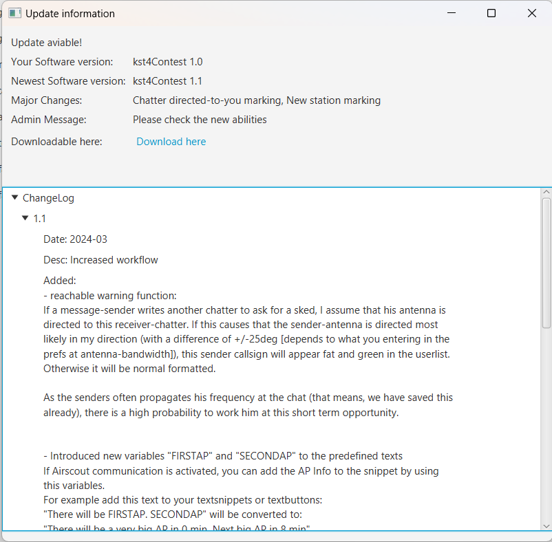

# Installation

> 🇬🇧 You are reading the English version | 🇩🇪 [Deutsche Version](de-Installation)

## Prerequisites

An resolution of 1200px by 720px is recommended

### ON4KST Account

To use the chat, a registered account with the ON4KST chat service is required:

- Register at: http://www.on4kst.info/chat/register.php

### Chat Etiquette

The official language in the ON4KST Chat is **English**. Please use English even when communicating with stations from your own country. Common HAM abbreviations (agn, dir, pse, rrr, tnx, 73 …) are widely used and understood.

### Personal Messages

To send a private message to another station, always use the following format:

```
/CQ CALLSIGN message text
```

Example: `/CQ DL5ASG pse sked 144.205?`

During heavy chat traffic (5–6 messages per second in a contest), public messages directed at a specific callsign are easily missed. However, KST4Contest also catches such messages if they are accidentally posted publicly (see [Features – PM Catching](Features#catching-personal-messages)).

---

## Download

### Windows

The latest version can be downloaded as a ZIP file:

**https://github.com/praktimarc/kst4contest/releases/latest**

The filename has the format `praktiKST-v<version_number>-windows-x64.zip`.

### Linux

The latest version can be downloaded as an AppImage:

**https://github.com/praktimarc/kst4contest/releases/latest**

The filename has the format `KST4Contest-v<version_number>-linux-x86_64.AppImage`.

### macOS

> ⚠️ **Best-Effort Support:** macOS builds are provided as a convenience but are **not fully tested**. We build and release macOS binaries with every release, but we cannot test every scenario on macOS. If you encounter issues, please report them – we will do our best to address them, but cannot guarantee the same level of support as for Windows and Linux.

The latest version can be downloaded as a DMG disk image (available for both Apple Silicon and Intel Macs):

**https://github.com/praktimarc/kst4contest/releases/latest**

The filename has the format `KST4Contest-v<version_number>-macos-<arch>.dmg`, where `<arch>` is `arm64` (Apple Silicon) or `x86_64` (Intel).


---

## Installation

### Windows

1. Download the ZIP file.
2. Unzip the ZIP file into a folder of your choice.
3. Run `praktiKST.exe`.

Settings are stored at `%USERPROFILE%\.praktikst\preferences.xml`.

### Linux
1. Download the AppImage.
2. Unzip the AppImage into a folder of your choice.
3. Make the AppImage executable (in the terminal with `chmod +x KST4Contest-v<version_number>-linux-x86_64.AppImage`)
4. Run the AppImage.

Settings are stored at `~/.praktikst/preferences.xml`.

### macOS
1. Download the DMG file for your architecture (Apple Silicon or Intel).
2. Open the DMG file.
3. Drag `KST4Contest.app` into your **Applications** folder.
4. On first launch, macOS may show a warning because the app is not notarised. To open it:
   - Right-click (or Control-click) on `KST4Contest.app` in Finder and choose **Open**.
   - Alternatively, go to **System Settings → Privacy & Security** and click **Open Anyway**.
5. Run KST4Contest from your Applications folder or Launchpad.

Settings are stored at `~/.praktikst/preferences.xml`.

---

## Updating

KST4Contest includes an **automatic update notification service**: as soon as a new version is available, a window will appear at startup with:
- information that a new version is available,
- a changelog,
- the download link for the new version.



### Update Process

#### Windows

Currently, there is only one way to update:

1. Delete the old folder.
2. Unzip the new ZIP file.

The settings file (`preferences.xml`) is preserved because it is stored in the user folder, not the program folder.

#### Linux

Currently as follows:
1. Download the new AppImage
2. Mark the new AppImage as executable
3. (optional) Delete the old AppImage.

#### macOS

1. Download the new DMG file.
2. Open the DMG.
3. Drag the new `KST4Contest.app` into your **Applications** folder, replacing the old version.


---

## Known Issues at Startup

### Norton 360

Norton 360 classifies `praktiKST.exe` as dangerous (false positive). An exception must be created for the file:

1. Open Norton 360.
2. Security → History → Find the corresponding event.
3. Select "Restore & Add Exception".

*(Reported by PE0WGA, Franz van Velzen – thank you!)*
