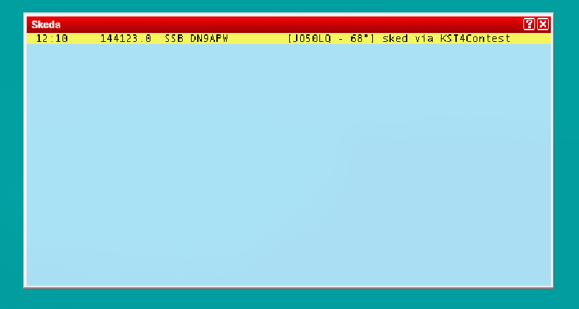

# Log Synchronisation

> 🇬🇧 You are reading the English version | 🇩🇪 [Deutsche Version](de-Log-Synchronisation)

KST4Contest imports worked stations from the logging application and derives the global Worked status, per-band Worked marks and – where a locator is available – worked grid squares. Three input paths are available: the file-based Simplelogfile interpreter, the general QSO UDP listener and the dedicated Win-Test network listener.

---

## Method 1: Universal File Based Callsign Interpreter (Simplelogfile)

KST4Contest reads the selected text file once per minute and searches it for callsigns using a fixed built-in regular expression. Each match is normalised to its base callsign, so the global Worked status applies to every currently active chat variant of that callsign.

The advantage is broad compatibility: no dedicated network interface is required from the logging application.

The limitation is equally clear. A callsign match alone provides neither a reliable band nor a locator. The Simplelogfile interpreter can therefore set only the global Worked status. It does not create a per-band `X`, a worked-grid record or a reliable basis for the band-upgrade hint after a log entry.

Select the text-file path in the **Log sync** tab. If the file is missing, KST4Contest creates it and displays a one-time, non-blocking notice with the path and the checks to perform next. Read or creation errors are logged; the scheduled task continues with its next one-minute pass. Use one of the network interfaces where possible if band-specific information is required.

Worked status derived from the Simplelogfile is not stored in the internal SQLite database. The selected file is the durable source and is read again after every restart. The interpreter only adds positive Worked marks; it does not remove an existing mark during the current application session and does not reset automatically for a new contest. A manual database reset does not change or empty the Simplelogfile either. Callsigns contained in it are marked as worked again when the file is next evaluated within one minute. Before each contest, verify that the logging application is writing the current contest log to this exact file.

---

## Method 2: Network Listener for QSO UDP Packets – Recommended

UCXLog, QARTest, N1MM+ and DXLog.net can transmit a UDP packet when a QSO is saved. KST4Contest receives these packets on port `12060` by default and imports the callsign together with any band and locator information they contain.

If a band is available, the callsign is marked as worked on that band. If the packet also contains a valid locator, KST4Contest stores its four-character grid square for that band. Missing information is not inferred from unrelated fields.

KST4Contest must be running when the packet is transmitted. Some logging applications can, however, resend an existing log: QARTest provides **Invia log completo**, while DXLog.net sends `contactreplace` packets when broadcasting the complete log. KST4Contest processes both mechanisms.

**Default port:** `12060`

---

## Supported Logging Software

### UCXLog (DL7UCX)

UCXLog sends QSO UDP packets and transceiver frequency packets.

**Settings in UCXLog:**
- Enable UDP broadcast
- Enter the IP address of the KST4Contest computer (for local operation: `127.0.0.1`)
- Port: 12060 (default)

Note the green-highlighted fields in the UCXLog settings: IP and port must be filled in.

Note for multi-setup (2 computers, 2 radios, one KST4Contest instance): Both logging programs must send QSO packets to the IP of the KST4Contest computer. In this case, at least one IP is not `127.0.0.1`.

### QARTest (IK3QAR)

**Special feature**: QARTest can send the **complete log** to KST4Contest (button "Invia log completo" in the QARTest settings). This means QSOs logged before KST4Contest was started are also captured.

**Settings in QARTest:**
- Configure UDP broadcast and IP/port as with UCXLog
- Use "Invia log completo" for a full log upload

*(„Buona funzionalità caro IK3QAR!" – DO5AMF)*

### N1MM+

**Settings in N1MM+:**

In N1MM+ under `Config → Configure Ports, Mode Control, Winkey, etc. → Broadcast Data`:
- Enable `Radio Info` (for TRX sync / QRG)
- Enable `Contact Info` (for QSO sync)
- IP: `127.0.0.1` (or IP of the KST4Contest computer)
- Port: 12060

For the built-in DX cluster server: configure N1MM+ as a DX cluster client (server: `127.0.0.1`, port as set in KST4Contest).

### DXLog.net

**Settings in DXLog.net:**
- Enable UDP broadcast
- Enter the IP of the KST4Contest computer (green-highlighted fields)
- Port: 12060

When broadcasting the complete logbook, DXLog.net uses `contactreplace` instead of `contactinfo`. KST4Contest processes both packet types. Older QSOs can therefore be imported by starting a complete-log broadcast while KST4Contest is running.

### Win-Test

Win-Test is connected through a dedicated UDP listener for the native Win-Test network protocol. This listener is independent of the general QSO UDP listener on port `12060`.

#### QSO and Worked synchronisation

For a new QSO, KST4Contest imports:

- the logged callsign,
- the native Win-Test band ID, and
- a valid locator where one is included in the packet.

Band IDs for 50 and 70 MHz are processed in the same way as the VHF, UHF and SHF bands. The callsign is marked as worked globally and on the detected band. If a locator is also available, its four-character grid square is stored for that band.

The information is written to the same internal database as Worked data received through the other QSO UDP interfaces and is restored after a restart.

#### Recovering QSOs logged earlier

Win-Test broadcasts every new QSO. QSOs logged before KST4Contest was started are not part of those broadcasts. KST4Contest therefore requests them itself as soon as the Win-Test network listener detects a Win-Test station on the network.

The recovery needs no dedicated setting and no operating step:

- Win-Test announces with `IHAVE` which QSO numbers of which log it holds.
- KST4Contest requests the missing ranges with `NEEDQSO`, at most 50 QSOs per request.
- Win-Test answers with ordinary `ADDQSO` packets. They are processed exactly like a QSO logged live.

Stations already worked therefore appear as worked even when KST4Contest is started during the contest. The recovery stays active afterwards and also picks up individual packets lost during operation. Known QSOs are recognised and not stored again.

When several Win-Test stations are active on the network, every log is recovered. The per-band Worked marks of all band stations are then complete. The station name filter still applies to the QRG synchronisation only and does not restrict the log recovery.

If a detected station sends no usable `IHAVE`, for example an older Win-Test version, KST4Contest requests the QSOs in blocks starting at QSO number 1 until a block remains unanswered.

The Win-Test network must be enabled. No recovery takes place while the Win-Test network or the listener in KST4Contest is disabled.

#### Handing skeds over to Win-Test

Pressing **Create sked** first creates an internal KST4Contest sked. If the Win-Test network listener is enabled, KST4Contest then automatically attempts to send the sked to the Win-Test network as an `ADDSKED` packet.

The QRG is selected in the following order:

1. KST4Contest looks for the most recent QRG of the remote station on the explicitly selected band. The QRG must be no more than 30 minutes old. Active variants of the same base callsign are evaluated together.
2. If no such QRG is available, KST4Contest checks the local QRG of the chat category in which the sked was created. It is only used if it can be parsed and actually belongs to the selected band.
3. If neither source provides a matching QRG, no `ADDSKED` packet is sent.

A fixed replacement frequency such as `144.300` is deliberately not used. During a contest, a technically successful handover containing the wrong band or QRG is worse than a visibly omitted handover.

The internal sked remains intact in every case. This also applies when the broadcast address is invalid, the network fails or no Win-Test client can be reached.

#### Handling KST callsign suffixes

KST suffixes often identify a particular chat login or band. They are not necessarily part of the log callsign. KST4Contest therefore removes a suffix separated by `-` before handing the callsign over to Win-Test, while preserving portable and international callsign components:

| Callsign in the KST chat | Callsign passed to Win-Test |
|---|---|
| `DN9APW-2` | `DN9APW` |
| `9A0BB-70` | `9A0BB` |
| `EA5/G8MBI/P-70` | `EA5/G8MBI/P` |
| `DN9APW-2/P` | `DN9APW/P` |

The complete callsign remains available inside KST4Contest. The timeline, reminder PMs and chat category continue to refer to the login which was actually selected.

#### Mode, time and notes

The mode is selected explicitly as `SSB` or `CW` when the sked is created. It is not inferred automatically from the QRG because a limited list of assumed band segments cannot represent every supported VHF, UHF and SHF band reliably.

KST4Contest sends the actual scheduled time without adding an extra minute. Where available, the notes include the locator and QTF together with an indication that the sked was created through KST4Contest.

The handover consists of the Win-Test packets `LOCKSKED`, `ADDSKED` and `UNLOCKSKED`.

#### Settings

In the **Log sync** tab:

- `Receive Win-Test network based UDP log messages`
- `UDP-Port for Win-Test listener`, default `9871`
- `KST station name in Win-Test network (src of SKED packets)`
- `Win-Test network broadcast address`

In the **TRX sync** tab:

- `Win-Test STATUS QRG Sync`
- `Use pass frequency from Win-Test STATUS`
- `Win-Test station name filter`

The Win-Test network must be enabled in Win-Test. The station name should identify the sending KST4Contest instance unambiguously within the Win-Test network.

KST4Contest determines the broadcast address itself: the source address of the received Win-Test packets identifies the matching local network, and the broadcast address of that network is used. The configured address serves as the fallback when no local network matches the Win-Test station, for example when Win-Test is located behind a router.

This matters because Win-Test only reacts to broadcasts, and an address in a network that does not exist raises no error: the packet is routed away silently. An outdated entry, for instance from a different network, therefore used to disable both the sked handover and the log recovery.

Detailed settings: [Win-Test Network Listener](en-Configuration#win-test-network-listener-from-v131)

## TRX Frequency Synchronisation

In addition to QSO synchronisation, UCXLog and other programs also transmit the **current transceiver frequency** via UDP. KST4Contest processes this information and makes it available as the `MYQRG` variable.

**Result**: An enabled interface updates `MYQRG` when it actually supplies valid frequency packets. Enabling an interface does not create a QRG on its own. If no suitable packets arrive, check the interface or disable both automatic sources and maintain the QRG manually.

**Sources for your own QRG (MYQRG):**
- UCXLog, N1MM+, DXLog.net, QARTest via UDP port 12060
- Win-Test STATUS packet (optional, configurable in the "TRX Synchronisation" tab under "Win-Test STATUS QRG Sync")
- Manual entry in the QRG field

> **Note for multi-setup**: With two logging programs on two computers, only **one** should send frequency packets. KST4Contest cannot distinguish between sources and processes all incoming packets.

---

## Multi-Setup: 2 Radios, 2 Computers

For DM5M-style setups (2 radios, 2 computers, one KST4Contest instance or two separate):

**Option A – One shared KST4Contest instance:**
- Both logging programs send QSO packets to the IP of the KST4Contest computer
- Only one logging program sends frequency packets (recommended: the VHF logging program)

**Option B – Two separate KST4Contest instances (recommended):**
- Each logging program communicates with its own KST4Contest instance via `127.0.0.1`
- Two separate chat logins
- Better separation and fewer conflicts

---

## Internal Database

KST4Contest stores Worked, NOT-QRV and worked-grid information received from network interfaces, together with manual marks, in its own SQLite database. This database is independent of the logging application's database. Simplelogfile matches are excluded and are derived again from the selected file in each application session.

The input sources provide different levels of detail:

| Source | Global callsign status | Per-band status | Grid square |
|---|---:|---:|---:|
| Simplelogfile | yes | no | no |
| QSO UDP listener | yes | yes, if included in the packet | yes, if both band and locator are available |
| Win-Test network listener | yes | yes | yes, if a locator is available |

The information stored in SQLite is restored when KST4Contest starts and updated during operation when new log entries arrive. It expires automatically after three days, so a reset before every contest is normally unnecessary. This lifetime does not apply to the Simplelogfile interpreter: its file remains the durable source and is neither changed nor emptied by a database reset. Callsigns contained in it set the global Worked status again during the next periodic evaluation.

A complete manual reset removes Worked marks, NOT-QRV marks and worked grid squares together. See [Worked Station Database Settings](en-Configuration#worked-station-database-settings) for details.
