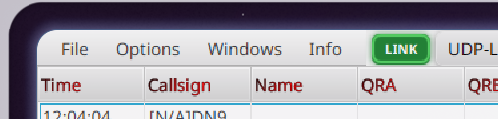
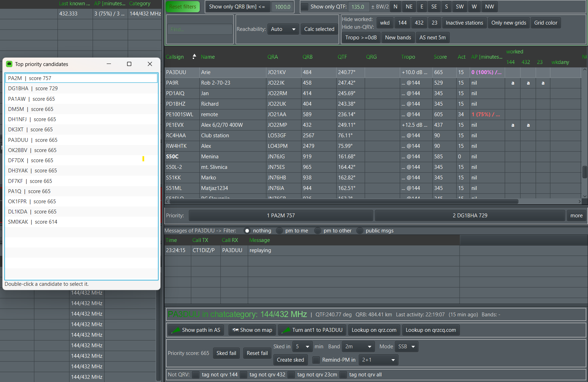
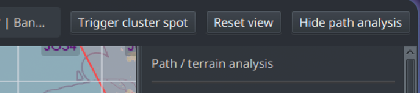

# User Interface

> 🇬🇧 You are reading the English version | 🇩🇪 [Deutsche Version](de-Benutzeroberflaeche)

## Connecting to the Chat

Before connecting for the first time, configure at least the callsign, password, locator and primary chat category in the settings window. If a second category is required, its login must also be enabled and configured completely.

The connection can be started in two ways:

- **Connect to …** in the settings window applies the values currently entered there and starts the connection.
- **File → Connect to …** uses the settings already applied in KST4Contest.

Use **Save Settings** if changed values should also be available after the next programme start.

An active connection can be terminated using **File → Disconnect** or **Disconnect** in the settings window. **Exit + disconnect** terminates the connection and then closes the programme.

If an established connection is lost unexpectedly, KST4Contest waits for a limited period and then attempts a controlled reconnect to ON4KST. A failed initial connection attempt no longer blocks the user interface.

The [`LINK` indicator](#status-bar-and-indicators) in the main window shows whether only the TCP connection exists or whether login and synchronisation have actually been completed.

---


## Main Window Overview

The main window consists of several areas:

### Status Bar and Indicators

The status bar is located at the top of the main window next to the menu.



The permanently visible `LINK` indicator shows the actual state of the ON4KST connection:

| Indicator | Meaning |
|---|---|
| green `LINK` | Login and synchronisation of all configured chat categories have been completed |
| yellow `LINK…` | Connection, login, user-list synchronisation or controlled shutdown is in progress |
| red `LINK!` | No connection exists, or KST4Contest is waiting before an automatic reconnect |

The tooltip contains the internal connection state and a more detailed description of the current step. The indicator is not a button.

KST4Contest reports `ONLINE` only after login has been confirmed and the user lists of all configured categories have been received. The send field and **TX** remain disabled while the connection is still being established or resynchronised.

Additional indicators appear temporarily after certain events:

- `SKED` indicates that a sked reminder is due. The text contains the complete target callsign and the remaining time.
- `BAND+` appears after a log entry if at least one common, locally enabled and unworked band has been detected for the worked station.

Both indicators flash for approximately twelve seconds and then disappear. Their tooltip contains the complete message or derivation. Neither indicator is clickable.


### PM Window (top left)

The PM window shows private messages addressed to the local chat logins and the corresponding outgoing replies.

Public messages are also shown when their text contains the configured local login callsign, ignoring letter case. This PM Catching mechanism – informally, **“gossip detection”** – changes neither the public `ALL` receiver nor the message text, chat category or routing.

If [QSO Monitoring](en-Features#qso-sniffer-from-v131) is enabled, it additionally shows captured messages involving the monitored base callsigns. These entries receive a `Sniffed:` prefix containing the complete visible sender and receiver callsigns.

New rows not sent by the local station pass through six green age levels and return to the normal table colour after five minutes. Messages sent by the local station retain their separate highlight. The colour only indicates message age; it does not change content or routing.

Selecting an incoming row prepares a reply to the sender. For an outgoing message from the local station, the original receiver is restored as the message target instead. Caught and monitored rows do not trigger PM audio output.

Age levels: [Coloured PM Rows](en-Features#coloured-pm-rows-from-v125). Recognition and limitations: [PM Catching](en-Features#pm-catching-from-v11).

### User List (Chat Members)

The central table of all currently active chat users. Columns (depending on configuration):

| Column | Content |
|---|---|
| Callsign | Station callsign |
| Name | Name and additional information from the chat name field |
| QRA | Maidenhead locator |
| QRB | Distance in km |
| QTF | Direction in degrees |
| QRG | Most recent frequency detected in a chat message |
| Tropo | Result of the band-specific tropo or path assessment |
| Score | Current, numerically sortable priority score of the normalised base callsign |
| Act | Minutes since the most recent activity |
| AP | AirScout aircraft data, when enabled |
| worked | Per-band Worked, band-opportunity and grid-square status, plus `wkdany` |
| NOT QRV @ | Bands on which the station has manually been marked not QRV |
| Category | Chat category of this entry |

The QRG column shows the frequency most recently detected for a station. Missing trailing zeros are added for display purposes, so `144.21`, for example, is shown as `144.210`. If KST4Contest detects frequencies on several bands in succession, the column shows the latest match. The internal band information may still contain several current bands for that station.

Relative frequency information is first combined with a band context from the same sender which is no more than 30 minutes old. Only if no such context exists does KST4Contest use the global fallback band. Detection rules, examples and limitations: [QRG Detection](en-Features#qrg-detection).


### Worked, band and grid-square status

The subcolumns under **worked** use compact codes because several enabled bands leave little room for full descriptions. `X` marks a callsign worked on that band. `a` and `B+` identify an offered band which has not yet been worked. An appended `o` means that the four-character grid square has already been worked on this band.

The **wkdany** subcolumn is band-independent: `x` means that the callsign has been worked, `o` means that the grid square has been worked on any band, and `xo` means both.

Each status cell has a tooltip containing the legend and the state derived for that station. For the complete calculation, including NOT-QRV precedence, see [Worked Callsigns, New Bands and New Grid Squares](en-Features#worked-callsigns-new-bands-and-new-grid-squares).


**Sorting**: Click column headers. QRB sorting is numerical (corrected in v1.22).

A callsign displayed in green and bold indicates a directional opportunity derived from a directed message. The marker applies to the sender of that message and remains visible for no more than five minutes. Derivation and limitations: [Directional Opportunities from Directed Messages](en-Features#directional-opportunities-from-directed-messages).


### Send Field

The send field contains the prepared text for the next outgoing message.

When an operator deliberately selects a station in the user list using the mouse or keyboard, KST4Contest prepares a directed message:

```text
/cq CALLSIGN
```

The complete visible callsign, including any suffix, and the chat category of the selected station are retained. A target such as `9A0BB-70` is not shortened to `9A0BB`.

A background refresh, changed sorting order or filter update must not overwrite message text which has already been edited. Only an actual station selection by the operator prepares the `/cq` recipient again.

- **TX** or `Enter` sends the prepared text.
- `Esc` clears the send field.
- The send field and **TX** remain disabled until KST4Contest is fully connected to ON4KST.

Shortcuts, snippets and variables are described under [Macros and Variables](en-Macros-and-Variables).

### MYQRG and SECONDQRG Fields

The two QRG fields contain the local frequencies for the primary and secondary chat categories.

`MYQRG` can be updated by an enabled TRX synchronisation interface or entered manually when no automatic QRG source is active. `SECONDQRG` remains independent and contains the frequency used for the second category.

Selecting a station from the second chat does not change the meaning of these values: `MYQRG` continues to belong to the primary category and `SECONDQRG` to the secondary category.

Further details: [TRX Sync Settings](en-Configuration#trx-sync-settings).

### MYQTF Field

The MYQTF field shows the current antenna direction as a numerical angle in degrees.

If PSTRotator is enabled, the value is received automatically and the field cannot be edited manually. Without active rotator synchronisation, the antenna direction can be entered directly. The changed value is applied when the field loses focus.

The value affects, among other things:

- QTF filtering,
- the antenna-sector display on the station map,
- priority-score calculation,
- the AP timeline, and
- the `MYQTF` variable.

---

## Message Tables

KST4Contest deliberately displays message text on a single line. This keeps a larger number of entries visible when chat activity is high. The disadvantage is obvious: if the **Message** column is narrow, not every message fits completely into its cell.

If the message text is wider than the visible cell, moving the mouse over that **Message** cell displays the complete content in a tooltip. No additional full-text tooltip is shown if the message already fits into the column.

Web addresses beginning with `http://`, `https://` or `www.` are displayed as links inside the message text. Clicking a link opens it in the operating system’s default browser. Other protocols are not treated as links.


This avoids having to move the divider merely to read an individual long message. The divider can, of course, still be adjusted if a permanently wider message area is required.

---

## Filters and Reachability Controls

The filter bar is located above the chat-member table. Filters can be combined; a station remains visible only if it satisfies every active condition.


### Station Filters

| Control | Effect |
|---|---|
| **Show only QTF** | Shows only stations inside the selected antenna direction and configured beamwidth |
| **Show only QRB [km] <=** | Limits the list to the entered maximum distance |
| **Find** | Filters by a complete or partial callsign |
| **wkd** | Hides base callsigns already worked on at least one supported band |
| individual band buttons | Hide stations already worked on that band or marked NOT QRV there |
| **Inactive stations** | Hides stations whose latest chat activity was more than 20 minutes ago |
| **Only new grids** | Shows only stations in four-character grid squares not yet worked on any band |
| **New bands** | Shows stations with at least one detected, locally enabled and unworked band opportunity |
| **Tropo >=0dB** | Shows stations with a calculated non-negative SSB margin |
| **AS next 5m** | Shows stations with a current AirScout window or one expected within the next five minutes |

For **New bands**, KST4Contest evaluates current QRGs, band information in the name field and active callsign variants together. Manual NOT-QRV marks take precedence.

The **Tropo >=0dB** filter removes only stations for which a completed calculation returned a negative margin. Stations with pending or failed calculations remain visible. Otherwise, a missing API result would incorrectly be treated as proof that the path is unsuitable.

### Grid Color

**Grid color** is not a filter. It only changes the presentation of the QRA cell and marks four-character grid squares which have already been worked.

The station remains visible regardless of this colour marker. **Reset filters** therefore does not disable **Grid color**.

### Reachability and Calc Selected

The **Reachability** dropdown selects the band used by the Tropo column, the Tropo filter and an explicitly requested path calculation.

- **Auto** derives the band from the station’s current QRG, band information in its name field and the supported chat category.
- An explicitly selected band overrides this automatic choice for the Reachability calculation.

Changing the dropdown does not start a calculation for the entire user list. With an online elevation-data source, that would be unnecessarily slow and multiply the number of external API requests.

**Calc selected** calculates only the currently selected station, using either the explicitly selected or automatically derived band. The result is then used by the Tropo column and the associated views.

### Resetting the Filters

**Reset filters** clears:

- the QTF filter,
- the QRB filter,
- the callsign search field,
- all Worked and band filters,
- **Inactive stations**,
- **Only new grids**,
- **New bands**,
- **Tropo >=0dB**, and
- **AS next 5m**.

The internal filter predicates are explicitly cleared as well. Resetting only the visible toggle buttons would not be sufficient.

The following settings are retained:

- **Grid color**, because it is a display option, and
- the **Reachability** selection, because it selects the calculation band rather than directly filtering the table.

### Behaviour in a Narrow View

The filter bar has no fixed width. QTF, Worked and Reachability controls initially use the available space in their respective rows.

When the middle divider is moved to the right and the chat-member area becomes narrower, controls wrap only when their actual required width no longer fits. Widening the area causes them to rearrange immediately.

In plain terms: the filters determine the table contents, but no longer enforce the minimum width of the entire right-hand side.

---

## Station Info Panel (Further Info)

The lower-right panel combines the messages associated with the selected station. This includes public messages, private messages to the local station and, where visible in the chat, private messages addressed to other stations.

The selected filter controls which of these messages are displayed. Under **Settings → GUI**, the default filter can be set to:

- all messages,
- private messages to the local station,
- private messages to other stations, or
- public messages.

This setting changes the Further Info display only. Messages are neither discarded nor removed from the other message tables, and the filter can be changed at any time for the currently selected station.

The lower part of the panel contains per-band **Not QRV** marks for the selected station. Individual controls are shown for the bands enabled in the local station settings. **tag not qrv all** sets or removes the mark for every supported band, including bands which are not currently visible.

The change immediately affects the **NOT QRV @** column, band opportunities and the corresponding filters. It is stored in the internal database and restored after a restart.


The current **Priority score** of the selected station is displayed in the same section.

**Sked fail** marks an unsuccessful attempt and strongly reduces the score of the normalised base callsign. **Reset fail** removes the mark. It applies to all active suffix and category variants of the station and remains active for the current program session.

The controls underneath are used to create a sked:

| Control | Meaning |
|---|---|
| **Sked in** | Time remaining until the sked |
| **Band** | Agreed band selected from the locally enabled bands |
| **Mode** | `SSB` or `CW` for a possible Win-Test handover |
| **Create sked** | Create the internal sked |
| **Remind-PM in** | Enable automatic reminder PMs |
| **2+1**, **5+2+1**, **10+5+2+1** | Times at which reminder PMs are sent before the sked |


The proposed band is derived from recent QRG and name information for the station. It can be changed explicitly before creating the sked. The mode selection only affects the Win-Test handover; the internal sked and reminder PMs work independently.

**Create sked** always creates the appointment inside KST4Contest first. If the Win-Test network listener is active, KST4Contest then attempts an additional handover to Win-Test. If no QRG matching the selected band can be found or Win-Test cannot be reached, the internal sked, its priority contribution and any scheduled reminders remain intact.

The complete derivation and limitations are described under [Skeds and Sked Reminders](en-Features#skeds-and-sked-reminders).

---

## Priority List

The compact priority bar is located on the right-hand side between the user list and the Further Info section. It displays the two currently highest-ranked candidates directly in the main window:

```text
Priority:  1 CALLSIGN SCORE  2 CALLSIGN SCORE  more
```

Clicking either candidate selects the corresponding active chat member. The complete callsign, including its suffix and chat category, is used.

The **more** button opens a separate window containing up to 15 candidates. The list is sorted by descending score. Double-clicking an entry selects the candidate and closes the window.



Stations with a score of `0` are not included in the priority list. They remain visible in the user list so that the reason for their exclusion can be examined and, for example, an incorrect NOT-QRV mark can be changed.

The score is calculated for the normalised base callsign. Several active variants such as `9A0BB-2` and `9A0BB-70` may therefore display the same value in the user list. They nevertheless remain separate message targets.

New messages, AirScout data, skeds and status changes request a new calculation. A periodic refresh also runs in the background. A briefly outdated order is therefore not an error.

Calculation and limitations: [Priority Score and Priority List](en-Features#priority-score-and-priority-list-from-v140).

---

## Station Map

The station map can be opened in two ways:

- **Windows → Show / hide station map** opens or closes the map window.
- **Show on map** in the **Further Info** panel opens the map and focuses the selected station.

The map uses the stations which remain visible after applying the current user-list filters. Its header shows the number of displayed stations and indicates a filtered view with `filtered view active`.


### Selecting a Station

A single station marker can be selected directly. KST4Contest then:

1. selects the corresponding chat member,
2. scrolls the main user list to that entry,
3. updates the **Further Info** panel, and
4. prepares the complete visible callsign as the `/cq` recipient.

Chat logins with the same normalised base callsign and position may share one marker. They nevertheless remain separate message targets inside KST4Contest.

Markers which are too close together at the current zoom level are displayed as a cluster containing the number of stations. Clicking the cluster zooms into that area. A concrete station is selected only after an individual marker becomes visible and is clicked.

For a selected station, the header additionally shows:

- the complete callsign,
- locator,
- QRB and QTF,
- detected active bands,
- any available `B+` band opportunity, and
- the most recently known QRGs.

Long header content is shortened. The complete text remains available in its tooltip.

### Clearing the Selection with Reset View

**Reset view** clears the selected station without changing the map position or zoom level.

It:

- clears the selected station,
- clears the selection in the main user list,
- removes the connection line to the remote station,
- discards a pending analysis for the previous station, and
- removes the right-hand analysis panel.

The map itself remains at the previously selected position and zoom level. This function is therefore not a geographical reset to the local station.



Selecting another individual marker restores the station selection and analysis panel.

### Triggering a DX Cluster Spot

**Trigger cluster spot** is visible only while a station is selected. It sends one spot to logging programmes connected to the built-in local DX Cluster server.

This requires:

- the local DX Cluster server to be enabled,
- at least one connected cluster client, and
- a usable QRG for the selected station.

The spot is not sent to a public Internet cluster.

### Path Analysis

The terrain profile is displayed below the map. The right-hand analysis panel includes, among other things:

- the data source and number of elevation samples,
- the analysis frequency,
- the Earth-curvature or refraction model,
- radio and terrain horizons,
- Fresnel-zone clearance,
- detected obstructions,
- the link budget,
- estimated received power, and
- a summarised path assessment.

The analysis uses the same centrally derived band as the Reachability functions. A band explicitly selected in the **Reachability** dropdown is taken into account.

These values remain technical estimates. Buildings, vegetation, local obstructions, current propagation conditions and unknown station parameters may substantially change the real result.

### Hiding the Path Analysis

**Hide path analysis** hides both the terrain profile and the right-hand analysis panel, leaving more space for the map.


The **Path analysis is hidden** message and **Show path analysis** button remain visible, so the function can be restored directly.

If no station is selected when the analysis is shown again, no empty right-hand panel is displayed. It is recreated only after a specific station has been selected.

The setting is stored and restored at the next programme start.

The divider between the map and detail panel can be moved horizontally. Longer values wrap in a narrow detail panel; a vertical scrollbar appears if the available height is insufficient.

Detailed derivation and limitations: [Station Map and Path Analysis](en-Features#station-map-and-path-analysis-from-v141).

---

## Global Message Tabs and Monitor Window

The lower part of the main window contains three global message tabs. Their contents do not depend on the station currently selected in the user list.

| Tab | Content |
|---|---|
| **Public messages** | Public chat messages, CQ calls and beacons |
| **DXCluster messages** | DX cluster messages received through ON4KST |
| **QSO of the other** | Directed messages between two other stations |


In **QSO of the other**, sender and receiver are displayed separately. **Last QRG TX** and **Last QRG RX** contain the frequencies most recently known for the two stations. They do not necessarily represent the frequency discussed in the displayed conversation.

**wkd TX?** and **wkd RX?** show the global Worked state of the two base callsigns. These values are not band-specific.

The **DXCluster messages** tab shows the reporting and reported stations, their locators, QRG, message text and the global Worked state of the reported station. Which fields are actually available depends on the message received from the ON4KST server.

Message text remains on one line. If a cell is too narrow, its complete content is available in a tooltip. Web addresses in the message text are clickable.

### Separate Monitor Window

KST4Contest additionally opens the **Cluster & QSO of the other** window. It shows DX cluster messages in the upper table and directed messages between other stations in the lower table.


The vertical divider position and window size are stored together with the other UI settings. Use **Save Settings** after changing them.

The window can be hidden and restored through:

```text
Windows → Hide cluster / stranger QSOs
Windows → Show cluster / stranger QSOs
```

The main-window tabs and separate monitor window use the same underlying data. Hiding the monitor window therefore neither stops message processing nor removes messages from the tabs.

Derivation and limitations: [Global Message Views](en-Features#global-message-views).

---

## Menu

### File

- **Connect to …** starts the connection using the settings already applied in KST4Contest.
- **Disconnect** terminates the current ON4KST connection without closing KST4Contest.
- **Exit + disconnect** terminates the connection and then closes the programme.

The Connect and Disconnect entries are enabled or disabled according to the current connection state.

### Options

- **Set QRG as name in Chat (main category)** sends `/SETNAME` containing the current `MYQRG` to the primary chat category.
- **Show me as away in chat** sends `/AWAY`.
- **Show me as active in chat** sends `/BACK`.
- **Show options** shows or hides the settings window.

Functions which communicate with the server are available only after the ON4KST connection has been established completely.

### Windows

- **Hide cluster / stranger QSOs** and **Show cluster / stranger QSOs** hide or restore the separate cluster and QSO monitor window.
- **hide options** and **show options** hide or restore the settings window.
- **Use dark mode design** activates the dark colour scheme.
- **Use default mode design** restores the standard light colour scheme.
- **Show / hide station map** opens or closes the separate station-map and path-analysis window.

---

## Window Sizes and Dividers

When **Save Settings** is clicked, KST4Contest stores the programme-window sizes and the positions of the relevant dividers in the configuration file. These values are reused at the next start.

The main window is additionally checked against the visible area of the primary screen during startup. If the stored size is too large, KST4Contest reduces and moves the window so that it remains accessible. The complete process is described under [Screen-Aware Main Window Sizing](en-Features#screen-aware-main-window-sizing-from-v141).

The other programme windows do not currently use this additional size restriction. If, for example, the separate monitor window appears too large after moving to a smaller screen, its size must be corrected manually and stored again using **Save Settings**.

If the layout has become inconvenient, first move the dividers back to usable positions and save the settings again. Deleting the configuration file also resets the UI values, but it removes the other stored programme settings as well. It should therefore be used only when the interface cannot be restored in another way.


---

## Operating Tips

- **Keep the settings window open**: This provides quick access to the beacon controls.
- **Right-click in the user list**: Opens the snippet menu and additional actions, including QRZ.com profiles and NOT-QRV marks.
- **Press Enter while working in the chat**: If the send field contains text, Enter sends it directly even when another control has focus.
- **Stop the beacon while scanning**: Disable the beacon while moving through frequencies to avoid flooding the chat with unnecessary messages.
